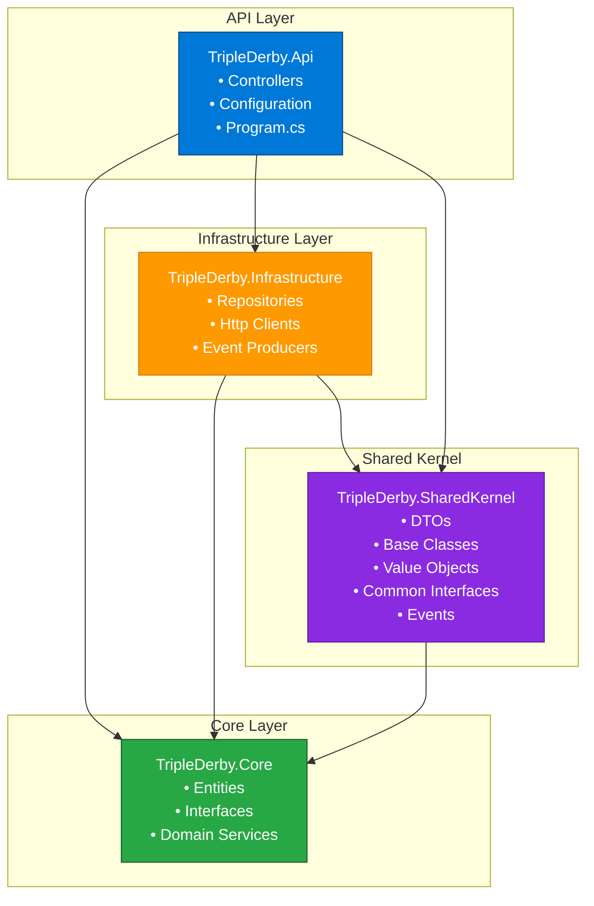
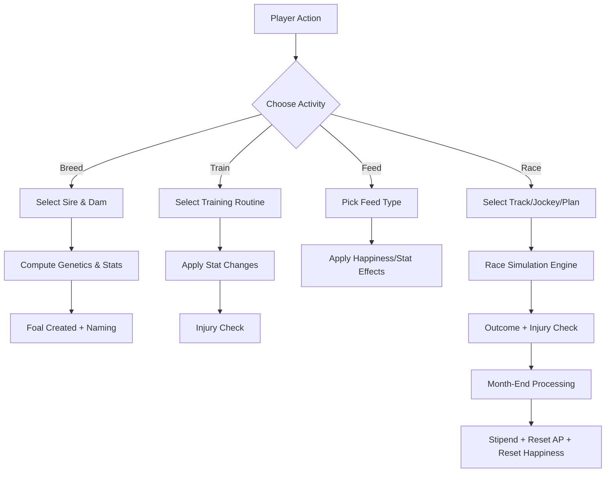
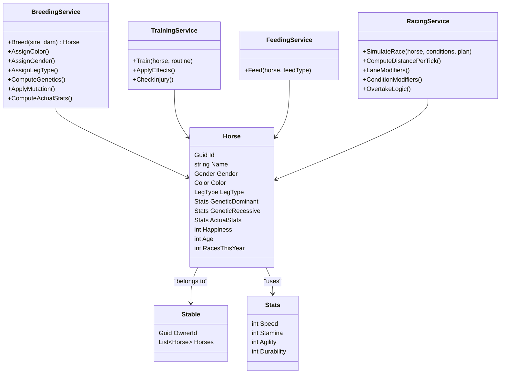
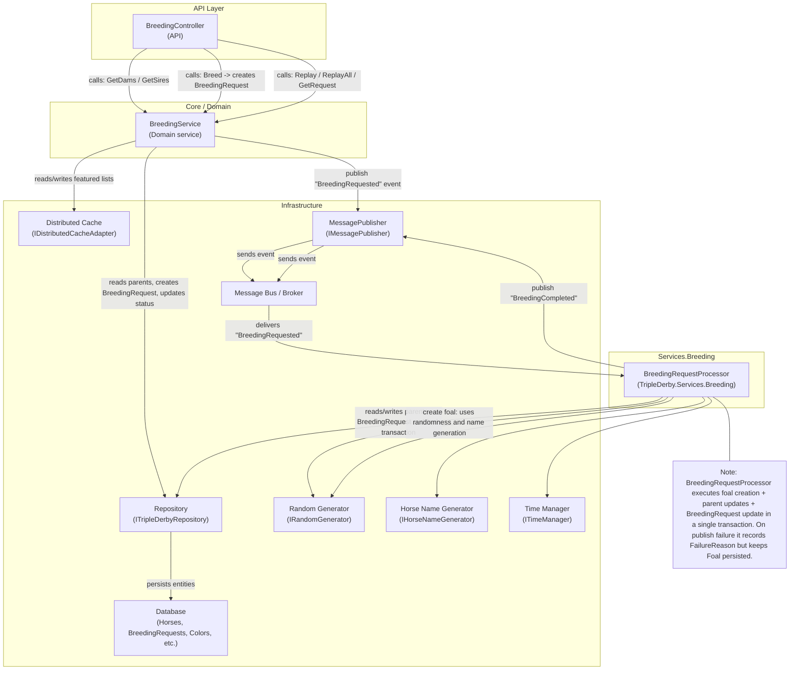

[](https://github.com/ovation22/TripleDerby/actions/workflows/ci.yml)
[](https://github.com/ovation22/TripleDerby/blob/main/LICENSE)

# Triple Derby  

*A modern horse racing simulation built with .NET Aspire, .NET 9 Web API, and Blazor.*

Triple Derby is a management and simulation game where players breed, train, feed, and race virtual horses — each with unique genetics and performance characteristics. This modern rebuild uses .NET 9, Blazor, and .NET Aspire to orchestrate a clean, extensible architecture.

---

## 🚀 Features

- Modern **.NET 9 Web API** for all gameplay operations  
- **Blazor Admin UI** for testing, debugging, and management  
- **.NET Aspire orchestration** for local infrastructure and future cloud deployment  
- Message-driven breeding pipeline with a background worker (`TripleDerby.Services.Breeding` / `BreedingRequestProcessor`) and transactional foal creation  
- Deterministic RNG support for reproducible breeding and race simulations  
- Breeding engine implementing Punnett-style dominant/recessive genetics and a weighted mutation system  
- Weighted color rarity selection and leg-type influenced racing behavior  
- Racing simulation with tick-based movement, leg types, lane modifiers, and track condition modifiers  
- Distributed caching for featured parent lists and performance-sensitive reads  
- Message broker support (RabbitMQ) for message-driven workflows and background processing  
- Training, feeding, and month-end lifecycle processing  
- Health checks, graceful cancellation handling, and robust error handling for background workers and API  
- Easily extensible to microservices, background workers, and cloud deployment

---

## 🏛️ Solution Structure

Included in the solution:

- [x] .NET 9 Web Api
- [x] Blazor Admin UI
- [x] .NET Aspire orchestration
- [x] Logging
- [x] Global Exception Handling
- [x] Cancellation Handling
- [x] Health Checks
- [x] CI Pipelines
- [x] Unit Tests
- [x] Worker Service(s) (e.g., Breeding & Racing Simulation)
- [x] Distributed Caching (`IDistributedCacheAdapter`)
- [x] Message Broker Support (RabbitMQ)
- [ ] Integration Tests
- [ ] Benchmark Tests
- [ ] Architectural Tests

---

## 🧩 Architecture Overview



---

## 🖥️ System Flow



---

## 📦 Domain Model Overview



---

## 🧬 Gameplay Systems Summary

### **Breeding**

Breeding creates a new foal influenced by parent traits:

- Select CPU or stable-owned sire/dam  
- Weighted color selection (with special colors)  
- Leg type influences racing behavior  
- Dominant/Recessive stats computed using Punnett-style quadrants  
- Final step: player names the foal  



### **Training**

- May increase stats  
- May increase happiness  
- Reduced effect if recently injured  
- Small chance of injury  

### **Feeding**

- Affects happiness  
- Can influence training effectiveness  
- May add minor stat variance  

### **Racing**

Race outcome depends on:

- Track selection (surface, length, hidden conditions)  
- Leg type (FrontRunner, StartDash, LastSpurt, StretchRunner, RailRunner)  
- Lane position effects  
- Condition modifiers (Fast, Muddy, Frozen, Soft, etc.)  
- Tick-based formula:  
  Distance = BaseSpeed × LegTypeModifier × ConditionModifier × LaneModifier  
- Overtaking logic and random events  
- Injury chance  
- Max 8 races per year, max 3-year racing career  

### **Month-End**

- Player receives stipend  
- Action points reset  
- Happiness resets to 50  

---

## ▶️ Running the Project

### **Prerequisites**

- .NET 9 SDK  
- Docker Desktop (optional, for Aspire dependencies)  
- VS 2022 or VS Code + C# Dev Kit  

### **Start the Full System via Aspire**

code
dotnet run --project src/TripleDerby.AppHost
code

Aspire launches:

- TripleDerby API  
- Blazor Admin UI  
- Database or other configured services  
- Aspire dashboard with logs + health checks  

### **Default Endpoints**

- Admin UI → https://localhost:{port}/  
- Swagger UI → https://localhost:{port}/swagger  

---

## 🛠️ Development Notes

- Keep gameplay logic in domain services for clean, testable architecture  
- Use deterministic RNG for reproducible breeding and racing tests  
- Use DTOs to avoid leaking domain internals  
- Future expansions:
  - Breeding Worker  
  - Racing Simulation Worker  
  - Month-End Scheduler  
- Consider messaging (RabbitMQ or Service Bus) for async workload distribution  

---

## Solution Structure

### Core Project

The Core project is the center of the Clean Architecture design, and all other project dependencies should point toward it. As such, it has very few external dependencies. The Core project should include things like:

- Entities
- DTOs
- Interfaces
- Domain Services

### Infrastructure Project

Most of your application's dependencies on external resources should be implemented in classed defined in the Infrastructure project. These classed should implement interfaces defined in Core. The Infrastructure project should include things like:

- Http clients
- Repositories
- Event Hub Producer clients
- Service Bus clients

### Api Project

The entry point of the application is the Api project. The Api project should include things like:

- Program.cs
- Controllers
- Configurations

### Test Projects

Test projects are organized based on the kind of test (unit, integration, benchmark, etc.).

#### Unit Tests

Unit tests provide a way to verify and validate functionality of individual methods/components/features. This project contains example tests using [xUnit](https://xunit.net/).

#### Integration Tests

[Integration testing](https://learn.microsoft.com/en-us/aspnet/core/test/integration-tests) provides a way to ensure that an application's components function correctly at each level.

#### Architectural Tests

Architectural rules can be enforced using [NetArchTest](https://github.com/BenMorris/NetArchTest), a fluent API for .NET Standard that can enforce architectural rules within unit tests.

#### Benchmark Tests

Benchmark testing is provided by [BenchmarkDotNet](https://github.com/dotnet/BenchmarkDotNet), a powerful .NET library for creating and executing benchmark tests.

```powershell
dotnet run --project ./tests/Api.Project.Template.Tests.Benchmark -c Release
```

---

## 🗺️ Roadmap

### **Short Term**

- Complete race engine visualization  
- Expand Admin UI tooling  
- Add stable management  

### **Long Term**

- Worker/microservice separation  
- In-game marketplace  
- Public player UI  
