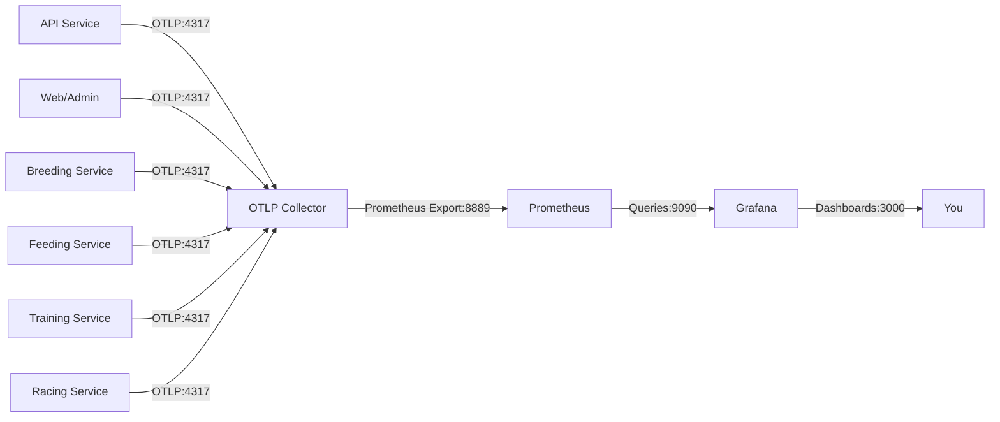

# TripleDerby Observability

This document describes the observability stack for local development and how to use it to monitor application performance.

## Overview

TripleDerby uses an observability stack built on industry-standard tools:

- **OpenTelemetry Collector**: Receives telemetry data from all services via OTLP (OpenTelemetry Protocol)
- **Prometheus**: Stores and queries metrics data scraped from the OTLP Collector
- **Grafana**: Visualizes metrics through pre-configured dashboards

## Architecture



**OTLP Collector Hub Pattern**: All services export metrics to a centralized OTLP Collector, which routes them to Prometheus. This approach provides:
- Single configuration point for telemetry routing
- Ability to add additional backends (Loki, Jaeger) without changing service code
- Consistent metric namespacing and labeling

## Accessing the Tools

When you run the AppHost, the following UIs become available:

| Tool | URL | Purpose |
|------|-----|---------|
| Grafana | http://localhost:3000 | Pre-configured dashboards for visualizing metrics |
| Prometheus | http://localhost:9090 | Raw metrics query interface |
| OTLP Collector | http://localhost:4317 (gRPC) | Telemetry ingestion endpoint |

### Grafana

- **Login**: Anonymous access enabled (no login required, admin role automatically granted)
- **Default Dashboard**: Navigate to "Dashboards" → "ASP.NET Core" folder
- **Auto-refresh**: Dashboards refresh every 10 seconds

### Prometheus

- Direct metrics queries via PromQL
- Useful for ad-hoc exploration and debugging
- Example query: `triple_derby_http_server_request_duration_seconds_count`

## Available Dashboards

### ASP.NET Core Dashboard

Shows application-wide metrics:

- **Request Duration**: p50, p75, p90, p95, p98, p99, p99.9 latency percentiles
- **Error Rates**: 4XX and 5XX response rates over time
- **Current Connections**: Active Kestrel connections
- **Current Requests**: Active HTTP requests being processed
- **Total Requests**: Cumulative request count
- **Total Unhandled Exceptions**: Count of exceptions that weren't caught
- **Requests by Protocol**: HTTP/1.1, HTTP/2, HTTP/3 breakdown
- **Top 10 Requested Endpoints**: Most frequently called API routes
- **Top 10 Exception Endpoints**: Routes throwing the most errors

### ASP.NET Core Endpoint Details Dashboard

Drill-down view for individual endpoints:

- Per-route latency percentiles
- Per-route error rates
- Filterable by HTTP method and route pattern

## Metrics Reference

All metrics are prefixed with `triple_derby_` to avoid naming conflicts.

### Key Metrics

| Metric Name | Type | Description |
|-------------|------|-------------|
| `triple_derby_http_server_request_duration_seconds_bucket` | Histogram | Request duration buckets for percentile calculations |
| `triple_derby_http_server_request_duration_seconds_count` | Counter | Total number of HTTP requests |
| `triple_derby_kestrel_active_connections` | Gauge | Current number of active connections |
| `triple_derby_http_server_active_requests` | Gauge | Current number of active requests being processed |

### Metric Labels

Common labels available for filtering:

- `job`: Service name (api, admin, breeding, feeding, training, racing)
- `instance`: Service instance (hostname:port)
- `http_route`: API route pattern (e.g., `/api/horses/{id}`)
- `http_request_method`: HTTP method (GET, POST, PUT, DELETE)
- `http_response_status_code`: Response status code (200, 404, 500, etc.)
- `error_type`: Exception type (if applicable)

## How It Works

### 1. Metrics Collection

Each service uses the `ServiceDefaults` project which configures OpenTelemetry:

```csharp
// In ServiceDefaults/Extensions.cs
builder.Services.AddOpenTelemetry()
    .WithMetrics(metrics => metrics
        .AddAspNetCoreInstrumentation()
        .AddHttpClientInstrumentation()
        .AddRuntimeInstrumentation());

// OTLP export is enabled when OTEL_EXPORTER_OTLP_ENDPOINT is set
if (!string.IsNullOrWhiteSpace(otlpEndpoint))
{
    builder.Services.AddOpenTelemetry().UseOtlpExporter();
}
```

### 2. Telemetry Flow

1. **Service startup**: Each service reads `OTEL_EXPORTER_OTLP_ENDPOINT` environment variable
2. **Metrics generation**: ASP.NET Core, HttpClient, and .NET Runtime emit metrics
3. **OTLP export**: Metrics are sent to OTLP Collector at `http://localhost:4317` via gRPC
4. **Collector processing**: OTLP Collector adds `triple_derby_` namespace prefix and `app: triple-derby` label
5. **Prometheus export**: Collector exposes metrics at `:8889/metrics` in Prometheus format
6. **Prometheus scraping**: Prometheus scrapes the collector every 15 seconds
7. **Grafana visualization**: Dashboards query Prometheus for metric data

### 3. Configuration Files

| File | Purpose |
|------|---------|
| `TripleDerby.AppHost/prometheus.yml` | Prometheus scrape configuration |
| `TripleDerby.AppHost/otel-collector-config.yaml` | OTLP Collector pipeline configuration |
| `TripleDerby.AppHost/grafana/provisioning/datasources/datasources.yaml` | Grafana datasource setup |
| `TripleDerby.AppHost/grafana/provisioning/dashboards/dashboards.yaml` | Dashboard auto-provisioning config |
| `TripleDerby.AppHost/grafana/dashboards/*.json` | Pre-configured Grafana dashboards |

## Adding Observability to New Services

When creating a new service or project:

1. **Reference ServiceDefaults**: Ensure your project references `TripleDerby.ServiceDefaults`
2. **Add to AppHost**: In `Program.cs`, add the service with OTLP configuration:

```csharp
builder.AddProject<Projects.YourNewService>("your-service")
    .WithReference(sql)  // or other dependencies
    .WaitFor(otelCollector)
    .WithEnvironment("OTEL_EXPORTER_OTLP_ENDPOINT", "http://localhost:4317");
```

3. **Verify metrics**: Run the app, make requests to your service, then check Grafana

The service will automatically emit standard ASP.NET Core metrics. No code changes needed.

## Querying Metrics Directly

### Prometheus Queries (PromQL)

Access http://localhost:9090 and try these queries:

```promql
# Request rate across all services
sum(rate(triple_derby_http_server_request_duration_seconds_count[5m])) by (job)

# 95th percentile latency for API service
histogram_quantile(0.95,
  sum(rate(triple_derby_http_server_request_duration_seconds_bucket{job="api"}[5m])) by (le)
)

# Error rate percentage
sum(rate(triple_derby_http_server_request_duration_seconds_count{http_response_status_code=~"5.."}[5m]))
/
sum(rate(triple_derby_http_server_request_duration_seconds_count[5m]))
```

## Troubleshooting

### No metrics appearing in Prometheus

1. Check OTLP Collector is receiving metrics:
   - Look at Aspire dashboard logs for `otel-collector`
   - Should see lines like: `Metric #0: Name: aspnetcore.routing.match_attempts`

2. Verify Prometheus is scraping:
   - Visit http://localhost:9090/targets
   - Status of `otel-collector` target should be "UP"

3. Check service configuration:
   - Ensure `OTEL_EXPORTER_OTLP_ENDPOINT` is set to `http://localhost:4317`
   - Note: Use `localhost`, not `otel-collector`, because services run as host processes

### Grafana dashboard shows "No Data"

1. Verify datasource is working:
   - Go to Configuration → Data Sources → Prometheus
   - Click "Test" - should show green "Data source is working"

2. Check metric names:
   - All queries should use `triple_derby_` prefix
   - Example: `triple_derby_http_server_request_duration_seconds_count`

3. Adjust time range:
   - Dashboards default to "Last 5 minutes"
   - If you just started the app, try making some API requests first

### Services not starting

If services fail with OTLP-related errors:

1. Ensure OTLP Collector container is running (check Aspire dashboard)
2. All services have `.WaitFor(otelCollector)` in `Program.cs` to ensure proper startup order
3. Check firewall isn't blocking port 4317

## Performance Impact

The observability stack has minimal performance impact:

- **Metrics collection**: Negligible CPU/memory overhead (~1-2% in local dev)
- **OTLP export**: Batched every 10 seconds, minimal network overhead
- **Prometheus scraping**: Pull-based, doesn't affect application performance
- **Container resources**: ~200MB RAM total for Prometheus + OTLP Collector + Grafana

All containers use `ContainerLifetime.Persistent` to survive restarts and preserve historical data.

## Production Considerations

While this setup works great for local development, production deployments should:

1. **Use managed services**: Azure Monitor, Application Insights, or Datadog
2. **Secure Grafana**: Disable anonymous access, use proper authentication
3. **Scale OTLP Collectors**: Deploy as sidecar or daemonset pattern
4. **Adjust retention**: Prometheus default is 15 days, configure based on needs
5. **Add alerting**: Set up Prometheus Alertmanager or Grafana alerts
6. **Use remote storage**: Prometheus remote write to long-term storage (Thanos, Cortex, etc.)

The architecture remains the same - only the deployment model changes.

## Further Reading

- [OpenTelemetry .NET Documentation](https://opentelemetry.io/docs/instrumentation/net/)
- [Prometheus Query Documentation](https://prometheus.io/docs/prometheus/latest/querying/basics/)
- [Grafana Dashboard Best Practices](https://grafana.com/docs/grafana/latest/dashboards/)
- [.NET Aspire Observability](https://learn.microsoft.com/en-us/dotnet/aspire/fundamentals/telemetry)
