# Racing Service Architecture Retrospective

**Created**: 2026-01-02
**Status**: Analysis
**Purpose**: Retrospective analysis of Racing service architecture with proposed improvements

---

## Current Architecture Overview

### What We Built

```mermaid
graph TB
    subgraph "Racing Service"
        RaceService[RaceService<br/>Orchestrates]
        RaceExecutor[RaceExecutor<br/>CENTRAL POINT<br/>Executes Everything]

        subgraph "RaceExecutor Responsibilities"
            Setup[SetupRace]
            Simulate[SimulateRace<br/>Tick loop]
            DetermineResults[DetermineRaceResults<br/>⚠️ GROWING PROBLEM]
        end

        subgraph "DetermineRaceResults Does"
            PlaceAssignment[Place assignment]
            Counters[Win/Place/Show counters]
            StatProg[Stat progression F018]
            Happiness[Happiness system F018]
            Future[Future: Purse, Achievements, etc.]
        end

        subgraph "Supporting Calculators ✅ Good Separation"
            SpeedCalc[SpeedModifier<br/>Calculator]
            StaminaCalc[Stamina<br/>Calculator]
            StatProgCalc[StatProgression<br/>Calculator]
            PurseCalc[Purse<br/>Calculator]
        end
    end

    RaceService --> RaceExecutor
    RaceExecutor --> Setup
    RaceExecutor --> Simulate
    RaceExecutor --> DetermineResults
    DetermineResults --> PlaceAssignment
    DetermineResults --> Counters
    DetermineResults --> StatProg
    DetermineResults --> Happiness
    DetermineResults --> Future

    RaceExecutor -.uses.-> SpeedCalc
    RaceExecutor -.uses.-> StaminaCalc
    RaceExecutor -.uses.-> StatProgCalc
    RaceExecutor -.uses.-> PurseCalc

    style RaceExecutor fill:#ffcccc
    style DetermineResults fill:#ffcccc
    style SpeedCalc fill:#ccffcc
    style StaminaCalc fill:#ccffcc
    style StatProgCalc fill:#ccffcc
    style PurseCalc fill:#ccffcc
```



### Pain Points Identified

1. **RaceExecutor is a God Object**
   - Handles setup, simulation, AND outcome processing
   - `DetermineRaceResults()` grows with every feature
   - 400+ lines and growing
   - Violates Single Responsibility Principle

2. **No Clear Separation of Concerns**
   ```
   Race Execution = Setup + Simulation + Outcomes
   ```
   All three are tightly coupled in one class

3. **Calculators are Good, But Incomplete**
   - We extracted calculation logic (good!)
   - But not orchestration logic (bad!)
   - RaceExecutor still orchestrates everything

4. **Testing Challenges**
   - Integration tests required for race outcomes
   - Hard to test outcome behaviors in isolation
   - Mock setup is complex

---

## Better Architecture: Proposed Design

### Pattern: Pipeline + Domain Model + Events


---

## Key Improvements

### 1. Rich Domain Model

**Current (Anemic)**:
```csharp
// RaceRun is just a data bag
public class RaceRun
{
    public Guid Id { get; set; }
    public List<RaceRunHorse> Horses { get; set; }
    public DateTime StartTime { get; set; }
    // ... just properties
}

// RaceExecutor does all the logic
public class RaceExecutor
{
    private void DetermineRaceResults(RaceRun raceRun)
    {
        // 100+ lines of logic operating ON the domain
    }
}
```

**Proposed (Rich Domain)**:
```csharp
// RaceRun has behavior
public class RaceRun
{
    public Guid Id { get; private set; }
    public List<RaceRunHorse> Horses { get; private set; }
    public DateTime StartTime { get; private set; }
    public RaceStatus Status { get; private set; }

    private readonly List<IDomainEvent> _domainEvents = new();
    public IReadOnlyCollection<IDomainEvent> DomainEvents => _domainEvents;

    // Business logic lives HERE
    public void Complete()
    {
        if (Status != RaceStatus.Running)
            throw new InvalidOperationException("Race is not running");

        // Determine results (simple sorting logic)
        var rankedHorses = Horses.OrderBy(h => h.FinishTime).ToList();
        for (byte i = 0; i < rankedHorses.Count; i++)
        {
            rankedHorses[i].AssignPlace((byte)(i + 1));
        }

        Status = RaceStatus.Completed;

        // Raise domain event for outcome processing
        _domainEvents.Add(new RaceCompletedEvent(this));
    }

    public void ClearDomainEvents() => _domainEvents.Clear();
}

// RaceRunHorse also has behavior
public class RaceRunHorse
{
    public void AssignPlace(byte place)
    {
        Place = place;

        // Update win/place/show counters (domain logic)
        switch (place)
        {
            case 1:
                Horse.RaceWins++;
                break;
            case 2:
                Horse.RacePlace++;
                break;
            case 3:
                Horse.RaceShow++;
                break;
        }

        Horse.IncrementRaceStarts();
    }
}
```

**Benefits**:
- Domain objects encapsulate their own behavior
- Business rules live with the data they operate on
- Self-documenting code
- Easier to test (test the domain directly)

---

### 2. Domain Events Pattern

**Current**:
```csharp
// Tightly coupled, procedural
private void DetermineRaceResults(RaceRun raceRun)
{
    // Sort horses...
    // Assign places...

    // Directly call outcome processors
    ApplyStatProgression(horse, raceRun);
    ApplyHappiness(horse, raceRun);
    // ... more and more as we add features
}
```

**Proposed**:
```csharp
// Domain raises events
public class RaceRun
{
    public void Complete()
    {
        // ... complete the race

        // Raise event (decoupled)
        _domainEvents.Add(new RaceCompletedEvent(this));
    }
}

// Application layer dispatches events
public class RaceOrchestrator
{
    private readonly IEventDispatcher _eventDispatcher;

    public async Task<RaceRun> ExecuteRaceAsync(RaceRequest request)
    {
        // 1. Setup
        var raceRun = await SetupRaceAsync(request);

        // 2. Simulate
        await SimulateRaceAsync(raceRun);

        // 3. Complete (domain logic)
        raceRun.Complete();

        // 4. Dispatch domain events (outcome processing)
        await _eventDispatcher.DispatchAsync(raceRun.DomainEvents);
        raceRun.ClearDomainEvents();

        // 5. Persist
        await _repository.SaveAsync(raceRun);

        return raceRun;
    }
}

// Handlers subscribe to events
public class StatProgressionHandler : IDomainEventHandler<RaceCompletedEvent>
{
    public async Task HandleAsync(RaceCompletedEvent @event)
    {
        foreach (var horse in @event.RaceRun.Horses)
        {
            // Apply stat progression
            _calculator.ApplyStatProgression(horse);
        }
    }
}
```

**Benefits**:
- Decoupled outcome processing
- Add new handlers without touching existing code
- Clear separation between "what happened" (event) and "what to do about it" (handler)
- Easy to test handlers independently

---

### 3. Layered Architecture


**Dependencies flow inward**:
- Presentation → Application → Domain
- Infrastructure → Domain (via interfaces)
- Domain has **zero dependencies** (pure business logic)

---

### 4. Better Separation of Concerns

**Current Problem**:
```csharp
// RaceExecutor does EVERYTHING
public class RaceExecutor
{
    public async Task<RaceRun> Race(...)
    {
        // Setup
        var raceRun = new RaceRun();
        // ... setup logic

        // Simulation
        for (short tick = 0; tick < totalTicks; tick++)
        {
            // ... simulation logic
        }

        // Outcomes
        DetermineRaceResults(raceRun);

        // Persistence
        await _repository.CreateAsync(raceRun);
    }
}
```

**Proposed Solution**:
```csharp
// Each concern gets its own class

// 1. Setup
public class RaceSetupService
{
    public RaceRun SetupRace(Race race, Horse playerHorse, List<Horse> cpuHorses)
    {
        // Setup logic
    }
}

// 2. Race Execution
public class RaceEngine
{
    public void Run(RaceRun raceRun)
    {
        // Tick loop, physics, movement
    }
}

// 3. Orchestration
public class RaceOrchestrator
{
    public async Task<RaceRun> ExecuteRaceAsync(RaceRequest request)
    {
        var raceRun = _setupService.SetupRace(...);
        _raceEngine.Run(raceRun);
        raceRun.Complete(); // Domain
        await _eventDispatcher.DispatchAsync(raceRun.DomainEvents);
        await _repository.SaveAsync(raceRun);
        return raceRun;
    }
}
```

---

## Detailed Design: Outcome Processing

### Current Approach (Procedural)

```csharp
private void DetermineRaceResults(RaceRun raceRun)
{
    var sorted = raceRun.Horses.OrderBy(h => h.Time).ToList();
    byte place = 1;

    foreach (var horse in sorted)
    {
        // Place assignment
        horse.Place = place;
        horse.Horse.RaceStarts++;

        // Win/place/show
        if (place == 1) { /* ... */ }
        else if (place == 2) { /* ... */ }

        // Stat progression
        ApplyStatProgression(horse, raceRun);

        // Happiness
        ApplyHappiness(horse, raceRun);

        // Future: Purse?
        // Future: Achievements?
        // Future: Training decay?

        place++;
    }
}
```

**Problems**:
- Grows linearly with features
- Hard to test individual behaviors
- Tight coupling

---

### Proposed Approach (Event-Driven Pipeline)

```csharp
// Domain event
public record RaceCompletedEvent(RaceRun RaceRun) : IDomainEvent;

// Handler interface
public interface IDomainEventHandler<TEvent> where TEvent : IDomainEvent
{
    Task HandleAsync(TEvent @event, CancellationToken ct = default);
}

// Individual handlers (each does ONE thing)

public class PlaceAssignmentHandler : IDomainEventHandler<RaceCompletedEvent>
{
    public Task HandleAsync(RaceCompletedEvent @event, CancellationToken ct)
    {
        var sorted = @event.RaceRun.Horses.OrderBy(h => h.FinishTime).ToList();

        for (byte i = 0; i < sorted.Count; i++)
        {
            sorted[i].AssignPlace((byte)(i + 1));
        }

        return Task.CompletedTask;
    }
}

public class StatProgressionHandler : IDomainEventHandler<RaceCompletedEvent>
{
    private readonly IStatProgressionCalculator _calculator;

    public Task HandleAsync(RaceCompletedEvent @event, CancellationToken ct)
    {
        foreach (var raceRunHorse in @event.RaceRun.Horses)
        {
            _calculator.ApplyStatProgression(
                raceRunHorse,
                @event.RaceRun.Race.Furlongs,
                @event.RaceRun.Horses.Count);
        }

        return Task.CompletedTask;
    }
}

public class PurseDistributionHandler : IDomainEventHandler<RaceCompletedEvent>
{
    private readonly IPurseCalculator _purseCalculator;

    public Task HandleAsync(RaceCompletedEvent @event, CancellationToken ct)
    {
        foreach (var raceRunHorse in @event.RaceRun.Horses)
        {
            var winnings = _purseCalculator.Calculate(
                raceRunHorse.Place,
                @event.RaceRun.Race.TotalPurse);

            raceRunHorse.Horse.Earnings += winnings;
        }

        return Task.CompletedTask;
    }
}

// Event dispatcher (simple implementation)
public class DomainEventDispatcher : IEventDispatcher
{
    private readonly IServiceProvider _serviceProvider;

    public async Task DispatchAsync(IEnumerable<IDomainEvent> events)
    {
        foreach (var @event in events)
        {
            var eventType = @event.GetType();
            var handlerType = typeof(IDomainEventHandler<>).MakeGenericType(eventType);
            var handlers = _serviceProvider.GetServices(handlerType);

            foreach (var handler in handlers)
            {
                var handleMethod = handlerType.GetMethod("HandleAsync");
                await (Task)handleMethod.Invoke(handler, new object[] { @event, CancellationToken.None });
            }
        }
    }
}

// DI Registration
services.AddScoped<IDomainEventHandler<RaceCompletedEvent>, PlaceAssignmentHandler>();
services.AddScoped<IDomainEventHandler<RaceCompletedEvent>, StatProgressionHandler>();
services.AddScoped<IDomainEventHandler<RaceCompletedEvent>, PurseDistributionHandler>();
services.AddScoped<IEventDispatcher, DomainEventDispatcher>();
```

**Benefits**:
- Each handler is 20-50 lines
- Add handlers without modifying existing code (Open/Closed)
- Test each handler independently
- Clear execution order via DI registration
- Can disable handlers via configuration

---

## Comparison: Before vs After

### Lines of Code

**Current**:
- RaceExecutor.cs: ~450 lines (and growing)
- DetermineRaceResults(): ~100 lines
- Tight coupling, hard to test

**Proposed**:
- RaceOrchestrator: ~80 lines (stable)
- RaceEngine: ~200 lines (focused on tick execution)
- RaceSetupService: ~100 lines (focused on setup)
- Each handler: ~30-50 lines
- Total similar, but **much better organized**

### Testing

**Current**:
```csharp
// Integration test required
[Fact]
public async Task Race_AppliesStatProgression()
{
    // Setup entire race
    // Run entire simulation
    // Check stats changed
    // Hard to isolate what you're testing
}
```

**Proposed**:
```csharp
// Unit test handler directly
[Fact]
public async Task StatProgressionHandler_AppliesGrowth()
{
    // Arrange: Create RaceCompletedEvent with known state
    var raceRun = TestDataBuilder.CreateCompletedRace();
    var @event = new RaceCompletedEvent(raceRun);
    var handler = new StatProgressionHandler(_calculator);

    // Act
    await handler.HandleAsync(@event);

    // Assert: Stats increased
    Assert.True(raceRun.Horses[0].Horse.Speed > initialSpeed);
}
```

### Extensibility

**Current**:
```csharp
// Want to add achievements? Modify RaceExecutor.
private void DetermineRaceResults(RaceRun raceRun)
{
    // ... existing code ...

    // NEW: Check achievements
    CheckAchievements(horse, raceRun); // <-- Add here
}
```

**Proposed**:
```csharp
// Want to add achievements? Just register a new handler!
public class AchievementTrackingHandler : IDomainEventHandler<RaceCompletedEvent>
{
    public Task HandleAsync(RaceCompletedEvent @event, CancellationToken ct)
    {
        // Achievement logic
    }
}

// DI
services.AddScoped<IDomainEventHandler<RaceCompletedEvent>, AchievementTrackingHandler>();

// Zero changes to existing code!
```

---

## Migration Path

### Phase 1: Extract Domain Behavior (Low Risk)
1. Move business logic into domain entities
   - `RaceRun.Complete()`
   - `RaceRunHorse.AssignPlace()`
2. Add domain events infrastructure
3. Keep RaceExecutor but have it call domain methods
4. **No breaking changes**, internal refactor only

### Phase 2: Introduce Event Handlers (Medium Risk)
1. Create `IDomainEventHandler<RaceCompletedEvent>`
2. Extract stat progression to handler
3. Extract happiness to handler
4. RaceExecutor dispatches events
5. **Test extensively**, run in parallel with old code

### Phase 3: Split RaceExecutor (High Risk)
1. Create RaceOrchestrator
2. Create RaceEngine
3. Create RaceSetupService
4. Remove old RaceExecutor
5. **Full integration testing required**

**Estimated Effort**: 12-20 hours total
**Risk**: Medium (careful incremental migration)
**Value**: High (future extensibility, maintainability)

---

## Alternative Patterns Considered

### CQRS (Command Query Responsibility Segregation)

**Concept**: Separate read and write models

```csharp
// Commands
public record ExecuteRaceCommand(byte RaceId, Guid HorseId);

// Command Handler
public class ExecuteRaceCommandHandler
{
    public async Task<RaceResult> HandleAsync(ExecuteRaceCommand cmd)
    {
        // Execute race
        // Return result
    }
}

// Queries
public record GetRaceRunQuery(Guid RaceRunId);

// Query Handler
public class GetRaceRunQueryHandler
{
    public async Task<RaceRunDto> HandleAsync(GetRaceRunQuery query)
    {
        // Fetch race run
        // Project to DTO
    }
}
```

**Verdict**:
- ✅ Good for complex domains with high read/write asymmetry
- ❌ Overkill for TripleDerby (racing is write-heavy)
- ❌ Adds complexity without clear benefit

---

### Event Sourcing

**Concept**: Store events instead of current state

```csharp
// Events
RaceStarted
HorseMoved
HorseChangedLane
HorseFinished
RaceCompleted

// Rebuild state by replaying events
```

**Verdict**:
- ✅ Perfect audit trail
- ✅ Can replay races exactly
- ❌ Massive complexity overhead
- ❌ EF Core doesn't support well
- ❌ Not needed for MVP

**Future Consideration**: If we want race replay feature, reconsider

---

### Mediator Pattern (MediatR)

**Concept**: Use MediatR library for request/response

```csharp
public record ExecuteRaceRequest(byte RaceId, Guid HorseId) : IRequest<RaceRun>;

public class ExecuteRaceHandler : IRequestHandler<ExecuteRaceRequest, RaceRun>
{
    public async Task<RaceRun> Handle(ExecuteRaceRequest request, CancellationToken ct)
    {
        // Execute race
    }
}
```

**Verdict**:
- ✅ Clean separation
- ✅ Great for complex workflows
- ⚠️ Adds external dependency
- ⚠️ Slight performance overhead
- ⚠️ Reflection-based dispatch
- **Consider for future** if we add many command types

---

### Custom Event Dispatcher (Recommended)

**Concept**: Build our own lightweight event dispatcher

```csharp
// Simple interface
public interface IDomainEventHandler<TEvent> where TEvent : IDomainEvent
{
    Task HandleAsync(TEvent @event, CancellationToken ct = default);
}

// Lightweight dispatcher using DI
public class DomainEventDispatcher : IEventDispatcher
{
    private readonly IServiceProvider _serviceProvider;

    public async Task DispatchAsync(IEnumerable<IDomainEvent> events, CancellationToken ct = default)
    {
        foreach (var @event in events)
        {
            var eventType = @event.GetType();
            var handlerType = typeof(IDomainEventHandler<>).MakeGenericType(eventType);
            var handlers = _serviceProvider.GetServices(handlerType);

            foreach (var handler in handlers)
            {
                var method = handlerType.GetMethod(nameof(IDomainEventHandler<IDomainEvent>.HandleAsync));
                await (Task)method!.Invoke(handler, new object[] { @event, ct })!;
            }
        }
    }
}

// Registration
services.AddScoped<IDomainEventHandler<RaceCompletedEvent>, PlaceAssignmentHandler>();
services.AddScoped<IDomainEventHandler<RaceCompletedEvent>, StatProgressionHandler>();
services.AddScoped<IEventDispatcher, DomainEventDispatcher>();
```

**Verdict**:
- ✅ Zero external dependencies
- ✅ Full control over implementation
- ✅ Simple to understand and debug
- ✅ ~50 lines of code total
- ✅ Type-safe with generics
- ✅ Easy to add logging/metrics
- **Best choice for TripleDerby**

---

### Brighter

**Concept**: Command processor and event dispatcher library

```csharp
[UsePolicy(CommandProcessor.RETRYPOLICY, 3)]
public class ExecuteRaceCommand : Command
{
    public byte RaceId { get; set; }
    public Guid HorseId { get; set; }
}

public class ExecuteRaceHandler : RequestHandler<ExecuteRaceCommand>
{
    public override ExecuteRaceCommand Handle(ExecuteRaceCommand command)
    {
        // Execute race
    }
}
```

**Verdict**:
- ✅ Built-in retry/circuit breaker patterns
- ✅ Support for async/distributed scenarios
- ⚠️ More complex than needed
- ⚠️ External dependency
- ❌ Overkill for in-process events

---

### Wolverine (formerly Jasper)

**Concept**: Modern .NET mediator with minimal ceremony

```csharp
// Handler is just a method
public static class RaceHandlers
{
    public static async Task Handle(RaceCompletedEvent @event, IStatProgressionCalculator calculator)
    {
        // Apply stat progression
    }
}

// Registration is convention-based
builder.Host.UseWolverine();
```

**Verdict**:
- ✅ Minimal boilerplate
- ✅ Convention over configuration
- ✅ Source generator for performance
- ⚠️ Relatively new (evolving API)
- ⚠️ External dependency
- **Interesting option** but may be too "magical"

---

### Mass Transit (Sagas/State Machines)

**Concept**: Distributed application framework with local event support

```csharp
public class RaceCompletedConsumer : IConsumer<RaceCompletedEvent>
{
    public async Task Consume(ConsumeContext<RaceCompletedEvent> context)
    {
        // Handle event
    }
}
```

**Verdict**:
- ✅ Great if you need distributed messaging later
- ✅ Built-in saga support
- ✅ Rich ecosystem
- ❌ Heavy framework for local events
- ❌ Adds significant complexity
- **Only if** planning distributed architecture

---

### Observer Pattern (Classic)

**Concept**: Traditional Gang of Four Observer pattern

```csharp
public interface IRaceEventListener
{
    void OnRaceCompleted(RaceRun raceRun);
}

public class RaceRun
{
    private readonly List<IRaceEventListener> _listeners = new();

    public void AddListener(IRaceEventListener listener) => _listeners.Add(listener);

    public void Complete()
    {
        // ... complete logic
        foreach (var listener in _listeners)
        {
            listener.OnRaceCompleted(this);
        }
    }
}
```

**Verdict**:
- ✅ Zero dependencies
- ✅ Simple and direct
- ❌ Tight coupling (listeners must be registered on domain objects)
- ❌ Hard to test in isolation
- ❌ No async support without custom handling
- **Not recommended** for our use case

---

### Comparison Table

| Approach | Dependencies | Complexity | Performance | Flexibility | Recommendation |
|----------|-------------|------------|-------------|-------------|----------------|
| **Custom Event Dispatcher** | None | Low | Excellent | High | ⭐ **Best for TripleDerby** |
| MediatR | NuGet | Medium | Good | High | Good alternative |
| Wolverine | NuGet | Low | Excellent | High | Interesting but new |
| Brighter | NuGet | High | Good | Very High | Overkill |
| Mass Transit | NuGet | Very High | Good | Very High | Only if going distributed |
| Observer Pattern | None | Very Low | Excellent | Low | Too coupled |
| CQRS | Varies | High | Good | Very High | Overkill for now |
| Event Sourcing | Varies | Very High | Varies | Very High | Future consideration |

### Our Recommendation: Custom Event Dispatcher

For Feature 019, we recommend **building a custom event dispatcher** because:

1. **Zero Dependencies**: No NuGet packages to maintain or update
2. **Simple**: ~50 lines of straightforward code
3. **Fast**: Direct method invocation, no reflection overhead in hot path
4. **Flexible**: Easy to add logging, metrics, error handling
5. **Testable**: Each handler is independently testable
6. **Maintainable**: Code we control and understand completely
7. **Educational**: Team learns the pattern instead of relying on "magic"

**If needs grow**, we can always migrate to MediatR or Wolverine later without changing handler interfaces significantly.

---

## Recommendations

### Immediate (Next Sprint)
1. ✅ **Implement Feature 019**: Pipeline pattern for race outcomes
   - Low risk, high value
   - Solves immediate pain point
   - Foundation for other improvements

### Short Term (1-2 Months)
2. **Add Domain Behavior** to RaceRun/RaceRunHorse
   - Move logic into entities
   - Introduce domain events
   - Keep existing structure, internal refactor

### Medium Term (3-6 Months)
3. **Split RaceExecutor** into focused services
   - RaceOrchestrator
   - RaceEngine
   - RaceSetupService

### Long Term (6-12 Months)
4. **Evaluate CQRS** if read/write patterns diverge
5. **Consider Event Sourcing** if race replay becomes a requirement

---

## Lessons Learned

### What Worked Well ✅

1. **Calculator Pattern**
   - Extracting calculations (Speed, Stamina, StatProgression) was good
   - Clean, testable, reusable

2. **Repository Pattern**
   - Single abstraction for data access works well
   - Easy to test with mocks

3. **Configuration-Driven**
   - RaceModifierConfig makes tuning easy
   - No code changes needed for balance adjustments

### What Could Be Better ⚠️

1. **Anemic Domain Model**
   - Entities are data bags
   - Logic scattered in service layer
   - Hard to understand business rules

2. **God Object (RaceExecutor)**
   - Too many responsibilities
   - Grows with every feature
   - Testing is integration-heavy

3. **Tight Coupling**
   - Outcome processing tightly coupled to execution
   - Hard to add new behaviors

### What We'd Change 🔄

1. **Start with Rich Domain Model**
   - Put behavior in entities from day one
   - Domain events from the start

2. **Separate Simulation from Orchestration**
   - Simulation engine as isolated component
   - Orchestrator just coordinates

3. **Event-Driven Outcomes from Day One**
   - Handler pattern for extensibility
   - Each outcome behavior independent

---

## Conclusion

The current Racing service architecture works, but has technical debt accumulating in RaceExecutor. The proposed improvements focus on:

1. **Rich domain model** - Business logic lives with data
2. **Domain events** - Decoupled outcome processing
3. **Layered architecture** - Clear separation of concerns
4. **Handler pattern** - Extensible race outcomes

These changes will make the codebase:
- More maintainable
- Easier to test
- Easier to extend
- More aligned with SOLID principles

**Next Step**: Implement Feature 019 (Pipeline Pattern) as first step toward this vision.

---

## Appendix: Full Class Diagram


