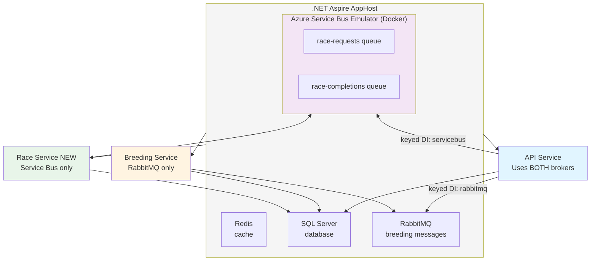

# Race Microservice Migration with Azure Service Bus - Feature Specification

**Feature Number:** 011

**Status:** 🔵 **Planned** (Future Enhancement - Deferred)

**Created:** 2025-12-26

**Depends On:** Feature 010 (RaceService Cleanup)

---

## Summary

Migration strategy for extracting Race functionality from the monolithic API into a dedicated microservice (`TripleDerby.Services.Race`), using Azure Service Bus emulator for local development and keyed dependency injection to support multiple message broker implementations simultaneously during migration.

This feature is **deferred** until after Feature 010 cleanup is complete but is documented now to inform architectural decisions.

---

## Motivation

### Current Architecture

**Monolithic API (TripleDerby.Api)**
- Contains all business logic: Races, Horses, Users, Stats, Training, Feeding
- Single deployment unit
- Direct database access
- RabbitMQ for Breeding microservice communication only

**Existing Microservice (TripleDerby.Services.Breeding)**
- Already extracted as separate service
- Uses RabbitMQ for message-based communication
- Demonstrates microservice pattern is working

### Goals for Race Microservice

1. **Scalability**: Race simulation is CPU-intensive; extract to scale independently
2. **Deployment Independence**: Deploy race simulation updates without touching API
3. **Technology Flexibility**: Azure Service Bus provides better Azure ecosystem integration
4. **Dual-Broker Support**: Breeding stays on RabbitMQ, Race uses Service Bus
5. **Gradual Migration**: Use keyed DI to run both brokers during transition

---

## Requirements

### Functional Requirements

**FR1: Race Microservice**
- New project: `TripleDerby.Services.Race`
- Exposes race simulation via message-based API
- Consumes `RaceRequested` messages
- Publishes `RaceCompleted` messages
- Independent deployment and scaling

**FR2: Azure Service Bus Integration**
- Use Azure Service Bus emulator for local development
- Configure via .NET Aspire AppHost
- Support queue-based communication (not pub/sub for now)
- Connection string configuration compatible with real Azure Service Bus

**FR3: Keyed Dependency Injection**
- Register both RabbitMQ and Service Bus publishers
- Use `[FromKeyedServices("rabbitmq")]` for Breeding communication
- Use `[FromKeyedServices("servicebus")]` for Race communication
- Allow services to choose broker via DI key

**FR4: Message Definitions**
- Define message contracts in `TripleDerby.SharedKernel.Messages`
- Follow existing pattern from Breeding messages
- Include: `RaceRequested`, `RaceCompleted`, `RaceRunCreated`

**FR5: Backward Compatibility**
- Existing REST API remains unchanged during migration
- `POST /api/races/{id}/run` endpoint delegates to microservice
- Fallback to direct RaceService if microservice unavailable (optional)

### Non-Functional Requirements

**NFR1: Performance**
- Message round-trip time < 100ms (local emulator)
- Support concurrent race simulations
- Service Bus connection pooling and reuse

**NFR2: Resilience**
- Retry logic for transient failures
- Dead-letter queue for failed messages
- Circuit breaker pattern for microservice communication

**NFR3: Developer Experience**
- Single `dotnet run` starts all services via Aspire
- Service Bus emulator runs as Docker container
- Hot reload support for local development

---

## Technical Design

### Architecture Diagram



### Phase 1: Azure Service Bus Emulator Setup

**Update AppHost/Program.cs:**

```csharp
var builder = DistributedApplication.CreateBuilder(args);

var cache = builder.AddRedis("cache");

var sql = builder.AddSqlServer("sql", port: 59944)
    .WithDataVolume()
    .WithLifetime(ContainerLifetime.Persistent)
    .AddDatabase("TripleDerby");

// EXISTING: RabbitMQ for Breeding service
var rabbit = builder.AddRabbitMQ("messaging")
    .WithDataVolume(isReadOnly: false)
    .WithLifetime(ContainerLifetime.Persistent)
    .WithManagementPlugin();

// NEW: Azure Service Bus Emulator for Race service
var serviceBus = builder.AddAzureServiceBus("servicebus")
    .RunAsEmulator() // Runs as Docker container
    .AddQueue("race-requests")
    .AddQueue("race-completions");

var apiService = builder.AddProject<Projects.TripleDerby_Api>("api")
    .WithReference(cache)
    .WaitFor(cache)
    .WithReference(sql)
    .WaitFor(sql)
    .WithReference(rabbit)      // Breeding messages
    .WaitFor(rabbit)
    .WithReference(serviceBus)  // Race messages
    .WaitFor(serviceBus);

builder.AddProject<Projects.TripleDerby_Web>("admin")
    .WithReference(apiService)
    .WaitFor(apiService);

// EXISTING: Breeding microservice
builder.AddProject<Projects.TripleDerby_Services_Breeding>("breeding")
    .WithReference(sql)
    .WaitFor(sql)
    .WithReference(rabbit)
    .WaitFor(rabbit);

// NEW: Race microservice
builder.AddProject<Projects.TripleDerby_Services_Race>("race")
    .WithReference(sql)
    .WaitFor(sql)
    .WithReference(serviceBus)
    .WaitFor(serviceBus);

builder.Build().Run();
```

**Notes:**
- `.RunAsEmulator()` runs Azure Service Bus as Docker container
- Emulator compatible with real Azure Service Bus SDK
- Connection string injected automatically via Aspire configuration

### Phase 2: Service Bus Message Publisher

**Create: TripleDerby.Infrastructure/Messaging/AzureServiceBusPublisher.cs**

```csharp
using Azure.Messaging.ServiceBus;
using Microsoft.Extensions.Configuration;
using Microsoft.Extensions.Logging;
using System.Text;
using System.Text.Json;
using TripleDerby.Core.Abstractions.Messaging;

namespace TripleDerby.Infrastructure.Messaging;

/// <summary>
/// Azure Service Bus implementation of IMessagePublisher.
/// Supports both emulator (local dev) and cloud (production).
/// </summary>
public class AzureServiceBusPublisher : IMessagePublisher, IAsyncDisposable
{
    private readonly ServiceBusClient _client;
    private readonly ILogger<AzureServiceBusPublisher> _logger;
    private readonly JsonSerializerOptions _jsonOptions;
    private readonly string _defaultQueue;

    public AzureServiceBusPublisher(
        IConfiguration configuration,
        ILogger<AzureServiceBusPublisher> logger)
    {
        _logger = logger;

        // Read connection string (Aspire injects this automatically)
        var connectionString =
            configuration["ConnectionStrings:servicebus"]
            ?? configuration.GetConnectionString("servicebus")
            ?? throw new InvalidOperationException(
                "Azure Service Bus connection string not configured. " +
                "Set ConnectionStrings:servicebus in configuration.");

        _client = new ServiceBusClient(connectionString);

        _defaultQueue = configuration["ServiceBus:DefaultQueue"] ?? "race-requests";

        _jsonOptions = new JsonSerializerOptions
        {
            PropertyNamingPolicy = JsonNamingPolicy.CamelCase,
            DefaultIgnoreCondition = System.Text.Json.Serialization.JsonIgnoreCondition.WhenWritingNull,
            WriteIndented = false
        };

        _logger.LogInformation(
            "AzureServiceBusPublisher configured for queue {Queue}",
            _defaultQueue);
    }

    public async Task PublishAsync<T>(
        T message,
        MessagePublishOptions? options = null,
        CancellationToken cancellationToken = default)
    {
        if (message is null)
            throw new ArgumentNullException(nameof(message));

        var queueName = options?.Destination ?? _defaultQueue;

        // Serialize message
        var payload = JsonSerializer.Serialize(message, _jsonOptions);
        var body = new BinaryData(Encoding.UTF8.GetBytes(payload));

        // Create Service Bus message
        var sbMessage = new ServiceBusMessage(body)
        {
            ContentType = "application/json",
            MessageId = Guid.NewGuid().ToString(),
            Subject = options?.Subject ?? typeof(T).Name
        };

        // Add metadata
        sbMessage.ApplicationProperties["MessageType"] = typeof(T).FullName ?? typeof(T).Name;
        sbMessage.ApplicationProperties["Timestamp"] = DateTimeOffset.UtcNow.ToString("O");

        // Send message
        await using var sender = _client.CreateSender(queueName);

        try
        {
            await sender.SendMessageAsync(sbMessage, cancellationToken);

            _logger.LogInformation(
                "Published message {MessageType} to queue {Queue} (MessageId: {MessageId})",
                typeof(T).Name,
                queueName,
                sbMessage.MessageId);
        }
        catch (ServiceBusException ex)
        {
            _logger.LogError(ex,
                "Failed to publish message {MessageType} to queue {Queue}",
                typeof(T).Name,
                queueName);
            throw;
        }
    }

    public async ValueTask DisposeAsync()
    {
        await _client.DisposeAsync();
        GC.SuppressFinalize(this);
    }
}
```

### Phase 3: Keyed Dependency Injection Setup

**Update: TripleDerby.Api/Program.cs**

```csharp
// EXISTING: Services
builder.Services.AddScoped<ITripleDerbyRepository, TripleDerbyRepository>();
builder.Services.AddScoped<IRaceService, RaceService>();
builder.Services.AddScoped<IBreedingService, BreedingService>();
// ... other services

// NEW: Register BOTH message publishers with keys
builder.Services.AddKeyedSingleton<IMessagePublisher, RabbitMqMessagePublisher>(
    "rabbitmq",
    (sp, key) => new RabbitMqMessagePublisher(
        sp.GetRequiredService<IConfiguration>(),
        sp.GetRequiredService<ILogger<RabbitMqMessagePublisher>>()));

builder.Services.AddKeyedSingleton<IMessagePublisher, AzureServiceBusPublisher>(
    "servicebus",
    (sp, key) => new AzureServiceBusPublisher(
        sp.GetRequiredService<IConfiguration>(),
        sp.GetRequiredService<ILogger<AzureServiceBusPublisher>>()));

// EXISTING: Breeding service uses RabbitMQ
// (Already configured, no changes needed)

// NEW: Race communication uses Service Bus
// Services that publish race messages will use [FromKeyedServices("servicebus")]
```

**Update: TripleDerby.Services.Breeding/Program.cs**

```csharp
// Breeding service continues using RabbitMQ ONLY
builder.Services.AddSingleton<IMessagePublisher, RabbitMqMessagePublisher>();

// No changes needed - Breeding stays on RabbitMQ
```

**Create: TripleDerby.Services.Race/Program.cs**

```csharp
using Microsoft.EntityFrameworkCore;
using Serilog;
using TripleDerby.Core.Abstractions.Messaging;
using TripleDerby.Core.Abstractions.Repositories;
using TripleDerby.Infrastructure.Data;
using TripleDerby.Infrastructure.Data.Repositories;
using TripleDerby.Infrastructure.Messaging;
using TripleDerby.ServiceDefaults;
using TripleDerby.Services.Race;

var builder = Host.CreateApplicationBuilder(args);

builder.AddServiceDefaults();

Log.Logger = new LoggerConfiguration()
    .ReadFrom.Configuration(builder.Configuration)
    .Enrich.FromLogContext()
    .CreateLogger();

builder.Logging.ClearProviders();
builder.Logging.AddSerilog(Log.Logger);

var conn = builder.Configuration.GetConnectionString("TripleDerby");

builder.Services.AddDbContextPool<TripleDerbyContext>(options =>
    options.UseSqlServer(conn, b => b.MigrationsAssembly("TripleDerby.Infrastructure")));

builder.Services.AddScoped<ITripleDerbyRepository, TripleDerbyRepository>();
builder.Services.AddScoped<IRaceRequestProcessor, RaceRequestProcessor>();

builder.Services.AddHostedService<Worker>();
builder.Services.AddSingleton<AzureServiceBusRaceConsumer>();

// Race service uses Azure Service Bus ONLY
builder.Services.AddSingleton<IMessagePublisher, AzureServiceBusPublisher>();

try
{
    Log.Information("Starting Race worker host");
    var host = builder.Build();
    host.Run();
}
catch (Exception ex)
{
    Log.Fatal(ex, "Host terminated unexpectedly");
    throw;
}
finally
{
    Log.CloseAndFlush();
}
```

### Phase 4: Message Contracts

**Create: TripleDerby.SharedKernel/Messages/RaceRequested.cs**

```csharp
namespace TripleDerby.SharedKernel.Messages;

/// <summary>
/// Message requesting a race simulation.
/// Published by: API
/// Consumed by: Race Service
/// </summary>
public record RaceRequested
{
    public Guid CorrelationId { get; init; } = Guid.NewGuid();
    public byte RaceId { get; init; }
    public Guid HorseId { get; init; }
    public Guid RequestedBy { get; init; } // User ID
    public DateTime RequestedAt { get; init; } = DateTime.UtcNow;
}
```

**Create: TripleDerby.SharedKernel/Messages/RaceCompleted.cs**

```csharp
namespace TripleDerby.SharedKernel.Messages;

/// <summary>
/// Message indicating race simulation completed.
/// Published by: Race Service
/// Consumed by: API
/// </summary>
public record RaceCompleted
{
    public Guid CorrelationId { get; init; }
    public Guid RaceRunId { get; init; }
    public byte RaceId { get; init; }
    public string RaceName { get; init; } = null!;
    public Guid WinnerHorseId { get; init; }
    public string WinnerName { get; init; } = null!;
    public double WinnerTime { get; init; }
    public int FieldSize { get; init; }
    public DateTime CompletedAt { get; init; } = DateTime.UtcNow;

    // Full result details (for immediate response)
    public RaceRunResult Result { get; init; } = null!;
}
```

### Phase 5: API Integration with Service Bus

**Update: TripleDerby.Api/Controllers/RacesController.cs**

```csharp
[ApiController]
[Route("api/[controller]")]
public class RacesController : ControllerBase
{
    private readonly IRaceService _raceService;
    private readonly IMessagePublisher _serviceBusPublisher;
    private readonly ILogger<RacesController> _logger;

    public RacesController(
        IRaceService raceService,
        [FromKeyedServices("servicebus")] IMessagePublisher serviceBusPublisher,
        ILogger<RacesController> logger)
    {
        _raceService = raceService;
        _serviceBusPublisher = serviceBusPublisher;
        _logger = logger;
    }

    /// <summary>
    /// Runs a race for a given horse (delegates to microservice).
    /// Returns Richardson Maturity Model Level 3 (HATEOAS) response with links.
    /// </summary>
    [HttpPost("{raceId}/run")]
    public async Task<ActionResult<Resource<RaceRequested>>> Race(
        [FromRoute] byte raceId,
        [FromQuery] Guid horseId)
    {
        // Asynchronous - publish message, return 202 Accepted
        var request = new RaceRequested
        {
            RaceId = raceId,
            HorseId = horseId,
            RequestedBy = GetCurrentUserId() // From JWT/claims
        };

        await _serviceBusPublisher.PublishAsync(
            request,
            new MessagePublishOptions { Destination = "race-requests" });

        _logger.LogInformation(
            "Race request published: RaceId={RaceId}, HorseId={HorseId}, CorrelationId={CorrelationId}",
            raceId, horseId, request.CorrelationId);

        // HATEOAS links (Richardson Maturity Model Level 3)
        var links = new List<Link>
        {
            new("self", Url.Action(nameof(GetRaceRequest), new { id = request.CorrelationId }, Request.Scheme)!, "GET"),
            new("status", Url.Action(nameof(GetRaceRequest), new { id = request.CorrelationId }, Request.Scheme)!, "GET"),
            new("race-details", Url.Action("Get", new { id = raceId }, Request.Scheme)!, "GET")
        };

        // Return 202 Accepted with strongly-typed RaceRequested and links
        return Accepted(new Resource<RaceRequested>(request, links));
    }

    /// <summary>
    /// Gets race request status by correlation ID.
    /// Returns Richardson Maturity Model Level 3 (HATEOAS) response with links.
    /// </summary>
    [HttpGet("requests/{id}")]
    public async Task<ActionResult<Resource<RaceRequestStatusResult>>> GetRaceRequest([FromRoute] Guid id)
    {
        var status = await _raceService.GetRaceRequestStatusAsync(id);

        if (status == null)
            return NotFound();

        // HATEOAS links - conditional based on status
        var links = new List<Link>
        {
            new("self", Url.Action(nameof(GetRaceRequest), new { id }, Request.Scheme)!, "GET")
        };

        if (status.Status == RaceRequestStatus.Completed && status.RaceRunId.HasValue)
        {
            links.Add(new Link("race-result", Url.Action("GetById", "RaceRuns", new { id = status.RaceRunId.Value }, Request.Scheme)!, "GET"));
        }

        if (status.Status == RaceRequestStatus.Failed)
        {
            links.Add(new Link("retry", Url.Action(nameof(Race), new { raceId = status.RaceId, horseId = status.HorseId }, Request.Scheme)!, "POST"));
        }

        return Ok(new Resource<RaceRequestStatusResult>(status, links));
    }

    private Guid GetCurrentUserId()
    {
        // Extract from JWT claims or session
        return Guid.Empty; // Placeholder
    }
}
```

**Richardson Maturity Model (RMM) Implementation:**
- Follows same pattern as BreedingController (see TripleDerby.Api/Controllers/BreedingController.cs)
- Level 3: HATEOAS (Hypermedia As The Engine Of Application State)
- Provides navigable links in responses
- Conditional links based on resource state (e.g., "retry" only if failed)
- Uses `Resource<T>` wrapper and `Link` records
- Enables API discoverability and self-documentation

### Phase 6: Race Service Consumer

**Create: TripleDerby.Services.Race/AzureServiceBusRaceConsumer.cs**

```csharp
using Azure.Messaging.ServiceBus;
using Microsoft.Extensions.Configuration;
using Microsoft.Extensions.Logging;
using System.Text;
using System.Text.Json;
using TripleDerby.Core.Abstractions.Messaging;
using TripleDerby.SharedKernel.Messages;

namespace TripleDerby.Services.Race;

public class AzureServiceBusRaceConsumer : IAsyncDisposable
{
    private readonly ServiceBusClient _client;
    private readonly ServiceBusProcessor _processor;
    private readonly IRaceRequestProcessor _requestProcessor;
    private readonly IMessagePublisher _publisher;
    private readonly ILogger<AzureServiceBusRaceConsumer> _logger;
    private readonly JsonSerializerOptions _jsonOptions;

    public AzureServiceBusRaceConsumer(
        IConfiguration configuration,
        IRaceRequestProcessor requestProcessor,
        IMessagePublisher publisher,
        ILogger<AzureServiceBusRaceConsumer> logger)
    {
        _requestProcessor = requestProcessor;
        _publisher = publisher;
        _logger = logger;

        var connectionString = configuration.GetConnectionString("servicebus")
            ?? throw new InvalidOperationException("Service Bus connection string not found");

        _client = new ServiceBusClient(connectionString);

        _processor = _client.CreateProcessor(
            "race-requests",
            new ServiceBusProcessorOptions
            {
                AutoCompleteMessages = false,
                MaxConcurrentCalls = 5, // Process 5 races concurrently
                PrefetchCount = 10
            });

        _processor.ProcessMessageAsync += ProcessMessageAsync;
        _processor.ProcessErrorAsync += ProcessErrorAsync;

        _jsonOptions = new JsonSerializerOptions
        {
            PropertyNamingPolicy = JsonNamingPolicy.CamelCase
        };
    }

    public async Task StartAsync(CancellationToken cancellationToken)
    {
        _logger.LogInformation("Starting Race Service Bus consumer");
        await _processor.StartProcessingAsync(cancellationToken);
    }

    public async Task StopAsync(CancellationToken cancellationToken)
    {
        _logger.LogInformation("Stopping Race Service Bus consumer");
        await _processor.StopProcessingAsync(cancellationToken);
    }

    private async Task ProcessMessageAsync(ProcessMessageEventArgs args)
    {
        var messageBody = Encoding.UTF8.GetString(args.Message.Body);

        try
        {
            var request = JsonSerializer.Deserialize<RaceRequested>(messageBody, _jsonOptions);

            if (request == null)
            {
                _logger.LogWarning("Received null RaceRequested message");
                await args.DeadLetterMessageAsync(args.Message, "NullMessage", "Message deserialized to null");
                return;
            }

            _logger.LogInformation(
                "Processing race request: RaceId={RaceId}, HorseId={HorseId}, CorrelationId={CorrelationId}",
                request.RaceId, request.HorseId, request.CorrelationId);

            // Process the race (delegates to RaceService)
            var result = await _requestProcessor.ProcessAsync(request, args.CancellationToken);

            // Publish completion message
            var completion = new RaceCompleted
            {
                CorrelationId = request.CorrelationId,
                RaceRunId = result.RaceRunId,
                RaceId = request.RaceId,
                RaceName = result.RaceName,
                WinnerHorseId = result.HorseResults.First().HorseId,
                WinnerName = result.HorseResults.First().HorseName,
                WinnerTime = result.HorseResults.First().Time,
                FieldSize = result.HorseResults.Count,
                Result = result
            };

            await _publisher.PublishAsync(
                completion,
                new MessagePublishOptions { Destination = "race-completions" },
                args.CancellationToken);

            // Complete the message (remove from queue)
            await args.CompleteMessageAsync(args.Message);

            _logger.LogInformation(
                "Race completed successfully: CorrelationId={CorrelationId}, Winner={Winner}",
                request.CorrelationId, completion.WinnerName);
        }
        catch (Exception ex)
        {
            _logger.LogError(ex,
                "Error processing race request: {MessageId}",
                args.Message.MessageId);

            // Dead-letter the message after max retries
            if (args.Message.DeliveryCount >= 3)
            {
                await args.DeadLetterMessageAsync(
                    args.Message,
                    "ProcessingFailed",
                    ex.Message);
            }
            else
            {
                // Abandon to retry
                await args.AbandonMessageAsync(args.Message);
            }
        }
    }

    private Task ProcessErrorAsync(ProcessErrorEventArgs args)
    {
        _logger.LogError(args.Exception,
            "Service Bus error: {ErrorSource}, Entity: {EntityPath}",
            args.ErrorSource,
            args.EntityPath);

        return Task.CompletedTask;
    }

    public async ValueTask DisposeAsync()
    {
        await _processor.DisposeAsync();
        await _client.DisposeAsync();
        GC.SuppressFinalize(this);
    }
}
```

**Create: TripleDerby.Services.Race/IRaceRequestProcessor.cs**

```csharp
namespace TripleDerby.Services.Race;

public interface IRaceRequestProcessor
{
    Task<RaceRunResult> ProcessAsync(RaceRequested request, CancellationToken cancellationToken);
}
```

**Create: TripleDerby.Services.Race/RaceRequestProcessor.cs**

```csharp
using TripleDerby.Core.Abstractions.Services;
using TripleDerby.SharedKernel.Messages;

namespace TripleDerby.Services.Race;

public class RaceRequestProcessor : IRaceRequestProcessor
{
    private readonly IRaceService _raceService;
    private readonly ILogger<RaceRequestProcessor> _logger;

    public RaceRequestProcessor(
        IRaceService raceService,
        ILogger<RaceRequestProcessor> logger)
    {
        _raceService = raceService;
        _logger = logger;
    }

    public async Task<RaceRunResult> ProcessAsync(
        RaceRequested request,
        CancellationToken cancellationToken)
    {
        _logger.LogInformation(
            "Processing race: RaceId={RaceId}, HorseId={HorseId}",
            request.RaceId, request.HorseId);

        // Delegate to existing RaceService.Race() method
        var result = await _raceService.Race(
            request.RaceId,
            request.HorseId,
            cancellationToken);

        _logger.LogInformation(
            "Race completed: Winner={Winner}, Time={Time}",
            result.HorseResults.First().HorseName,
            result.HorseResults.First().Time);

        return result;
    }
}
```

---

## Implementation Phases

### Phase 1: Infrastructure Setup (2 hours)

**Tasks:**
1. Update AppHost to add Azure Service Bus emulator
2. Create `AzureServiceBusPublisher` implementation
3. Add Azure.Messaging.ServiceBus NuGet package
4. Configure keyed DI in API project
5. Test emulator connectivity

**Verification:**
- Aspire starts Service Bus emulator container
- Connection string injected correctly
- Can publish test message to queue

### Phase 2: Message Contracts (1 hour)

**Tasks:**
1. Create `RaceRequested` message
2. Create `RaceCompleted` message
3. Update SharedKernel project
4. Document message schemas

**Verification:**
- Messages serialize/deserialize correctly
- Schema documented

### Phase 3: Race Microservice (3 hours)

**Tasks:**
1. Create `TripleDerby.Services.Race` project
2. Implement `AzureServiceBusRaceConsumer`
3. Implement `RaceRequestProcessor`
4. Register services in DI
5. Add to AppHost

**Verification:**
- Service starts and connects to Service Bus
- Can consume messages from queue
- Race simulation executes successfully

### Phase 4: API Integration (2 hours)

**Tasks:**
1. Update `RacesController` to use keyed IMessagePublisher
2. Publish `RaceRequested` messages
3. Return 202 Accepted with correlation ID
4. Add correlation ID tracking

**Verification:**
- API publishes messages successfully
- Race service processes messages
- Results published to completion queue

### Phase 5: Testing (2 hours)

**Tasks:**
1. Integration tests for message flow
2. Load testing (concurrent races)
3. Error handling and retry logic
4. Dead-letter queue monitoring

**Verification:**
- End-to-end flow works
- Handles failures gracefully
- Performance acceptable

---

## Configuration Examples

### appsettings.json (API)

```json
{
  "ConnectionStrings": {
    "TripleDerby": "...",
    "servicebus": "Endpoint=sb://localhost;...",
    "RabbitMq": "Host=localhost;..."
  },
  "ServiceBus": {
    "DefaultQueue": "race-requests"
  },
  "MessageBus": {
    "RabbitMq": "Host=localhost;Username=guest;Password=guest",
    "Exchange": "triplederby.events"
  }
}
```

### appsettings.json (Race Service)

```json
{
  "ConnectionStrings": {
    "TripleDerby": "...",
    "servicebus": "Endpoint=sb://localhost;..."
  },
  "ServiceBus": {
    "RequestQueue": "race-requests",
    "CompletionQueue": "race-completions",
    "MaxConcurrentCalls": 5,
    "PrefetchCount": 10
  }
}
```

---

## Migration Strategy

### Step 1: Keep RabbitMQ for Breeding (No Changes)
- Breeding service continues using RabbitMQ
- No breaking changes to existing messaging

### Step 2: Add Service Bus for Race (New)
- Register both brokers in API
- Use keyed DI: `[FromKeyedServices("servicebus")]` for race
- Use keyed DI: `[FromKeyedServices("rabbitmq")]` for breeding

### Step 3: Gradual Rollout
- Start with Service Bus in dev environment only
- Test thoroughly before production
- Monitor performance and errors
- Can roll back to direct RaceService calls if needed

### Step 4: Future Consolidation (Optional)
- Eventually migrate Breeding to Service Bus
- Or keep dual-broker setup for specialized needs
- Decision based on operational experience

---

## Key Benefits of Keyed DI

1. **No Breaking Changes**: Existing code continues working
2. **Flexibility**: Different services can use different brokers
3. **Gradual Migration**: Low-risk incremental approach
4. **Testability**: Easy to mock specific broker implementations
5. **Clear Intent**: `[FromKeyedServices("servicebus")]` makes dependency explicit

---

## Alternative: Request/Response Pattern

For **synchronous** API responses (instead of 202 Accepted):

```csharp
// Use Azure Service Bus Sessions for request/response
var request = new RaceRequested { ... };
var response = await _serviceBusPublisher.RequestAsync<RaceCompleted>(
    request,
    timeout: TimeSpan.FromSeconds(30));

return Ok(response.Result);
```

This requires:
- Service Bus sessions enabled
- Reply-to queue configuration
- Correlation ID matching
- Timeout handling

**Recommendation:** Start with async (202 Accepted), add sync later if needed.

---

## Testing Strategy

### Unit Tests

```csharp
[Fact]
public async Task AzureServiceBusPublisher_PublishMessage_SendsToQueue()
{
    // Arrange
    var publisher = new AzureServiceBusPublisher(config, logger);
    var message = new RaceRequested { RaceId = 1, HorseId = Guid.NewGuid() };

    // Act
    await publisher.PublishAsync(message);

    // Assert - verify message sent (requires test infrastructure)
}
```

### Integration Tests

```csharp
[Fact]
public async Task RaceService_ProcessMessage_CompletesRace()
{
    // Arrange: publish RaceRequested to emulator
    // Act: wait for RaceCompleted message
    // Assert: verify result correctness
}
```

---

## Rollback Plan

If issues arise:

1. **Disable Race Microservice**: Comment out in AppHost
2. **Revert API Controller**: Remove Service Bus publisher, use direct RaceService
3. **Keep RabbitMQ**: Breeding unaffected
4. **Remove Keyed DI**: Revert to single IMessagePublisher registration

All changes are additive; rollback is safe.

---

## Future Enhancements

1. **SignalR for Real-Time Updates**: Notify web clients when race completes
2. **Request/Response Pattern**: Synchronous API responses
3. **Saga Pattern**: Complex multi-step race workflows
4. **Event Sourcing**: Store race history as events
5. **CQRS**: Separate read/write models for race data

---

## Acceptance Criteria

- [x] Azure Service Bus emulator runs via Aspire AppHost
- [x] Both RabbitMQ and Service Bus registered with keyed DI
- [x] Race microservice consumes messages successfully
- [x] API publishes race requests to Service Bus
- [x] Breeding continues using RabbitMQ unchanged
- [x] End-to-end race flow works (API → Service Bus → Race Service → Completion)
- [x] Error handling and retries working
- [x] Performance meets targets (< 100ms message latency)

---

## Related Features

- **Feature 010**: RaceService Cleanup (prerequisite)
- **Breeding Microservice**: Existing pattern to follow

---

## Revision History

| Date | Author | Changes |
|------|--------|---------|
| 2025-12-26 | Claude Sonnet 4.5 | Initial specification based on user requirements for Azure Service Bus emulator and keyed DI |
