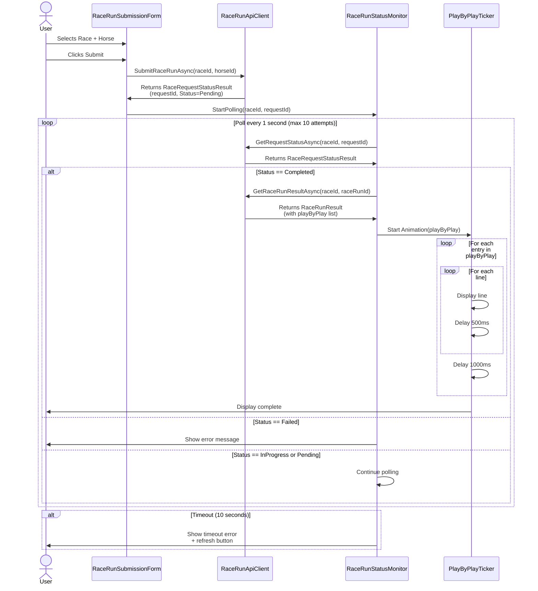

# Race Admin UI - Feature Specification

**Feature Number:** 013

**Status:** 🔄 **In Planning**

**Created:** 2025-12-30

**Depends On:** Feature 011 (Race Microservice Migration)

---

## Summary

Admin UI for managing race operations including:
- Paginated/sortable grid displaying available races
- Form to submit race runs by selecting horse and race
- Real-time status monitoring during race execution
- Animated play-by-play ticker displaying race commentary
- Error handling with auto-dismissing message notifications

This feature provides the first user interface for the Race microservice architecture, allowing administrators to submit race runs and view results with live commentary playback.

---

## Motivation

### Current State
- Race microservice (Feature 011) is functional with async request/response pattern
- No UI exists to interact with the race system
- Testing requires manual API calls via Postman/curl
- No way to visualize race results or play-by-play commentary

### Goals
1. **Admin Operations**: Enable submitting race runs for any horse/race combination
2. **Live Feedback**: Show real-time status updates during race processing
3. **Race Commentary**: Display play-by-play in an engaging, animated ticker format
4. **Reusable Components**: Build components that can be reused in future player-facing UIs
5. **Pattern Consistency**: Follow existing UI patterns (Horses.razor, Breeding.razor)

---

## Requirements

### Functional Requirements

#### FR1: Race Grid Display
- Display paginated, sortable grid of available races
- Columns: Name, Description, Furlongs, Surface, Track, Field Size (display only)
- All columns sortable except Field Size
- Uses FluentUI DataGrid component
- Auto-loads on page initialization
- Follows pagination pattern from Horses.razor

#### FR2: Race Run Submission Form
- Two FluentAutocomplete inputs:
  - **Race Selection**: Searchable autocomplete of available races
    - Display format: "Race Name (Track, Furlongs)"
    - Empty until user types
    - Debounced search using RaceApiClient
  - **Horse Selection**: Searchable autocomplete of eligible horses
    - Filter: Owner NotEquals "Breeders"
    - Display format: "Horse Name (Owner Username)"
    - Empty until user types
    - Debounced search using HorseApiClient (300ms)
- Submit button (enabled when both race and horse selected)
- Submits to: `POST /api/races/{raceId}/runs?horseId={horseId}`
- Uses `Guid.Empty` for OwnerId (admin mode)

#### FR3: Race Status Monitoring
- After submission, poll request status every 1 second
- Display current status (Pending, InProgress, Completed, Failed)
- Show spinner/loading indicator during polling
- Timeout after 10 seconds if not complete
- On completion: Immediately fetch full RaceRunResult and start ticker
- On error: Display MessageBar with error details + refresh/retry button

#### FR4: Play-by-Play Ticker Animation
- Display each PlayByPlay entry line-by-line
- Within each entry, split on ";" delimiter for line breaks
- Animation timing (Option A - line-by-line):
  - Display first line of entry
  - Pause 500ms
  - Add `<br/>` and display next line
  - Pause 500ms between lines within entry
  - Pause 1000ms between entries
- Monospace font styling
- No color coding or sound effects
- Users must wait (no skip/pause controls)
- Not scrollable (ticker grows downward)

#### FR5: Result Management
- Submitting a new race run clears previous ticker/results
- Results remain visible until next submission
- No persistence of results between page navigations

#### FR6: Error Handling
- Display errors using FluentUI MessageBar component
- Position: Bottom-middle of page
- Auto-dismiss after reasonable timeout
- Error scenarios:
  - **Submission failure**: Show error + retry button
  - **Polling timeout**: Show "Still processing" + refresh button
  - **Failed status**: Show failure reason + retry button
  - **Network errors**: Show generic error + refresh button

### Non-Functional Requirements

#### NFR1: Performance
- Race grid pagination prevents loading excessive data
- Debounced autocomplete prevents API spam (300ms delay)
- Efficient polling (1-second interval, max 10 attempts)

#### NFR2: UI/UX Consistency
- Uses FluentUI Blazor library components throughout
- Follows existing patterns from Horses.razor and Breeding.razor
- Responsive layout (works on different screen sizes)

#### NFR3: Component Reusability
- Components designed for potential reuse in player-facing UI
- Clean separation of concerns (presentation vs. API logic)

---

## Technical Approach

### Architecture

#### Page Structure
```
Races.razor (main page)
├── RaceGrid component (displays available races)
├── RaceRunSubmissionForm component
│   ├── Race FluentAutocomplete
│   ├── Horse FluentAutocomplete
│   └── Submit button
├── RaceRunStatusMonitor component
│   ├── Status display
│   └── Loading spinner
├── PlayByPlayTicker component
│   └── Animated commentary display
└── MessageBar (errors/notifications)
```

#### Component Breakdown

**1. RaceGrid Component**
- Input: None (loads data internally)
- Uses: `IRaceApiClient.SearchAsync(PaginationRequest)`
- Displays: FluentDataGrid with RacesResult items
- Pattern: Mirrors Horses.razor pagination/sorting

**2. RaceRunSubmissionForm Component**
- Inputs: None
- Outputs: `OnRaceRunSubmitted` event with `(byte raceId, Guid horseId)`
- Uses: `IRaceApiClient` for race search, `IHorseApiClient` for horse search
- Contains: Two FluentAutocomplete controls + submit button
- Validation: Button enabled only when both selections valid

**3. RaceRunStatusMonitor Component**
- Inputs: `byte raceId, Guid requestId`
- Outputs: `OnRaceComplete` event with `RaceRunResult`
- Uses: `IRaceRunApiClient.GetRequestStatusAsync()`
- Logic:
  - Polls every 1 second
  - Max 10 attempts (10 seconds)
  - On Completed: Fetches full result via `GetRaceRunResultAsync()`
  - On Failed/Timeout: Raises error event
- Display: Status text + spinner

**4. PlayByPlayTicker Component**
- Input: `List<string> playByPlay`
- Logic:
  - Iterates through each entry
  - Splits entry on ";" delimiter
  - Displays lines sequentially with delays
  - Uses `Task.Delay()` for timing
  - StateHasChanged() after each line
- Styling: Monospace font, simple layout

**5. MessageBar Integration**
- Uses FluentUI MessageBar component
- Positioned bottom-middle
- Auto-dismiss with timer
- Types: Error, Warning, Info

### API Clients

#### RaceApiClient
```csharp
public interface IRaceApiClient
{
    Task<PagedList<RacesResult>?> SearchAsync(PaginationRequest request, CancellationToken ct = default);
    Task<RaceResult?> GetByIdAsync(byte id, CancellationToken ct = default);
}
```

Pattern: Mirrors `HorseApiClient` structure
- Extends `BaseApiClient`
- Implements `IGenericApiClient` for search
- Endpoints:
  - `GET /api/races` (with query params for pagination/filtering)
  - `GET /api/races/{id}`

#### RaceRunApiClient
```csharp
public interface IRaceRunApiClient
{
    Task<RaceRequestStatusResult?> SubmitRaceRunAsync(byte raceId, Guid horseId, CancellationToken ct = default);
    Task<RaceRequestStatusResult?> GetRequestStatusAsync(byte raceId, Guid requestId, CancellationToken ct = default);
    Task<RaceRunResult?> GetRaceRunResultAsync(byte raceId, Guid runId, CancellationToken ct = default);
}
```

Pattern: Custom client for race run operations
- Extends `BaseApiClient`
- Endpoints:
  - `POST /api/races/{raceId}/runs?horseId={horseId}`
  - `GET /api/races/{raceId}/runs/requests/{requestId}`
  - `GET /api/races/{raceId}/runs/{runId}`

### Data Flow



### State Management

**Races.razor Page State**
```csharp
// Form state
RacesResult? selectedRace = null;
HorseResult? selectedHorse = null;

// Submission state
Guid? currentRequestId = null;
bool isPolling = false;

// Results state
RaceRunResult? currentResult = null;
bool showTicker = false;

// Error state
string? errorMessage = null;
bool showError = false;
```

### Timing & Animation

**Play-by-Play Animation Algorithm**
```csharp
foreach (var entry in playByPlay)
{
    var lines = entry.Split(';');
    foreach (var line in lines)
    {
        // Append line to display
        displayedText += (displayedText.Length > 0 ? "<br/>" : "") + line;
        StateHasChanged();
        await Task.Delay(500); // 500ms between lines
    }
    await Task.Delay(1000); // 1000ms between entries
}
```

**Polling Logic**
```csharp
var attempts = 0;
var maxAttempts = 10;
var pollInterval = TimeSpan.FromSeconds(1);

while (attempts < maxAttempts)
{
    var status = await GetRequestStatusAsync(raceId, requestId);

    if (status.Status == RaceRequestStatus.Completed)
    {
        // Fetch full result and break
        var result = await GetRaceRunResultAsync(raceId, status.RaceRunId.Value);
        OnRaceComplete.InvokeAsync(result);
        break;
    }
    else if (status.Status == RaceRequestStatus.Failed)
    {
        // Show error
        OnError.InvokeAsync(status.FailureReason);
        break;
    }

    await Task.Delay(pollInterval);
    attempts++;
}

if (attempts >= maxAttempts)
{
    OnTimeout.InvokeAsync();
}
```

---

## Implementation Plan

### Phase 1: API Clients & Infrastructure
**Goal**: Create API clients following existing patterns

**Tasks**:
1. Create `IRaceApiClient` interface in `ApiClients/Abstractions/`
2. Implement `RaceApiClient` extending `BaseApiClient`
   - `SearchAsync<RacesResult>()` with pagination support
   - `GetByIdAsync(byte id)` for single race
3. Create `IRaceRunApiClient` interface in `ApiClients/Abstractions/`
4. Implement `RaceRunApiClient` extending `BaseApiClient`
   - `SubmitRaceRunAsync(byte raceId, Guid horseId)`
   - `GetRequestStatusAsync(byte raceId, Guid requestId)`
   - `GetRaceRunResultAsync(byte raceId, Guid runId)`
5. Register both clients in DI container (`Program.cs`)
6. Test API clients with unit tests (optional for admin UI)

**Estimated Complexity**: Low-Medium (following existing patterns)

---

### Phase 2: Race Grid Component
**Goal**: Display paginated/sortable race grid

**Tasks**:
1. Update `Races.razor` to inject `IRaceApiClient`
2. Implement grid state (IQueryable, pagination, loading)
3. Add `RefreshItemsAsync()` method for pagination
4. Add FluentDataGrid with columns:
   - Name (sortable)
   - Description (sortable)
   - Furlongs (sortable)
   - Surface (sortable)
   - Track (sortable)
   - Field Size (display as "Min-Max", not sortable)
5. Add FluentPaginator component
6. Test grid loading, sorting, pagination

**Estimated Complexity**: Low (direct copy from Horses.razor pattern)

---

### Phase 3: Race Run Submission Form
**Goal**: Enable race/horse selection and submission

**Tasks**:
1. Add FluentAutocomplete for Race selection
   - Implement `OnRaceOptionsSearchAsync()` handler
   - Debounce search with 300ms delay
   - Display format: "Name (Track, Furlongs)"
   - Bind to `selectedRace` state
2. Add FluentAutocomplete for Horse selection
   - Implement `OnHorseOptionsSearchAsync()` handler
   - Filter: `Owner != "Breeders"`
   - Debounce search with 300ms delay
   - Display format: "Name (Owner)"
   - Bind to `selectedHorse` state
3. Add Submit button
   - Enabled when both selections valid
   - Click handler: `SubmitRaceRunAsync()`
4. Implement submission logic
   - Call `RaceRunApiClient.SubmitRaceRunAsync()`
   - Store returned `requestId`
   - Trigger status monitoring
5. Test form interactions, validation, submission

**Estimated Complexity**: Low-Medium (follows Breeding.razor pattern)

---

### Phase 4: Status Monitoring Component
**Goal**: Poll race status and handle completion

**Tasks**:
1. Create `RaceRunStatusMonitor.razor` component (or inline in page)
2. Add state: `isPolling`, `currentStatus`, `attempts`
3. Implement `StartPollingAsync(byte raceId, Guid requestId)` method
4. Polling logic:
   - Loop with 1-second delays
   - Call `GetRequestStatusAsync()`
   - Update status display
   - Handle Completed → fetch full result
   - Handle Failed → show error
   - Handle timeout → show error with refresh
5. Add spinner/loading UI (FluentProgressRing?)
6. Add status text display
7. Test polling flow, completion, timeout, errors

**Estimated Complexity**: Medium (async/timing logic)

---

### Phase 5: Play-by-Play Ticker Component
**Goal**: Animate race commentary line-by-line

**Tasks**:
1. Create `PlayByPlayTicker.razor` component
2. Add parameter: `[Parameter] public List<string> PlayByPlay { get; set; }`
3. Add state: `displayedLines` (List<string>), `isAnimating`
4. Implement `StartAnimationAsync()` method:
   - Iterate through each entry
   - Split on ";" delimiter
   - Append lines with delays (500ms within entry, 1000ms between)
   - Call `StateHasChanged()` after each line
5. Add markup: Display lines with `<br/>` separators
6. Apply monospace font styling
7. Test animation timing, line breaks, completion

**Estimated Complexity**: Medium (animation timing, state updates)

---

### Phase 6: Error Handling & MessageBar
**Goal**: Display errors with auto-dismiss notifications

**Tasks**:
1. Add FluentMessageBar component to Races.razor
2. Position at bottom-middle of page (CSS/styling)
3. Add error state: `errorMessage`, `showError`, `messageType`
4. Implement `ShowErrorAsync(string message, int autoCloseMs = 5000)`
5. Implement auto-dismiss timer
6. Add error handlers:
   - Submission failure
   - Polling timeout
   - Failed race status
   - Network errors
7. Add retry/refresh button in MessageBar content
8. Test error scenarios, auto-dismiss, retry actions

**Estimated Complexity**: Low (FluentUI component usage)

---

### Phase 7: Integration & Polish
**Goal**: Connect all components and refine UX

**Tasks**:
1. Wire up component interactions:
   - Form submission → Status monitor
   - Status completion → Ticker start
   - New submission → Clear previous results
2. Add page layout/structure:
   - Page header
   - Grid section
   - Form section
   - Status/results section
   - MessageBar at bottom
3. Add CSS styling:
   - Monospace font for ticker
   - Spacing/margins
   - Responsive layout
4. Test full end-to-end flow:
   - Load page → Grid displays
   - Select race/horse → Submit
   - Monitor status → Poll completes
   - Ticker animates → Results display
   - Submit new race → Previous clears
5. Handle edge cases:
   - Empty grid
   - No horses match filter
   - API errors
   - Slow network

**Estimated Complexity**: Medium (integration, UX refinement)

---

### Phase 8: Component Extraction (Optional)
**Goal**: Extract reusable components for future use

**Tasks**:
1. Evaluate if components should be extracted to separate files:
   - `Components/Pages/RaceGrid.razor`?
   - `Components/Ui/PlayByPlayTicker.razor`?
   - Keep in single file for now if simpler
2. If extracting, create component files and move logic
3. Update Races.razor to use child components
4. Test after refactoring

**Estimated Complexity**: Low (optional refactoring)

---

## Success Criteria

✅ **Race Grid**
- [ ] Displays all available races in paginated grid
- [ ] Sorting works on all designated columns
- [ ] Pagination controls work correctly
- [ ] Grid auto-loads on page initialization

✅ **Race Submission**
- [ ] Race autocomplete searches and displays correctly
- [ ] Horse autocomplete filters out "Breeders" owner
- [ ] Both autocompletes debounce search (no API spam)
- [ ] Submit button enabled only when both selected
- [ ] Submission successfully creates race request

✅ **Status Monitoring**
- [ ] Status polls every 1 second after submission
- [ ] Displays current status (Pending, InProgress, Completed)
- [ ] Timeout occurs after 10 seconds if not complete
- [ ] On completion, automatically fetches full result

✅ **Play-by-Play Ticker**
- [ ] Animates line-by-line with correct timing (500ms/1000ms)
- [ ] Splits on ";" delimiter for line breaks
- [ ] Uses monospace font
- [ ] Completes full playback without errors

✅ **Error Handling**
- [ ] MessageBar displays on errors
- [ ] Auto-dismisses after timeout
- [ ] Retry/refresh buttons work
- [ ] All error scenarios handled (submission, polling, status)

✅ **Flow Management**
- [ ] Submitting new race clears previous results
- [ ] Form state persists after submission (not cleared)
- [ ] No memory leaks from polling/timers

---

## Open Questions

1. **Future Enhancements**:
   - Should we add a "Stop" button to cancel ongoing race requests?
   - Should ticker support pause/play controls?
   - Should results table be added in this phase or deferred?

2. **Component Structure**:
   - Keep everything in Races.razor or extract components now?
   - Recommendation: Start monolithic, extract if reuse needed

3. **Race Run History**:
   - When to add historical race run viewing?
   - Separate page or integrated into this page?

4. **Purse Display**:
   - Race entity has Purse field, but RaceResult doesn't include it
   - Should we add Purse to the grid? (Requires API change)

---

## Notes

- This feature builds on the Race microservice (Feature 011) infrastructure
- Future player-facing UI will likely reuse components from this implementation
- Admin UI uses `Guid.Empty` for owner; player UI will use authenticated user
- FluentUI Blazor library used throughout for consistency
- Monospace font gives retro horse-racing ticker aesthetic

---

## Dependencies

**Required**:
- Feature 011: Race Microservice Migration (completed)
- FluentUI Blazor library (already installed)
- Existing API clients pattern (Horses, Breeding)

**API Endpoints** (already available):
- `GET /api/races` - List races
- `GET /api/races/{id}` - Get race details
- `POST /api/races/{raceId}/runs?horseId={horseId}` - Submit race run
- `GET /api/races/{raceId}/runs/requests/{requestId}` - Get request status
- `GET /api/races/{raceId}/runs/{runId}` - Get race run result

**New Infrastructure Needed**:
- `RaceApiClient` implementation
- `RaceRunApiClient` implementation
- DI registrations

---

## Future Considerations

1. **Race Run Details Page**: Dedicated page for viewing individual race results with full stats
2. **Race Run History Grid**: Paginated list of past race runs with filtering
3. **Player UI**: Non-admin version respecting ownership and authentication
4. **Real-time Updates**: WebSocket/SignalR instead of polling for live race updates
5. **Results Table**: Display horse placements, times, payouts after ticker completes
6. **Betting Integration**: Add betting interface before race submission
7. **Multi-Horse Submission**: Allow submitting full field at once (not just single horse)
8. **Commentary Customization**: Settings for ticker speed, auto-play, etc.

---

**End of Specification**
