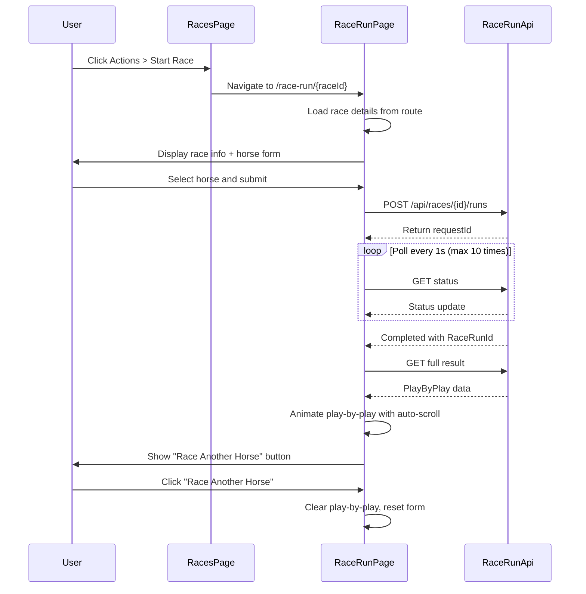

# Feature 013b: Race Run Page Redesign

## Summary
Redesign the race submission experience by separating the race grid from the race execution. The Races page becomes a grid-only view with navigation to individual race pages, where users can submit horses and watch an immersive auto-scrolling play-by-play experience.

## Requirements

### Functional Requirements
1. **Race Grid (Races.razor)**
   - Display paginated/sortable grid of races
   - Add actions menu (far right column) with "Start Race" option
   - Navigate to `/race-run/{raceId}` when action clicked

2. **Race Run Page (RaceRun.razor)**
   - Display race details at top: Name, Track, Distance (Furlongs), Surface
   - Horse selection via FluentAutocomplete (filter out "Breeders")
   - Submit button to start race
   - Status polling (1 second intervals, max 10 attempts)
   - Auto-scrolling play-by-play display
   - "Race Another Horse" button after completion

3. **Auto-Scroll Behavior**
   - Smooth scroll for single line updates (500ms timing)
   - Instant scroll for rapid updates (detect multiple pending lines)
   - Pause auto-scroll when user manually scrolls up
   - Resume auto-scroll when user scrolls within 50px of bottom

4. **Multi-Race Support**
   - Allow racing another horse on same page after completion
   - Clear play-by-play immediately when "Race Another Horse" clicked
   - Reset form state but keep race details

### Non-Functional Requirements
1. **Navigation**: Clean RESTful URLs (`/race-run/{raceId}`)
2. **Performance**: Efficient scroll position detection without performance impact
3. **UX**: Smooth transitions, responsive feedback
4. **Accessibility**: Proper ARIA labels for actions menu and scroll container

## Technical Approach

### Architecture Changes

```
┌─────────────────┐
│  Races.razor    │  Grid only, actions menu navigation
└────────┬────────┘
         │ Navigate to /race-run/{raceId}
         ▼
┌─────────────────┐
│ RaceRun.razor   │  Race details, submission, play-by-play
│  - Race header  │
│  - Horse form   │
│  - Status poll  │
│  - Auto-scroll  │
│  - Race again   │
└─────────────────┘
```

### Component Structure

**Races.razor** (Modified)
- Remove: Horse autocomplete, submit button, polling, play-by-play
- Add: Actions column with FluentUI menu
- Keep: Race grid with pagination/sorting

**RaceRun.razor** (New)
- Race details section (read from route parameter)
- Horse selection form
- Submit and status monitoring
- Auto-scrolling play-by-play container
- Race another horse functionality

### Auto-Scroll Implementation

```csharp
// Scroll container reference
ElementReference _playByPlayContainer;

// Track user scroll state
bool _userHasScrolledUp = false;
double _lastScrollTop = 0;

// Detect scroll events
private async Task OnScroll()
{
    var scrollInfo = await JS.InvokeAsync<ScrollInfo>("getScrollInfo", _playByPlayContainer);

    // Check if within 50px of bottom
    var isNearBottom = (scrollInfo.ScrollHeight - scrollInfo.ScrollTop - scrollInfo.ClientHeight) <= 50;

    _userHasScrolledUp = !isNearBottom;
}

// Auto-scroll when adding lines
private async Task AddPlayByPlayLine(string line)
{
    _playByPlayLines.Add(line);
    await InvokeAsync(StateHasChanged);

    if (!_userHasScrolledUp)
    {
        // Determine scroll behavior based on pending updates
        var behavior = _pendingLinesCount > 3 ? "instant" : "smooth";
        await JS.InvokeVoidAsync("scrollToBottom", _playByPlayContainer, behavior);
    }
}
```

### Navigation Flow



## Implementation Plan

### Phase 1: Update Races.razor
- Remove race submission form, polling, and play-by-play sections
- Add TemplateColumn with FluentUI MenuButton for actions
- Implement navigation to `/race-run/{raceId}` on action click
- Test grid-only functionality

### Phase 2: Create RaceRun.razor Structure
- Create new page with `@page "/race-run/{RaceId:int}"` route
- Inject NavigationManager and RaceApiClient
- Load race details from route parameter in OnInitializedAsync
- Display race information header (Name, Track, Furlongs, Surface)

### Phase 3: Implement Race Submission Form
- Add Horse autocomplete (filter Owner != "Breeders")
- Add Submit button with validation
- Implement SubmitRaceRunAsync with status polling
- Display status spinner during polling

### Phase 4: Build Auto-Scrolling Play-by-Play
- Create scrollable container with ElementReference
- Implement JavaScript interop for scroll detection and scrollToBottom
- Add OnScroll event handler to track user scroll position
- Implement scroll pause/resume logic (50px threshold)

### Phase 5: Add Play-by-Play Animation
- Port AnimatePlayByPlayAsync logic from current implementation
- Integrate auto-scroll behavior with line animation
- Implement adaptive scroll (smooth vs instant based on update rate)
- Test scroll pause when user reviews earlier commentary

### Phase 6: Implement "Race Another Horse"
- Add "Race Another Horse" button (hidden until race complete)
- Implement clear functionality: reset play-by-play, clear selections, reset state
- Keep race details loaded (no re-navigation needed)
- Test multiple race submissions in sequence

### Phase 7: Polish and Error Handling
- Add error MessageBar for submission/polling failures
- Handle edge cases (invalid race ID, horse not found, etc.)
- Add loading states and skeleton UI
- Test navigation back to grid and to other races

### Phase 8: JavaScript Interop Utilities
- Create wwwroot/js/racerun.js with scroll utilities
- Implement getScrollInfo function
- Implement scrollToBottom function with behavior parameter
- Register script in App.razor or _Host.cshtml

## Success Criteria

1. ✅ Race grid displays with actions menu in rightmost column
2. ✅ Clicking "Start Race" navigates to `/race-run/{raceId}` with race details
3. ✅ Race Run page displays correct race information from route
4. ✅ Horse selection and submission works identically to current implementation
5. ✅ Play-by-play auto-scrolls smoothly as lines appear
6. ✅ Auto-scroll pauses when user scrolls up, resumes when near bottom
7. ✅ "Race Another Horse" clears play-by-play and resets form immediately
8. ✅ Multiple races can be run in sequence without re-navigation
9. ✅ Error handling works for all failure scenarios
10. ✅ Navigation between pages is smooth and intuitive

## Open Questions

None - all requirements clarified through discovery questions.

## Technical Debt / Future Enhancements

1. Consider adding race history section showing previous runs
2. Could add social features (share race results, leaderboards)
3. Potential to extract auto-scroll play-by-play as reusable component
4. Could add race scheduling/queuing for multiple horses
5. Consider adding race filters/search on grid page

## Files to Modify

### Modified
- `TripleDerby.Web/Components/Pages/Races.razor` - Strip down to grid only, add actions menu
- `TripleDerby.Web/Components/App.razor` - Register JavaScript interop if needed

### Created
- `TripleDerby.Web/Components/Pages/RaceRun.razor` - New race execution page
- `TripleDerby.Web/wwwroot/js/racerun.js` - Scroll utilities for auto-scroll behavior

### No Changes Needed
- All API clients already implemented
- RaceService and backend already support required operations
