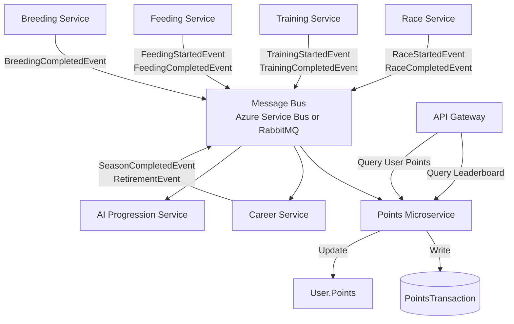

# Feature 024: Season Career Progression System

**Status**: Discovery Complete
**Created**: 2026-01-22
**Updated**: 2026-01-22

---

## Overview

Implement a structured career progression system for horses that guides gameplay through seasons and races, creating an engaging game loop similar to Angry Birds' map progression. Horses progress through up to 5 seasons, each containing 10 pre-defined races, with optional training and feeding between races. Players earn points for a leaderboard based on race performance, season completion, and horse care, while horses earn money to pay for their expenses. The system uses an **event-driven microservice architecture** where a dedicated Points Service awards points based on events from Race, Training, Feeding, and Career services.

## Goals

1. **Clear Progression Path**: Structured career journey from novice (Season 1) to peak form (Season 3) to retirement
2. **Engaging Game Loop**: Race → Train (optional) → Feed (optional) → Next Race rhythm
3. **Player Economy**: Dual currency system (horse earnings for expenses, player points for leaderboard)
4. **Natural Lifecycle**: Horses mature through Season 3 (peak), then decline in Seasons 4-5, encouraging strategic retirement
5. **Performance-Based Gameplay**: Players judge horses by race results, not numeric stats (stats are hidden)
6. **Winner-Focused Rewards**: Winning races awards significantly more points than participation
7. **Event-Driven Architecture**: Points microservice consumes events from all game systems
8. **AI Progression**: AI horses (owned by "Racers" user) progress automatically via event triggers

---

## Existing Foundation

### Current System
- **Horse** entity tracks: Earnings, RaceStarts/Wins/Place/Show, IsRetired
- **Horse** has flags: `HasTrainedSinceLastRace`, `HasFedSinceLastRace`
- **Training System** (Feature 020): Improves stats, costs money, once per race
- **Feeding System** (Feature 022): Improves happiness, costs money, once per race
- **Race** entity has: RaceClass (difficulty tiers), Purse, Track, Surface
- **RaceRun** tracks: Winners, Purse distribution
- **User** entity: Basic identity (Username, Email) - no economy yet
- **"Racers" user** (ID: `72115894-88CD-433E-9892-CAC22E335F1D`): Owns all AI opponent horses
- **Microservices Architecture** (Feature 023): Azure Service Bus or RabbitMQ (configurable) for async messaging

### What Needs Implementation
- **Season structure**: 5 seasons with 10 races each, pre-defined sequences
- **Career tracking**: HorseCareer entity tracks current season, race position, next action
- **Career events**: Explicit audit log of all career transitions
- **User points**: Leaderboard currency separate from horse earnings
- **Points microservice**: Event-driven service that awards points based on game events
- **Stat decline**: Horses lose 5% stats in Season 4, 10% in Season 5
- **Retirement mechanics**: Player choice or forced at Season 5
- **AI auto-progression**: Event-driven AI horse management

---

## Requirements

### Functional Requirements

#### FR-1: Season Structure
- Each horse has a career spanning up to **5 seasons**
- Each season contains exactly **10 races** in a pre-defined sequence
- Season progression:
  - **Season 1** (Learning): Maiden and claiming races, building experience
  - **Season 2** (Maturing): Allowance and stakes races, proving ability
  - **Season 3** (Peak Form): Graded and championship races, peak stats
  - **Season 4** (Aging): Stats decline by 5%, high-level competition
  - **Season 5** (Veteran): Stats decline by 10%, final championship attempts
- Races are pre-defined via `SeasonTemplate` entity
- All horses follow the same race sequence (consistent experience)
- Instant transition between seasons (no special events or delays)

#### FR-2: Career Progression Loop
The core game loop follows this sequence:
1. **Race N**: Horse competes in race, earns money from purse
2. **Training Option**: Player can train (costs money, improves stats) or skip
3. **Feeding Option**: Player can feed (costs money, improves happiness) or skip
4. **Race N+1**: Next race becomes available
5. Repeat for 10 races
6. **Season Complete**: After Race 10, instantly advance to next season
7. Continue until retirement

**Lazy Career Creation**: `HorseCareer` record is created when player first enters a race (not at horse birth).

#### FR-3: Retirement Mechanics

**Voluntary Retirement** (Player Choice):
- Players can retire a horse at any time via "Retire Horse" button
- **Confirmation required**: Popup shows career summary and warning that retirement is permanent
- **Career highlights**: Display race record, earnings, points generated, notable achievements
- **Retirement bonuses**:
  - Season 1-2: +50 points (early retirement)
  - Season 3: +200 points (optimal timing - horse at peak stats for breeding)
  - Season 4-5: +100 points (veteran bonus)
- **End-of-Season 3 prompt**: System suggests retirement with bonus message and warns about stat decline

**Forced Retirement** (System):
- Automatic after completing Season 5, Race 10
- No bonus points (already received Season 5 completion bonus)
- Sets `HorseCareer.Status = Completed`

**Stat Decline in Veteran Seasons**:
- **Season 4**: All stats multiplied by 0.95 (5% decline)
- **Season 5**: All stats multiplied by 0.90 (10% decline)
- Decline affects both base stats and trained stats
- Creates strategic pressure to retire at Season 3 for:
  - +200 retirement bonus points
  - Maximum breeding genetics (no stat decline)
  - Optimal point-per-race efficiency

**Retired Horse Capabilities**:
- ✅ Can be used for breeding (Sire or Dam) **by the owner only**
- ✅ Appear in "Retired Stable" UI
- ✅ View career history, stats, race record
- ❌ Cannot enter races
- ❌ Cannot train or feed
- ❌ Cannot un-retire (permanent decision)
- ❌ Cannot be bred by other players (only owner can use their retired horses)

**Retirement sets**:
- `Horse.IsRetired = true`
- `HorseCareer.Status = Retired` (or `Completed` if forced)
- `HorseCareer.RetiredDate = now`

#### FR-4: Dual Currency System

**Horse Earnings (Money)**:
- Horses earn money from race purses (existing `Horse.Earnings`)
- Money used to pay for training and feeding
- Each horse manages its own finances
- Insufficient funds prevents training/feeding

**Player Points (Leaderboard)**:
- Users earn points across all their horses (new `User.Points`)
- Points determine leaderboard ranking
- **Winner-focused**: Winning awards 10x more points than last place
- Points awarded for:

| Event | Points | Notes |
|-------|--------|-------|
| **Race Participation** | +10 | Starting a race |
| **1st Place** | +150 | Bonus on top of participation (160 total) |
| **2nd Place** | +75 | Bonus on top of participation (85 total) |
| **3rd Place** | +40 | Bonus on top of participation (50 total) |
| **4th Place** | +20 | Bonus on top of participation (30 total) |
| **5th Place** | +10 | Bonus on top of participation (20 total) |
| **6th-12th Place** | +5 | Bonus on top of participation (15 total) |
| **Complete Season 1** | +200 | Milestone bonus |
| **Complete Season 2** | +300 | Milestone bonus |
| **Complete Season 3** | +500 | Peak achievement |
| **Complete Season 4** | +400 | Veteran milestone |
| **Complete Season 5** | +600 | Career completion |
| **Start Training** | +5 | Starting a training session |
| **Complete Training** | +5 | Completing a training session (10 total) |
| **Start Feeding** | +5 | Starting a feeding session |
| **Complete Feeding** | +5 | Completing a feeding session (10 total) |
| **Breeding Attempt** | +25 | Engagement reward |
| **High-Stat Foal** | +25 to +150 | Based on offspring quality |
| **Retire Season 3** | +200 | Optimal retirement bonus |
| **Retire Season 4-5** | +100 | Veteran retirement bonus |
| **Retire Season 1-2** | +50 | Early retirement consolation |
| **First Win Ever** | +100 | One-time achievement |
| **First Season Complete** | +100 | One-time achievement |
| **First Breeding** | +50 | One-time achievement |
| **First Retirement** | +50 | One-time achievement |
| **Stable of 5 Horses** | +100 | One-time achievement |
| **Stable of 10 Horses** | +200 | One-time achievement |

**Future Point Sources** (documented for extensibility):
- Daily login: +5
- Weekly streak (7 days): +50
- Monthly streak (30 days): +200
- Daily challenge: +100
- Weekly challenge: +200
- Special event: +500

**Points Rules**:
- Points are never lost (no negative transactions)
- All point events logged in `PointsTransaction` table
- `User.Points` maintained as running total (no SUM queries needed)
- AI horses (owned by "Racers" user) do NOT earn points

#### FR-5: AI Horse Career Management

**AI Horse Ownership**:
- All AI opponent horses owned by "Racers" user (existing)
- AI horses follow same season progression as player horses
- AI horses have `HorseCareer` records like player horses

**AI Progression: Event-Driven** ✅
- When a race completes, RaceService publishes `RaceCompletedEvent`
- Event handler processes ALL horses in the race:
  - **Player horses**: Advance to `TrainingOption` (player decides what to do)
  - **AI horses**: Auto-progress with random decisions

**AI Decision Logic**:
```
After race completes:
1. Advance AI horse to TrainingOption
2. Randomly decide: Train (60% S1, 50% S2, 40% S3, 30% S4-5) or Skip
3. If Train: Execute training (any type, random selection)
4. Advance to FeedingOption
5. Randomly decide: Feed (50% S1, 40% S2, 30% S3, 25% S4-5) or Skip
6. If Feed: Execute feeding (any type, random selection)
7. Advance to next race
```

**AI Budget**: Unlimited ✅
- AI horses never check earnings before training/feeding
- Training/feeding costs deducted but never blocks action
- AI horses accumulate earnings (for realism) but never run out

**AI Points**: Skipped ✅
- PointsService checks if `UserId == RACERS_USER_ID` and skips transactions
- Racers user never appears on leaderboard
- Only player users earn points

**AI Retirement Strategy**:
- Forced retirement after Season 5 (same as players)
- Random retirement after Season 3: 60% chance (encourages turnover)
- Random retirement after Season 4: 40% chance
- Silent retirement (no confirmation, no highlights screen)

**AI Pool Management**:
- Target: 80 AI horses in Season 1, 40 in Season 2, 30 in Season 3, 10 in Season 4-5
- Replenish Season 1 pool via breeding when count drops below target
- Use retired AI horses as breeding stock for new generation

**AI Matchmaking**:
- When player enters race, find AI horses at same (Season, Race) position
- Select random opponents to fill race field (MinFieldSize to MaxFieldSize)
- If insufficient AI horses available, generate temporary opponents on-demand

#### FR-6: Performance-Based Gameplay (Hidden Stats)

**What Players CAN See**:
- Horse name, color, leg type
- Race record (Starts/Wins/Place/Show)
- Total earnings
- Career season/race position
- Race finish positions (results)
- Training/feeding history (dates, types)

**What Players CANNOT See**:
- ❌ Speed/Stamina/Agility/Durability/Happiness **numeric values**
- ❌ NOT for their own horses
- ❌ NOT for AI opponent horses
- ❌ NOT for any horses in the game

**Design Rationale**:
- Players judge horse quality by **performance, not numbers**
- Emphasizes racing results over spreadsheet optimization
- Creates suspense: "Did that training make my horse faster?"
- Encourages experimentation with training/feeding
- Breeding focuses on lineage and race records, not min-maxing stats

#### FR-7: Career Event Logging

All career transitions logged in `CareerEvent` table:
- Career start
- Race completion → Training option
- Training completion/skip → Feeding option
- Feeding completion/skip → Next race
- Season transitions
- Retirement (voluntary or forced)

**Benefits**:
- Full audit trail for debugging
- Timeline reconstruction for UI
- Analytics: player behavior patterns
- Career history queries

#### FR-8: Event-Driven Microservice Architecture

**Points Service** (NEW):
- Dedicated microservice for point awarding and leaderboard
- Subscribes to events from all game systems via **Azure Service Bus or RabbitMQ** (configurable per Feature 023)
- Consumes events, awards points, maintains User.Points total
- Idempotent event processing (uses EventId to prevent duplicates)

**Event Flow**:


**Event Types Consumed by Points Service**:

```csharp
// Race events
public class RaceStartedEvent
{
    public Guid RaceRunId { get; set; }
    public Guid HorseId { get; set; }
    public Guid UserId { get; set; }
}

public class RaceCompletedEvent
{
    public Guid RaceRunId { get; set; }
    public Guid HorseId { get; set; }
    public Guid UserId { get; set; }
    public int FinishPosition { get; set; }
    public int TotalHorses { get; set; }
}

// Training events
public class TrainingStartedEvent
{
    public Guid TrainingSessionId { get; set; }
    public Guid HorseId { get; set; }
    public Guid UserId { get; set; }
}

public class TrainingCompletedEvent
{
    public Guid TrainingSessionId { get; set; }
    public Guid HorseId { get; set; }
    public Guid UserId { get; set; }
}

// Feeding events
public class FeedingStartedEvent
{
    public Guid FeedingSessionId { get; set; }
    public Guid HorseId { get; set; }
    public Guid UserId { get; set; }
}

public class FeedingCompletedEvent
{
    public Guid FeedingSessionId { get; set; }
    public Guid HorseId { get; set; }
    public Guid UserId { get; set; }
}

// Career events
public class SeasonCompletedEvent
{
    public Guid HorseId { get; set; }
    public Guid UserId { get; set; }
    public int SeasonNumber { get; set; }
}

public class HorseRetiredEvent
{
    public Guid HorseId { get; set; }
    public Guid UserId { get; set; }
    public int FinalSeasonNumber { get; set; }
    public bool Voluntary { get; set; }
}

// Breeding events
public class BreedingCompletedEvent
{
    public Guid BreedingSessionId { get; set; }
    public Guid ParentUserId { get; set; }
    public Guid FoalId { get; set; }
    public int FoalStatTotal { get; set; }
}

// Achievement events (future)
public class AchievementUnlockedEvent
{
    public Guid UserId { get; set; }
    public string AchievementId { get; set; }
}
```

**Points Service Responsibilities**:
1. Subscribe to all point-earning events (RaceStarted, RaceCompleted, TrainingStarted, TrainingCompleted, FeedingStarted, FeedingCompleted, etc.)
2. Determine points awarded based on event type and data
3. Check if UserId == RACERS_USER_ID and skip if AI
4. Check for duplicate events using EventId (idempotency)
5. Insert PointsTransaction record
6. Update User.Points running total (atomic transaction)
7. Provide leaderboard and point history queries via API endpoints

### Non-Functional Requirements

#### NFR-1: Performance
- Career state transitions: < 10ms
- Points event processing: < 50ms per event
- Leaderboard query (top 100): < 200ms
- Career history query: < 500ms

#### NFR-2: Scalability
- Support 10,000+ active horses with careers
- Support 100,000+ users on leaderboard
- Points Service scales independently via multiple consumers
- Efficient queries for matchmaking (AI horses at same season/race)

#### NFR-3: Data Integrity
- Career progression is atomic (state changes succeed or rollback)
- Points transactions are append-only (no updates/deletes)
- User.Points always matches SUM(PointsTransaction.Points)
- Idempotent event processing (duplicate events ignored)

#### NFR-4: Reliability
- Event processing failures retry automatically (Azure Service Bus or RabbitMQ)
- Dead letter queue for permanently failed events
- Career state machine validates all transitions
- Cannot skip steps in progression sequence
- All event-driven operations use messaging (no direct service calls between microservices)

---

## Technical Analysis

### Affected Systems

**New Microservice**:
- **TripleDerby.Services.Points**: Dedicated points/leaderboard microservice

**Entities** (New):
- `HorseCareer`: Tracks current season, race, next action
- `CareerEvent`: Audit log of all career transitions
- `SeasonTemplate`: Pre-defined race sequences (50 records)
- `PointsTransaction`: Event-sourced point awards

**Entities** (Updated):
- `User`: Add `Points` field (running total)

**Services** (New):
- `CareerService`: Manages progression, state transitions, retirement
- `PointsService`: Awards points, maintains leaderboard

**Services** (Updated):
- `RaceService`: Publish events, trigger career progression, handle AI auto-progress
- `TrainingService`: Publish events, integrate with career advancement
- `FeedingService`: Publish events, integrate with career advancement
- `BreedingService`: Publish events for breeding success points

**Data Layer**:
- New migrations for HorseCareer, CareerEvent, SeasonTemplate, PointsTransaction
- Update User table (add Points column and index)
- Seed 50 SeasonTemplate records

**API Endpoints** (New):
- `CareerController`: Career management and queries
- `PointsController`: Leaderboard and point history (or part of PointsService API)

---

## Data Model

### Core Entities

#### User (Updated)
```csharp
public class User
{
    public Guid Id { get; set; }
    public string Username { get; set; } = null!;
    public string Email { get; set; } = null!;
    public int Points { get; set; } = 0; // NEW: Running total
    public bool IsActive { get; set; }
    public bool IsAdmin { get; set; }

    public virtual ICollection<Horse> Horses { get; set; }
    public virtual ICollection<PointsTransaction> PointsTransactions { get; set; }
}
```

#### HorseCareer (NEW)
```csharp
public class HorseCareer
{
    [Key]
    public Guid HorseId { get; set; } // PK and FK (one-to-one)

    public byte CurrentSeasonNumber { get; set; } // 1-5
    public byte CurrentRaceOrder { get; set; } // 1-10
    public CareerStepType CurrentStepType { get; set; }
    public CareerStatus Status { get; set; }

    public DateTimeOffset CreatedDate { get; set; }
    public DateTimeOffset UpdatedDate { get; set; }
    public DateTimeOffset? RetiredDate { get; set; }

    public virtual Horse Horse { get; set; } = null!;
    public virtual ICollection<CareerEvent> Events { get; set; }
}
```

**Constraints**:
- Check: `CurrentSeasonNumber BETWEEN 1 AND 5`
- Check: `CurrentRaceOrder BETWEEN 1 AND 10`

**Indexes**:
- `IX_HorseCareer_Status` on `Status`
- `IX_HorseCareer_Season_Race` on `(CurrentSeasonNumber, CurrentRaceOrder)`
- `IX_HorseCareer_Owner_Status` on `(Horse.OwnerId, Status)` via foreign key

#### CareerEvent (NEW)
```csharp
public class CareerEvent
{
    [Key]
    public Guid Id { get; set; }

    public Guid HorseId { get; set; }
    public CareerEventType EventType { get; set; }

    public byte SeasonNumber { get; set; } // 1-5
    public byte RaceOrder { get; set; } // 1-10
    public CareerStepType FromStep { get; set; }
    public CareerStepType ToStep { get; set; }

    public Guid? RaceRunId { get; set; }
    public Guid? TrainingSessionId { get; set; }
    public Guid? FeedingSessionId { get; set; }

    public DateTimeOffset CreatedDate { get; set; }

    public virtual Horse Horse { get; set; } = null!;
}
```

**Indexes**:
- `IX_CareerEvent_Horse_Date` on `(HorseId, CreatedDate DESC)`

#### SeasonTemplate (NEW)
```csharp
public class SeasonTemplate
{
    [Key]
    public int Id { get; set; }

    public byte SeasonNumber { get; set; } // 1-5
    public byte RaceOrder { get; set; } // 1-10
    public byte RaceId { get; set; }
    public string? Description { get; set; }

    public virtual Race Race { get; set; } = null!;
}
```

**Constraints**:
- Unique: `(SeasonNumber, RaceOrder)`

**Indexes**:
- `IX_SeasonTemplate_Lookup` on `(SeasonNumber, RaceOrder)` (clustered)

#### PointsTransaction (NEW)
```csharp
public class PointsTransaction
{
    [Key]
    public Guid Id { get; set; }

    public Guid UserId { get; set; }
    public Guid? HorseId { get; set; }
    public int Points { get; set; } // Always > 0
    public PointsReasonType Reason { get; set; }

    // Event sourcing
    public string EventId { get; set; } = null!; // Idempotency key
    public string EventType { get; set; } = null!;

    public Guid? RelatedEntityId { get; set; }
    public DateTimeOffset CreatedDate { get; set; }

    public virtual User User { get; set; } = null!;
    public virtual Horse? Horse { get; set; }
}
```

**Constraints**:
- Check: `Points > 0`
- Unique: `EventId` (idempotency)

**Indexes**:
- `UQ_PointsTransaction_EventId` unique on `EventId`
- `IX_PointsTransaction_User` on `(UserId, CreatedDate DESC)`
- `IX_PointsTransaction_Horse` on `HorseId`

### Enums

#### CareerStepType
```csharp
public enum CareerStepType
{
    Race = 1,
    TrainingOption = 2,
    FeedingOption = 3
}
```

#### CareerStatus
```csharp
public enum CareerStatus
{
    Active = 1,
    Retired = 2,
    Completed = 3 // Forced retirement after Season 5
}
```

#### CareerEventType
```csharp
public enum CareerEventType
{
    CareerStarted = 1,

    RaceCompleted = 10,
    AdvancedToTraining = 11,

    TrainingCompleted = 20,
    TrainingSkipped = 21,
    AdvancedToFeeding = 22,

    FeedingCompleted = 30,
    FeedingSkipped = 31,
    AdvancedToNextRace = 32,

    SeasonCompleted = 40,
    AdvancedToNextSeason = 41,

    RetiredVoluntary = 50,
    RetiredForced = 51
}
```

#### PointsReasonType
```csharp
public enum PointsReasonType
{
    // Race
    RaceStarted = 1,
    RaceWin = 2,
    RacePlace = 3,
    RaceShow = 4,
    RaceFinish = 5,

    // Career
    SeasonCompleted = 10,

    // Horse care
    TrainingStarted = 20,
    TrainingCompleted = 21,
    FeedingStarted = 22,
    FeedingCompleted = 23,

    // Breeding
    BreedingAttempt = 30,
    BreedingSuccess = 31,

    // Retirement
    EarlyRetirement = 40,
    OptimalRetirement = 41,
    VeteranRetirement = 42,

    // Achievements
    FirstWin = 50,
    FirstSeasonComplete = 51,
    FirstBreeding = 52,
    FirstRetirement = 53,
    StableSize5 = 54,
    StableSize10 = 55,

    // Engagement (future)
    DailyLogin = 100,
    WeeklyStreak = 101,
    MonthlyStreak = 102,

    // Challenges (future)
    DailyChallengeCompleted = 200,
    WeeklyChallengeCompleted = 201,
    SpecialEventCompleted = 202
}
```

### Entity Relationships

```mermaid
erDiagram
    User ||--o{ Horse : owns
    User ||--o{ PointsTransaction : earns
    User {
        Guid Id PK
        string Username
        string Email
        int Points
    }

    Horse ||--|| HorseCareer : has
    Horse ||--o{ CareerEvent : generates
    Horse ||--o{ PointsTransaction : generates
    Horse {
        Guid Id PK
        Guid OwnerId FK
        bool IsRetired
        int Earnings
    }

    HorseCareer {
        Guid HorseId PK_FK
        int CurrentSeasonNumber
        int CurrentRaceOrder
        CareerStepType CurrentStepType
        CareerStatus Status
    }

    CareerEvent {
        Guid Id PK
        Guid HorseId FK
        CareerEventType EventType
        int SeasonNumber
        int RaceOrder
    }

    SeasonTemplate ||--|| Race : defines
    SeasonTemplate {
        int Id PK
        int SeasonNumber
        int RaceOrder
        byte RaceId FK
    }

    PointsTransaction {
        Guid Id PK
        Guid UserId FK
        Guid HorseId FK
        int Points
        string EventId
    }
```

---

## Season Templates

### Progression Design Philosophy

- **Season 1**: Maiden/Maiden Claiming → Claiming (learning, building experience)
- **Season 2**: Claiming → Allowance (5 races) → Stakes (maturing, proving ability)
- **Season 3**: Stakes → Grade III → Elite Stakes → Championships (peak performance)
- **Seasons 4-5**: Repeat Season 3 structure with declining stats (veteran phase)

**Distance Variety**: 32% sprints (≤7F), 68% routes (8F+)
**Surface Variety**: 28% turf, 72% dirt/artificial

### Season 1: Learning Phase

| Order | Race ID | Race Name | Class | Dist | Surf | Purse |
|-------|---------|-----------|-------|------|------|-------|
| 1 | 20 | Brightline Newcomer Sprint | Maiden | 5F | Dirt | $20K |
| 2 | 22 | Dockside First Bid | Maiden Claiming | 5F | Dirt | $18K |
| 3 | 18 | Keystone First Flight | Maiden | 6F | Dirt | $20K |
| 4 | 21 | Greenway First Mile | Maiden | 8F | Turf | $20K |
| 5 | 19 | Copperfield Debut | Maiden | 7F | Dirt | $20K |
| 6 | 23 | Ironworks Opening Offer | Maiden Claiming | 5.5F | Dirt | $18K |
| 7 | 15 | Ironworks Sale Dash | Claiming | 6F | Dirt | $25K |
| 8 | 17 | Spires Turf Exchange | Claiming | 7.5F | Turf | $25K |
| 9 | 14 | Dockside Open Market Sprint | Claiming | 6.5F | Dirt | $25K |
| 10 | 16 | Seabreeze Open Market Route | Claiming | 8.5F | Dirt | $25K |

**Turf**: 20% (2/10)

### Season 2: Maturing Phase

| Order | Race ID | Race Name | Class | Dist | Surf | Purse |
|-------|---------|-----------|-------|------|------|-------|
| 1 | 16 | Seabreeze Open Market Route | Claiming | 8.5F | Dirt | $25K |
| 2 | 11 | Northbridge Silver Series | Allowance | 8.5F | Dirt | $40K |
| 3 | 12 | Verdant Park Green Ribbon | Allowance | 8F | Turf | $40K |
| 4 | 13 | Founders Select | Allowance Optional | 10F | Dirt | $50K |
| 5 | 11 | Northbridge Silver Series | Allowance | 8.5F | Dirt | $40K |
| 6 | 12 | Verdant Park Green Ribbon | Allowance | 8F | Turf | $40K |
| 7 | 9 | Spirelight Sprint | Stakes | 6F | Dirt | $100K |
| 8 | 10 | Horizon Mile | Stakes | 8F | Turf | $100K |
| 9 | 8 | Apex Memorial Stakes | Stakes | 9F | Dirt | $100K |
| 10 | 10 | Horizon Mile | Stakes | 8F | Turf | $100K |

**Turf**: 40% (4/10)

### Season 3: Peak Performance (Stats at 100%)

| Order | Race ID | Race Name | Class | Dist | Surf | Purse |
|-------|---------|-----------|-------|------|------|-------|
| 1 | 9 | Spirelight Sprint | Stakes | 6F | Dirt | $100K |
| 2 | 8 | Apex Memorial Stakes | Stakes | 9F | Dirt | $100K |
| 3 | 7 | Silverline Turf Mile | Grade III | 8F | Turf | $200K |
| 4 | 5 | Cobalt Ridge Handicap | Grade III | 8F | Dirt | $200K |
| 5 | 6 | Blue Lantern Derby Trial | Elite Stakes | 9F | Dirt | $500K |
| 6 | 4 | Sunflower River Invitational | Elite Stakes | 9.5F | Dirt | $500K |
| 7 | 27 | Pimento Sprint Championship | Championship | 6F | Dirt | $1M |
| 8 | 3 | Emerald Classic | Championship | 10F | Turf | $1M |
| 9 | 2 | Belle Meade Cup | Championship | 12F | Dirt | $1.1M |
| 10 | 1 | Triple Derby | Championship | 10F | Dirt | $1.5M |

**Turf**: 20% (2/10)

**Player Prompt**: After Race 10, system suggests retirement for +200 bonus and warns about stat decline.

### Season 4: Aging Phase (Stats at 95%)

| Order | Race ID | Race Name | Class | Dist | Surf | Purse |
|-------|---------|-----------|-------|------|------|-------|
| 1 | 8 | Apex Memorial Stakes | Stakes | 9F | Dirt | $100K |
| 2 | 10 | Horizon Mile | Stakes | 8F | Turf | $100K |
| 3 | 5 | Cobalt Ridge Handicap | Grade III | 8F | Dirt | $200K |
| 4 | 7 | Silverline Turf Mile | Grade III | 8F | Turf | $200K |
| 5 | 4 | Sunflower River Invitational | Elite Stakes | 9.5F | Dirt | $500K |
| 6 | 6 | Blue Lantern Derby Trial | Elite Stakes | 9F | Dirt | $500K |
| 7 | 29 | Golden Gate Derby | Championship | 10F | Dirt | $1M |
| 8 | 3 | Emerald Classic | Championship | 10F | Turf | $1M |
| 9 | 28 | Emerald Turf Cup | Championship | 12F | Turf | $1.1M |
| 10 | 1 | Triple Derby | Championship | 10F | Dirt | $1.5M |

**Turf**: 40% (4/10)

**Stats**: All stats × 0.95 (5% decline due to aging)

### Season 5: Veteran Phase (Stats at 90%)

| Order | Race ID | Race Name | Class | Dist | Surf | Purse |
|-------|---------|-----------|-------|------|------|-------|
| 1 | 9 | Spirelight Sprint | Stakes | 6F | Dirt | $100K |
| 2 | 10 | Horizon Mile | Stakes | 8F | Turf | $100K |
| 3 | 8 | Apex Memorial Stakes | Stakes | 9F | Dirt | $100K |
| 4 | 5 | Cobalt Ridge Handicap | Grade III | 8F | Dirt | $200K |
| 5 | 7 | Silverline Turf Mile | Grade III | 8F | Turf | $200K |
| 6 | 25 | Spires Juvenile Championship | Championship | 8.5F | Dirt | $1M |
| 7 | 30 | Founders Oaks | Championship | 9F | Dirt | $1M |
| 8 | 26 | Belle Meade Marathon Championship | Championship | 14F | Dirt | $1.2M |
| 9 | 2 | Belle Meade Cup | Championship | 12F | Dirt | $1.1M |
| 10 | 1 | Triple Derby | Championship | 10F | Dirt | $1.5M |

**Turf**: 20% (2/10)

**Stats**: All stats × 0.90 (10% decline due to aging)

**After Race 10**: Forced retirement, `Status = Completed`

### Career Summary

**Race Class Distribution** (50 races):
- Maiden/Maiden Claiming: 13 races (26%)
- Claiming: 5 races (10%)
- Allowance: 7 races (14%)
- Stakes: 10 races (20%)
- Grade III: 5 races (10%)
- Elite Stakes: 4 races (8%)
- Championship: 6 races (12%)

**Total Potential Earnings** (if horse wins all 50 races):
- Season 1: ~$225K
- Season 2: ~$525K
- Season 3: ~$6M
- Season 4: ~$5.6M
- Season 5: ~$5.7M
- **Career Total**: ~$18M

---

## Implementation Phases

### Phase 1: Core Career Entities & Migrations
**Goal**: Establish data model

- [ ] Create `HorseCareer` entity and configuration
- [ ] Create `CareerEvent` entity and configuration
- [ ] Create `SeasonTemplate` entity and configuration
- [ ] Create `PointsTransaction` entity and configuration
- [ ] Add `Points` field to `User` entity
- [ ] Create enums: `CareerStepType`, `CareerStatus`, `CareerEventType`, `PointsReasonType`
- [ ] Configure EF Core relationships and indexes
- [ ] Create migration (drop/recreate strategy)
- [ ] Seed 50 `SeasonTemplate` records (all 5 seasons)

### Phase 2: Career Service (Business Logic)
**Goal**: Implement career progression state machine

- [ ] Create `ICareerService` interface
- [ ] Implement `StartCareerAsync(horseId)` - lazy creation on first race entry
- [ ] Implement `GetCareerAsync(horseId)` - query career state
- [ ] Implement `GetCurrentRaceAsync(horseId)` - lookup SeasonTemplate
- [ ] Implement `AdvanceToTrainingAsync(horseId)` - after race completes
- [ ] Implement `AdvanceToFeedingAsync(horseId)` - after training/skip
- [ ] Implement `AdvanceToNextRaceAsync(horseId)` - after feeding/skip, handle season transitions
- [ ] Implement `RetireHorseAsync(horseId, voluntary)` - retirement with bonuses
- [ ] Implement `ApplyStatDecline(horse, seasonNumber)` - multiply stats by 0.95 or 0.90
- [ ] Add state transition validation (cannot skip steps)
- [ ] Log all transitions to `CareerEvent` table

### Phase 3: Points Microservice (Event-Driven)
**Goal**: Award points based on game events

- [ ] Create `TripleDerby.Services.Points` project
- [ ] Create `IPointsService` interface
- [ ] Implement `AwardPointsAsync(userId, horseId, points, reason, eventId, relatedEntityId)`
- [ ] Check if `UserId == RACERS_USER_ID` and skip
- [ ] Check for duplicate `EventId` (idempotency)
- [ ] Insert `PointsTransaction` record
- [ ] Update `User.Points` atomically (transaction)
- [ ] Implement `GetLeaderboardAsync(top)` - query top N users by points
- [ ] Implement `GetUserPointsAsync(userId)` - return total and history
- [ ] Configure message bus subscriptions (Azure Service Bus or RabbitMQ) for all point events
- [ ] Implement event handlers for:
  - `RaceStartedEvent` → +10 points (starting race)
  - `RaceCompletedEvent` → +5 to +150 points based on position
  - `TrainingStartedEvent` → +5 points (starting training)
  - `TrainingCompletedEvent` → +5 points (completing training)
  - `FeedingStartedEvent` → +5 points (starting feeding)
  - `FeedingCompletedEvent` → +5 points (completing feeding)
  - `SeasonCompletedEvent` → +200 to +600 points based on season
  - `HorseRetiredEvent` → +50 to +200 points based on timing
  - `BreedingCompletedEvent` → +25 to +150 points based on foal quality

### Phase 4: Integration with Existing Services
**Goal**: Connect career progression to race/train/feed flow

**RaceService Updates**:
- [ ] When race queued, publish `RaceStartedEvent` for each horse
- [ ] When race completes, publish `RaceCompletedEvent` for each horse with finish position
- [ ] `RaceCompletedEvent` triggers career progression via message consumers (not direct calls):
  - [ ] **CareerService** consumes event for player horses → advances to TrainingOption
  - [ ] **AIProgressionService** consumes event for AI horses → auto-decides train/skip → auto-decides feed/skip → advances to next race

**TrainingService Updates**:
- [ ] When training starts, publish `TrainingStartedEvent`
- [ ] When training completes, publish `TrainingCompletedEvent`
- [ ] `TrainingCompletedEvent` triggers career progression via message consumer:
  - [ ] **CareerService** consumes event → advances to FeedingOption

**FeedingService Updates**:
- [ ] When feeding starts, publish `FeedingStartedEvent`
- [ ] When feeding completes, publish `FeedingCompletedEvent`
- [ ] `FeedingCompletedEvent` triggers career progression via message consumer:
  - [ ] **CareerService** consumes event → advances to next race
  - [ ] If season transition (race 10 → race 1), publish `SeasonCompletedEvent`

**BreedingService Updates**:
- [ ] After breeding completes, publish `BreedingCompletedEvent` with foal stats

**Skip Functionality** (NEW):
- [ ] Add `CareerService.SkipTrainingAsync(horseId)` - publishes `TrainingSkippedEvent` → no points, no cost, advance to feeding
- [ ] Add `CareerService.SkipFeedingAsync(horseId)` - publishes `FeedingSkippedEvent` → no points, no cost, advance to next race

### Phase 5: AI Horse Management
**Goal**: Automate AI horse progression

- [ ] Create `IAIProgressionService` interface
- [ ] Implement `ProgressAIHorseAsync(horseId)` - called after AI horse completes race
  - [ ] Advance to training
  - [ ] Random decision: train or skip (season-dependent probability)
  - [ ] If train: execute random training type, no cost check
  - [ ] Advance to feeding
  - [ ] Random decision: feed or skip (season-dependent probability)
  - [ ] If feed: execute random feeding type, no cost check
  - [ ] Advance to next race
- [ ] Implement AI retirement logic:
  - [ ] After Season 3: 60% random retirement
  - [ ] After Season 4: 40% random retirement
  - [ ] After Season 5: forced retirement
- [ ] Implement AI pool management:
  - [ ] Background job to monitor Season 1 AI horse count
  - [ ] Replenish via breeding when count < 80

### Phase 6: Matchmaking & Race Entry
**Goal**: Find appropriate AI opponents

**NOTE**: Verify if matchmaking already exists in Racing microservice. If so, integrate with career system. If not:

- [ ] Create `IRaceMatchmakingService` interface
- [ ] Implement `FindOpponentsAsync(playerHorseId, raceId)`
  - [ ] Get player horse career (season, race order)
  - [ ] Query AI horses at same (season, race order) with `Status = Active`
  - [ ] Randomly select field size (MinFieldSize to MaxFieldSize)
  - [ ] If insufficient AI horses, generate temporary opponents
- [ ] Update race entry to use matchmaking service

### Phase 7: Specifications & Queries
**Goal**: Efficient data access patterns

- [ ] Create `HorseCareerSpecification` - filter by status, season, owner
- [ ] Create `ActiveCareersSpecification` - Status = Active
- [ ] Create `AIHorsesAtSeasonRaceSpecification` - for matchmaking
- [ ] Create `LeaderboardSpecification` - top N users by points
- [ ] Create `CareerHistorySpecification` - events + sessions for horse
- [ ] Add indexes:
  - [ ] `User.Points DESC` for leaderboard
  - [ ] `HorseCareer(CurrentSeasonNumber, CurrentRaceOrder)` for matchmaking
  - [ ] `CareerEvent(HorseId, CreatedDate DESC)` for history
  - [ ] `PointsTransaction(EventId)` unique for idempotency

### Phase 8: API Endpoints
**Goal**: Expose functionality to UI

**CareerController**:
- [ ] `GET /api/horses/{id}/career` - Get career summary
- [ ] `GET /api/horses/{id}/next-race` - Get next race info from SeasonTemplate
- [ ] `GET /api/horses/{id}/career-history` - Get CareerEvent timeline
- [ ] `POST /api/horses/{id}/retire` - Retire horse (voluntary)
- [ ] `POST /api/horses/{id}/skip-training` - Skip training step
- [ ] `POST /api/horses/{id}/skip-feeding` - Skip feeding step

**PointsController** (or part of Points Service API):
- [ ] `GET /api/leaderboard` - Get leaderboard with **PaginationRequest** (Page, Size, SortBy=Points, Direction=Desc, Filters)
  - Returns `PagedList<LeaderboardEntry>` with pagination metadata
- [ ] `GET /api/users/{id}/points` - Get user points total
- [ ] `GET /api/users/{id}/points/history` - Get points history with **PaginationRequest**
  - Returns `PagedList<PointsTransaction>` with pagination metadata

### Phase 9: UI Features (Future)
**Goal**: Player-facing career interface

- [ ] Season map / progression screen (Angry Birds style)
- [ ] "Next Action" indicator (race/train/feed button)
- [ ] Retirement confirmation popup with career highlights
- [ ] End-of-Season 3 retirement prompt
- [ ] Career timeline view (CareerEvent visualization)
- [ ] Leaderboard page (top 100 users)
- [ ] User profile with points history
- [ ] Horse career summary page (record, earnings, seasons)

### Phase 10: Testing
**Goal**: Ensure correctness and reliability

**Unit Tests**:
- [ ] `CareerService` state transitions (all scenarios)
- [ ] `PointsService` award logic (all event types)
- [ ] AI progression decision logic
- [ ] Stat decline calculation
- [ ] Retirement bonus calculation

**Integration Tests**:
- [ ] Full career flow: Race → Train → Feed → Next Race
- [ ] Season transitions (10 races → next season)
- [ ] Retirement (voluntary and forced)
- [ ] Points awarding from all event types
- [ ] AI horse auto-progression after race
- [ ] Event idempotency (duplicate events ignored)

**End-to-End Tests**:
- [ ] Player completes Season 1, earns ~760 points
- [ ] Player retires after Season 3, earns +200 bonus
- [ ] AI horses progress automatically through seasons
- [ ] Leaderboard reflects all point transactions
- [ ] Matchmaking finds appropriate AI opponents

---

## Acceptance Criteria

### Career Creation & Progression
- [ ] `HorseCareer` created lazily when horse first enters race
- [ ] Career starts at Season 1, Race 1, Status = Active
- [ ] After race: CurrentStepType = TrainingOption
- [ ] After training/skip: CurrentStepType = FeedingOption
- [ ] After feeding/skip: RaceOrder increments OR SeasonNumber increments (if race 10)
- [ ] Cannot train/feed when CurrentStepType = Race
- [ ] Cannot race when CurrentStepType = TrainingOption or FeedingOption
- [ ] All transitions logged to CareerEvent table

### Points System
- [ ] Race started: +10 points (starting race)
- [ ] 1st place: +150 bonus (160 total)
- [ ] 2nd place: +75 bonus (85 total)
- [ ] 3rd place: +40 bonus (50 total)
- [ ] Training started: +5 points
- [ ] Training completed: +5 points (10 total)
- [ ] Feeding started: +5 points
- [ ] Feeding completed: +5 points (10 total)
- [ ] Season completion: +200/+300/+500/+400/+600 based on season
- [ ] Retirement: +50/+200/+100 based on timing
- [ ] All transactions logged to PointsTransaction table
- [ ] User.Points matches SUM(PointsTransaction.Points)
- [ ] AI horses (Racers user) never earn points
- [ ] Duplicate events (same EventId) ignored

### Stat Decline
- [ ] Season 4: all stats × 0.95 (5% decline)
- [ ] Season 5: all stats × 0.90 (10% decline)
- [ ] Decline affects race speed calculations
- [ ] End-of-Season 3 prompt warns about decline

### Retirement
- [ ] Player can retire anytime via "Retire Horse" button
- [ ] Confirmation popup shows career summary
- [ ] Career highlights displayed after confirmation
- [ ] Retirement bonuses awarded correctly (+50/+200/+100)
- [ ] Forced retirement after Season 5, Race 10
- [ ] Retired horses: IsRetired = true, Status = Retired/Completed
- [ ] Retired horses cannot race/train/feed
- [ ] Retired horses available for breeding

### AI Integration
- [ ] AI horses auto-progress after race via event handler
- [ ] AI training decision: season-dependent probability
- [ ] AI feeding decision: season-dependent probability
- [ ] AI training/feeding: unlimited budget (no cost check)
- [ ] AI horses never earn points
- [ ] AI retirement: random after S3 (60%), S4 (40%), forced after S5

### Season Templates
- [ ] SeasonTemplate has exactly 50 records (5 seasons × 10 races)
- [ ] Each (SeasonNumber, RaceOrder) maps to unique RaceId
- [ ] Query SeasonTemplate returns correct race for progression
- [ ] All 30 existing races used in templates

### Matchmaking
- [ ] Matchmaking finds AI horses at same (Season, Race) position
- [ ] Field size between Race.MinFieldSize and MaxFieldSize
- [ ] If insufficient AI horses, generate temporary opponents

### Performance
- [ ] Career state transition: < 10ms
- [ ] Points event processing: < 50ms
- [ ] Leaderboard query (top 100): < 200ms
- [ ] Career history query: < 500ms

### Data Integrity
- [ ] Career transitions are atomic (success or rollback)
- [ ] Points transactions append-only (no updates/deletes)
- [ ] EventId uniqueness enforced (idempotency)
- [ ] User.Points always consistent with transactions

---

## Migration Strategy

**Approach**: Drop and recreate database (no backfill) ✅

**Rationale**:
- Game in development, no production users
- Cleaner than complex data migrations
- Allows schema redesign without constraints
- All users start fresh at 0 points (fair)

**Process**:
1. Drop existing database
2. Run new migrations with all entities
3. Seed reference data:
   - Users (Breeders, Racers, Player)
   - Colors, Statistics, Tracks, Surfaces, RaceClasses
   - 30 Races (existing)
   - 50 SeasonTemplates (NEW)
   - Training types, Feeding types
4. Generate initial AI horse pool via breeding
5. Start fresh with new career system

---

## Open Questions

None - all questions resolved during discovery.

**Finalized Decisions**:
- ✅ Career creation: Lazy (on first race entry)
- ✅ Points: No backfill, start at 0
- ✅ Career history: CareerEvent table
- ✅ Season template changes: Drop/recreate (no migration)
- ✅ AI progression: Event-driven (triggered by race completion)
- ✅ AI budget: Unlimited (no cost checks)
- ✅ AI points: Skipped (Racers user excluded)
- ✅ AI retirement: Silent (no ceremony)
- ✅ Player visibility: Names/colors/performance only (stats hidden)
- ✅ Points architecture: Event-driven microservice
- ✅ Stat decline: 5% Season 4, 10% Season 5
- ✅ Retirement bonuses: +50/+200/+100 based on timing
- ✅ Season templates: Revised with slower progression, more turf

---

## Future Enhancements (Out of Scope for MVP)

- **Daily/Weekly Challenges**: Special objectives for bonus points
- **Achievements System**: Badges for milestones (100 wins, 10 champions, etc.)
- **Seasonal Leaderboards**: Reset points quarterly for competition
- **Career Replays**: Watch highlights of best race performances
- **Hall of Fame**: Showcase legendary retired horses
- **Stable Management UI**: Multi-horse career dashboard
- **Advanced Matchmaking**: Player-selectable difficulty tiers
- **Special Events**: Limited-time championship races
- **Breeding Leaderboard**: Separate ranking for breeding success

---

## Related Features

- **Feature 020**: Horse Training System (training integration, stat improvements)
- **Feature 022**: Horse Feeding System (feeding integration, happiness management)
- **Feature 018**: Race Outcome Stat Progression (stat growth affects career success)
- **Feature 009**: Purse Distribution (horse earnings fund training/feeding)
- **Feature 023**: Unified Microservice Messaging Architecture (event-driven foundation)
- **Breeding System** (retired horses become breeding stock, foal quality earns points)

---

**End of Feature Specification**
