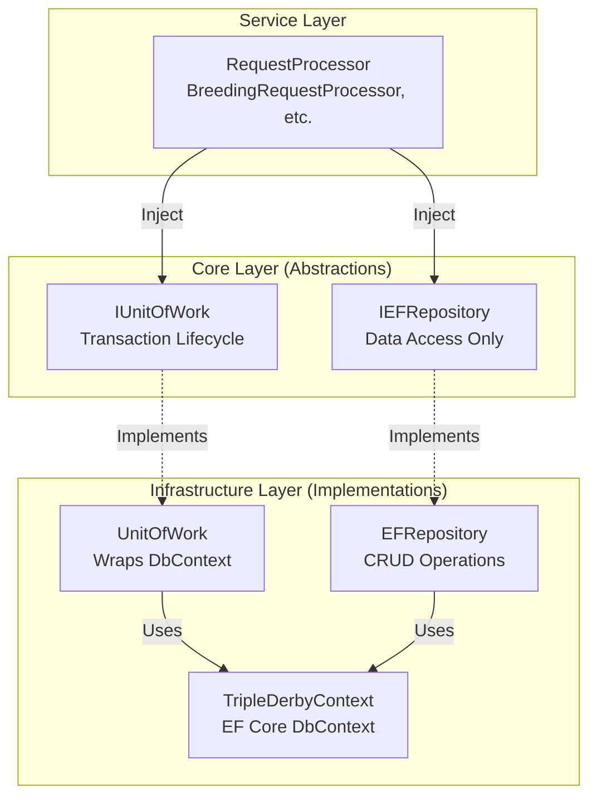

# Unit of Work Pattern Implementation

**Feature Number:** 025

**Status:** 📋 **Planned**

**Created:** 2026-01-26

**Reference:** https://deviq.com/design-patterns/unit-of-work-pattern

---

## Summary

Replace the `ExecuteInTransactionAsync` method on `IEFRepository` with a dedicated `IUnitOfWork` abstraction that provides explicit transaction management. This refactoring improves separation of concerns by removing transaction management responsibilities from the repository and provides a cleaner, more maintainable approach to coordinating multi-step database operations.

**Key Benefits:**
- **Clearer Separation of Concerns**: Repositories focus on data access, Unit of Work manages transactions
- **Better Semantic Clarity**: Transaction boundaries are explicit and obvious in calling code
- **Standard Pattern**: Aligns with industry-standard Unit of Work pattern
- **Simplified Testing**: Easier to mock transaction behavior independently from repository operations
- **Better Architecture**: Prepares for potential future enhancements like Outbox pattern integration

**Design Decisions:**
- Repository methods (`CreateAsync`, `UpdateAsync`, `DeleteAsync`) continue to call `SaveChangesAsync()` immediately
- `IUnitOfWork` is a separate interface injected alongside `ITripleDerbyRepository`
- `ExecuteInTransactionAsync` will be completely removed (no deprecation phase)

---

## Motivation

### Current State

Transaction management currently lives within `IEFRepository`:

```csharp
// TripleDerby.Core/Abstractions/Repositories/IEFRepository.cs:320-341
public interface IEFRepository
{
    // ... CRUD operations ...

    Task ExecuteInTransactionAsync(Func<Task> operation, CancellationToken cancellationToken = default);
    Task<T> ExecuteInTransactionAsync<T>(Func<Task<T>> operation, CancellationToken cancellationToken = default);
}
```

**Current Usage** (3 locations):
- [TripleDerby.Services.Breeding/BreedingRequestProcessor.cs:106](c:\Development\TripleDerby\TripleDerby.Services.Breeding\BreedingRequestProcessor.cs#L106)
- [TripleDerby.Services.Training/TrainingRequestProcessor.cs:103](c:\Development\TripleDerby\TripleDerby.Services.Training\TrainingRequestProcessor.cs#L103)
- [TripleDerby.Services.Feeding/FeedingRequestProcessor.cs:103](c:\Development\TripleDerby\TripleDerby.Services.Feeding\FeedingRequestProcessor.cs#L103)

**Example Current Usage:**
```csharp
// TripleDerby.Services.Breeding/BreedingRequestProcessor.cs
var result = await repository.ExecuteInTransactionAsync(async () =>
{
    var breedingResult = await breedingExecutor.Breed(
        request.SireId, request.DamId, request.OwnerId, cancellationToken);

    await repository.UpdateParentedAsync(request.SireId, request.DamId, cancellationToken);

    breedingRequestEntity.FoalId = breedingResult.FoalId;
    breedingRequestEntity.Status = BreedingRequestStatus.Completed;
    await repository.UpdateAsync(breedingRequestEntity, cancellationToken);

    return breedingResult;
}, cancellationToken);
```

### Problems

1. **Single Responsibility Violation**: Repository handles both data access AND transaction management
2. **Mixing Concerns**: `IEFRepository` interface combines CRUD operations with transaction control
3. **Limited Flexibility**: Cannot easily test transaction behavior independently
4. **Architectural Smell**: Transaction management doesn't conceptually belong to the repository
5. **Pattern Deviation**: Doesn't align with standard Unit of Work pattern where transactions coordinate multiple repository operations

### Goals

1. **Separation of Concerns**: Move transaction management to dedicated `IUnitOfWork` abstraction
2. **Explicit Transactions**: Make transaction boundaries visible and obvious in calling code
3. **Standard Pattern Alignment**: Follow industry-standard Unit of Work pattern
4. **Maintain Simplicity**: Repository CRUD methods continue to auto-save (no deferred commits for simple operations)
5. **Clean Migration**: Remove `ExecuteInTransactionAsync` completely and update all 3 usages

---

## Requirements

### Functional Requirements

**FR1: Create IUnitOfWork Interface**
- Define `IUnitOfWork` interface in `TripleDerby.Core/Abstractions/Data/`
- Provide transaction lifecycle methods:
  - `Task BeginTransactionAsync(CancellationToken cancellationToken = default)`
  - `Task CommitAsync(CancellationToken cancellationToken = default)`
  - `Task RollbackAsync(CancellationToken cancellationToken = default)`
- Provide convenience method for atomic operations:
  - `Task ExecuteAsync(Func<Task> operation, CancellationToken cancellationToken = default)`
  - `Task<T> ExecuteAsync<T>(Func<Task<T>> operation, CancellationToken cancellationToken = default)`

**FR2: Implement UnitOfWork Class**
- Create concrete `UnitOfWork` class in `TripleDerby.Infrastructure/Data/`
- Wrap EF Core `DbContext` transaction management
- Handle commit/rollback with proper error handling and logging
- Prevent nested transactions (throw if transaction already active)
- Implement `IDisposable` or `IAsyncDisposable` for automatic rollback on disposal

**FR3: Repository Behavior Unchanged**
- Repository methods (`CreateAsync`, `UpdateAsync`, `DeleteAsync`) continue calling `SaveChangesAsync()` immediately
- No changes to repository interface beyond removing `ExecuteInTransactionAsync`
- Repository remains focused on data access operations only

**FR4: Remove ExecuteInTransactionAsync**
- Delete `ExecuteInTransactionAsync` methods from `IEFRepository` interface
- Delete implementations from `EFRepository` base class
- Update all 3 call sites to use `IUnitOfWork` instead

**FR5: Update Microservice Usages**
- Update `BreedingRequestProcessor` to inject and use `IUnitOfWork`
- Update `TrainingRequestProcessor` to inject and use `IUnitOfWork`
- Update `FeedingRequestProcessor` to inject and use `IUnitOfWork`

**FR6: Dependency Injection Registration**
- Register `IUnitOfWork` as scoped in DI container
- Update all 4 microservice Program.cs files (Racing, Breeding, Training, Feeding)
- Update API Program.cs if needed

### Non-Functional Requirements

**NFR1: Error Handling**
- Automatic rollback on exceptions
- Proper disposal of transaction resources
- Clear error messages for transaction failures
- Log transaction start, commit, and rollback events

**NFR2: Performance**
- No performance degradation compared to current `ExecuteInTransactionAsync`
- Same transactional guarantees and isolation levels
- Minimal overhead for transaction management

**NFR3: Testability**
- Easy to mock `IUnitOfWork` in unit tests
- Test doubles can verify transaction lifecycle calls
- Integration tests can verify actual transaction behavior

**NFR4: Developer Experience**
- Clear, intuitive API for transaction management
- Code is more readable with explicit transaction boundaries
- Easier to understand transaction scope in calling code

---

## Proposed Architecture

### New Abstractions



### Interface Design

```csharp
namespace TripleDerby.Core.Abstractions.Data;

/// <summary>
/// Manages database transactions, coordinating multiple repository operations
/// as a single atomic unit of work.
/// </summary>
public interface IUnitOfWork
{
    /// <summary>
    /// Begins a new database transaction.
    /// </summary>
    /// <exception cref="InvalidOperationException">Thrown if a transaction is already active.</exception>
    Task BeginTransactionAsync(CancellationToken cancellationToken = default);

    /// <summary>
    /// Commits the current transaction, persisting all changes.
    /// </summary>
    /// <exception cref="InvalidOperationException">Thrown if no transaction is active.</exception>
    Task CommitAsync(CancellationToken cancellationToken = default);

    /// <summary>
    /// Rolls back the current transaction, discarding all changes.
    /// </summary>
    /// <exception cref="InvalidOperationException">Thrown if no transaction is active.</exception>
    Task RollbackAsync(CancellationToken cancellationToken = default);

    /// <summary>
    /// Executes the provided operation within a transaction.
    /// Automatically commits on success or rolls back on exception.
    /// </summary>
    Task ExecuteAsync(Func<Task> operation, CancellationToken cancellationToken = default);

    /// <summary>
    /// Executes the provided operation within a transaction and returns a result.
    /// Automatically commits on success or rolls back on exception.
    /// </summary>
    Task<T> ExecuteAsync<T>(Func<Task<T>> operation, CancellationToken cancellationToken = default);
}
```

### Updated Repository Interface

```csharp
namespace TripleDerby.Core.Abstractions.Repositories;

public interface IEFRepository
{
    // Query operations
    Task<T?> FindAsync<T>(object id, CancellationToken cancellationToken = default) where T : class;
    Task<List<T>> ListAsync<T>(ISpecification<T> specification, CancellationToken cancellationToken = default) where T : class;
    // ... other query methods ...

    // Command operations (auto-save)
    Task<T> CreateAsync<T>(T entity, CancellationToken cancellationToken = default) where T : class;
    Task<T> UpdateAsync<T>(T entity, CancellationToken cancellationToken = default) where T : class;
    Task DeleteAsync<T>(T entity, CancellationToken cancellationToken = default) where T : class;

    // REMOVED:
    // Task ExecuteInTransactionAsync(Func<Task> operation, CancellationToken cancellationToken = default);
    // Task<T> ExecuteInTransactionAsync<T>(Func<Task<T>> operation, CancellationToken cancellationToken = default);
}
```

---

## Implementation Details

### 1. Create IUnitOfWork Interface

**File:** `TripleDerby.Core/Abstractions/Data/IUnitOfWork.cs`

```csharp
using System;
using System.Threading;
using System.Threading.Tasks;

namespace TripleDerby.Core.Abstractions.Data;

/// <summary>
/// Manages database transactions, coordinating multiple repository operations
/// as a single atomic unit of work.
/// </summary>
/// <remarks>
/// Based on the Unit of Work pattern described at:
/// https://deviq.com/design-patterns/unit-of-work-pattern
///
/// This interface provides explicit transaction lifecycle management,
/// separating transaction control from repository data access operations.
/// </remarks>
public interface IUnitOfWork
{
    /// <summary>
    /// Begins a new database transaction.
    /// </summary>
    /// <param name="cancellationToken">Cancellation token.</param>
    /// <exception cref="InvalidOperationException">Thrown if a transaction is already active.</exception>
    Task BeginTransactionAsync(CancellationToken cancellationToken = default);

    /// <summary>
    /// Commits the current transaction, persisting all changes made within the transaction scope.
    /// </summary>
    /// <param name="cancellationToken">Cancellation token.</param>
    /// <exception cref="InvalidOperationException">Thrown if no transaction is active.</exception>
    Task CommitAsync(CancellationToken cancellationToken = default);

    /// <summary>
    /// Rolls back the current transaction, discarding all changes made within the transaction scope.
    /// </summary>
    /// <param name="cancellationToken">Cancellation token.</param>
    /// <exception cref="InvalidOperationException">Thrown if no transaction is active.</exception>
    Task RollbackAsync(CancellationToken cancellationToken = default);

    /// <summary>
    /// Executes the provided asynchronous operation within a database transaction.
    /// Automatically commits on success or rolls back on exception.
    /// </summary>
    /// <param name="operation">The async operation to execute inside the transaction.</param>
    /// <param name="cancellationToken">Cancellation token.</param>
    /// <exception cref="ArgumentNullException">Thrown if operation is null.</exception>
    Task ExecuteAsync(Func<Task> operation, CancellationToken cancellationToken = default);

    /// <summary>
    /// Executes the provided asynchronous operation within a database transaction and returns a result.
    /// Automatically commits on success or rolls back on exception.
    /// </summary>
    /// <typeparam name="T">Return type of the operation.</typeparam>
    /// <param name="operation">The async operation to execute inside the transaction.</param>
    /// <param name="cancellationToken">Cancellation token.</param>
    /// <returns>The result of the operation.</returns>
    /// <exception cref="ArgumentNullException">Thrown if operation is null.</exception>
    Task<T> ExecuteAsync<T>(Func<Task<T>> operation, CancellationToken cancellationToken = default);
}
```

### 2. Implement UnitOfWork Class

**File:** `TripleDerby.Infrastructure/Data/UnitOfWork.cs`

```csharp
using Microsoft.EntityFrameworkCore;
using Microsoft.EntityFrameworkCore.Storage;
using Microsoft.Extensions.Logging;
using TripleDerby.Core.Abstractions.Data;

namespace TripleDerby.Infrastructure.Data;

public class UnitOfWork : IUnitOfWork
{
    private readonly DbContext _dbContext;
    private readonly ILogger<UnitOfWork> _logger;
    private IDbContextTransaction? _currentTransaction;

    public UnitOfWork(TripleDerbyContext dbContext, ILogger<UnitOfWork> logger)
    {
        _dbContext = dbContext ?? throw new ArgumentNullException(nameof(dbContext));
        _logger = logger ?? throw new ArgumentNullException(nameof(logger));
    }

    public async Task BeginTransactionAsync(CancellationToken cancellationToken = default)
    {
        if (_currentTransaction != null)
        {
            throw new InvalidOperationException("A transaction is already active. Nested transactions are not supported.");
        }

        _logger.LogDebug("Beginning database transaction");
        _currentTransaction = await _dbContext.Database.BeginTransactionAsync(cancellationToken);
    }

    public async Task CommitAsync(CancellationToken cancellationToken = default)
    {
        if (_currentTransaction == null)
        {
            throw new InvalidOperationException("No active transaction to commit.");
        }

        try
        {
            _logger.LogDebug("Committing database transaction");
            await _currentTransaction.CommitAsync(cancellationToken);
        }
        catch (Exception ex)
        {
            _logger.LogError(ex, "Error committing transaction");
            throw;
        }
        finally
        {
            await _currentTransaction.DisposeAsync();
            _currentTransaction = null;
        }
    }

    public async Task RollbackAsync(CancellationToken cancellationToken = default)
    {
        if (_currentTransaction == null)
        {
            throw new InvalidOperationException("No active transaction to rollback.");
        }

        try
        {
            _logger.LogWarning("Rolling back database transaction");
            await _currentTransaction.RollbackAsync(cancellationToken);
        }
        catch (Exception ex)
        {
            _logger.LogError(ex, "Error rolling back transaction");
            throw;
        }
        finally
        {
            await _currentTransaction.DisposeAsync();
            _currentTransaction = null;
        }
    }

    public async Task ExecuteAsync(Func<Task> operation, CancellationToken cancellationToken = default)
    {
        if (operation == null) throw new ArgumentNullException(nameof(operation));

        await using var transaction = await _dbContext.Database.BeginTransactionAsync(cancellationToken);
        try
        {
            _logger.LogDebug("Executing operation within transaction");
            await operation();

            await transaction.CommitAsync(cancellationToken);
            _logger.LogDebug("Transaction committed successfully");
        }
        catch (Exception ex)
        {
            _logger.LogError(ex, "Operation failed, rolling back transaction");
            try
            {
                await transaction.RollbackAsync(cancellationToken);
            }
            catch (Exception rollbackEx)
            {
                _logger.LogError(rollbackEx, "Failed to rollback transaction after operation failure");
            }
            throw;
        }
    }

    public async Task<T> ExecuteAsync<T>(Func<Task<T>> operation, CancellationToken cancellationToken = default)
    {
        if (operation == null) throw new ArgumentNullException(nameof(operation));

        await using var transaction = await _dbContext.Database.BeginTransactionAsync(cancellationToken);
        try
        {
            _logger.LogDebug("Executing operation within transaction");
            var result = await operation();

            await transaction.CommitAsync(cancellationToken);
            _logger.LogDebug("Transaction committed successfully");

            return result;
        }
        catch (Exception ex)
        {
            _logger.LogError(ex, "Operation failed, rolling back transaction");
            try
            {
                await transaction.RollbackAsync(cancellationToken);
            }
            catch (Exception rollbackEx)
            {
                _logger.LogError(rollbackEx, "Failed to rollback transaction after operation failure");
            }
            throw;
        }
    }
}
```

### 3. Update Repository Interface

**File:** `TripleDerby.Core/Abstractions/Repositories/IEFRepository.cs`

Remove lines 323-340:
```csharp
// DELETE THESE METHODS:
Task ExecuteInTransactionAsync(Func<Task> operation, CancellationToken cancellationToken = default);
Task<T> ExecuteInTransactionAsync<T>(Func<Task<T>> operation, CancellationToken cancellationToken = default);
```

### 4. Update Repository Implementation

**File:** `TripleDerby.Infrastructure/Data/Repositories/EFRepository.cs`

Remove lines 314-377 (both `ExecuteInTransactionAsync` method implementations).

### 5. Update Microservice Usage - Breeding

**File:** `TripleDerby.Services.Breeding/BreedingRequestProcessor.cs`

**Before:**
```csharp
public class BreedingRequestProcessor : IBreedingRequestProcessor
{
    private readonly ITripleDerbyRepository repository;
    // ...

    public BreedingRequestProcessor(
        ITripleDerbyRepository repository,
        // ...
    ) { }

    private async Task Breed(...)
    {
        var result = await repository.ExecuteInTransactionAsync(async () =>
        {
            // ... breeding logic ...
        }, cancellationToken);
    }
}
```

**After:**
```csharp
public class BreedingRequestProcessor : IBreedingRequestProcessor
{
    private readonly ITripleDerbyRepository repository;
    private readonly IUnitOfWork unitOfWork;
    // ...

    public BreedingRequestProcessor(
        ITripleDerbyRepository repository,
        IUnitOfWork unitOfWork,
        // ...
    ) {
        this.unitOfWork = unitOfWork ?? throw new ArgumentNullException(nameof(unitOfWork));
    }

    private async Task Breed(...)
    {
        var result = await unitOfWork.ExecuteAsync(async () =>
        {
            // ... breeding logic ...
        }, cancellationToken);
    }
}
```

### 6. Update Microservice Usage - Training

**File:** `TripleDerby.Services.Training/TrainingRequestProcessor.cs`

Same pattern as Breeding - inject `IUnitOfWork` and replace `repository.ExecuteInTransactionAsync` with `unitOfWork.ExecuteAsync`.

### 7. Update Microservice Usage - Feeding

**File:** `TripleDerby.Services.Feeding/FeedingRequestProcessor.cs`

Same pattern as Breeding - inject `IUnitOfWork` and replace `repository.ExecuteInTransactionAsync` with `unitOfWork.ExecuteAsync`.

### 8. Update DI Registration

Update all microservice `Program.cs` files:

```csharp
// Add this line after DbContext registration
builder.Services.AddScoped<IUnitOfWork, UnitOfWork>();
```

**Files to Update:**
- `TripleDerby.Services.Breeding/Program.cs`
- `TripleDerby.Services.Training/Program.cs`
- `TripleDerby.Services.Feeding/Program.cs`
- `TripleDerby.Services.Racing/Program.cs`
- `TripleDerby.Api/Program.cs`

---

## Testing Strategy

### Unit Tests

**File:** `TripleDerby.Tests.Unit/Infrastructure/Data/UnitOfWorkTests.cs`

Test scenarios:
- `ExecuteAsync_SuccessfulOperation_CommitsTransaction`
- `ExecuteAsync_OperationThrowsException_RollsBackTransaction`
- `ExecuteAsync_WithResult_ReturnsResultAndCommits`
- `BeginTransactionAsync_WhenTransactionActive_ThrowsInvalidOperationException`
- `CommitAsync_WhenNoTransaction_ThrowsInvalidOperationException`
- `RollbackAsync_WhenNoTransaction_ThrowsInvalidOperationException`

### Integration Tests

Test that updated request processors work correctly:
- Breeding request creates foal within transaction
- Training request updates horse within transaction
- Feeding request updates horse within transaction
- Transaction rolls back on failure (data not persisted)

### Migration Verification

- Verify all 3 usages of `ExecuteInTransactionAsync` have been updated
- Verify repository interface no longer contains transaction methods
- Verify repository implementation no longer contains transaction methods
- Verify all DI registrations include `IUnitOfWork`

---

## Migration Plan

### Phase 1: Add IUnitOfWork Infrastructure
1. Create `IUnitOfWork` interface
2. Implement `UnitOfWork` class
3. Add unit tests for `UnitOfWork`
4. Register `IUnitOfWork` in all microservice DI containers

### Phase 2: Update Request Processors
1. Update `BreedingRequestProcessor` to use `IUnitOfWork`
2. Update `TrainingRequestProcessor` to use `IUnitOfWork`
3. Update `FeedingRequestProcessor` to use `IUnitOfWork`
4. Verify integration tests pass

### Phase 3: Remove Old Transaction Methods
1. Remove `ExecuteInTransactionAsync` from `IEFRepository` interface
2. Remove `ExecuteInTransactionAsync` implementations from `EFRepository` class
3. Run all tests to verify no regressions
4. Clean up any unused imports

### Phase 4: Verification
1. Search codebase for any remaining references to `ExecuteInTransactionAsync`
2. Run full test suite
3. Manual testing of breeding, training, and feeding workflows
4. Code review

---

## Success Criteria

- [ ] `IUnitOfWork` interface created with transaction lifecycle methods
- [ ] `UnitOfWork` implementation created and tested
- [ ] All 3 request processors updated to use `IUnitOfWork`
- [ ] `ExecuteInTransactionAsync` completely removed from repository
- [ ] `IUnitOfWork` registered in all microservice DI containers
- [ ] All unit tests pass
- [ ] All integration tests pass
- [ ] No references to `ExecuteInTransactionAsync` remain in codebase
- [ ] Transaction behavior verified (commit on success, rollback on failure)
- [ ] Code is more readable with explicit transaction boundaries

---

## Files Modified

### New Files
- `TripleDerby.Core/Abstractions/Data/IUnitOfWork.cs`
- `TripleDerby.Infrastructure/Data/UnitOfWork.cs`
- `TripleDerby.Tests.Unit/Infrastructure/Data/UnitOfWorkTests.cs`

### Modified Files
- `TripleDerby.Core/Abstractions/Repositories/IEFRepository.cs` (remove transaction methods)
- `TripleDerby.Infrastructure/Data/Repositories/EFRepository.cs` (remove transaction methods)
- `TripleDerby.Services.Breeding/BreedingRequestProcessor.cs` (use IUnitOfWork)
- `TripleDerby.Services.Training/TrainingRequestProcessor.cs` (use IUnitOfWork)
- `TripleDerby.Services.Feeding/FeedingRequestProcessor.cs` (use IUnitOfWork)
- `TripleDerby.Services.Breeding/Program.cs` (register IUnitOfWork)
- `TripleDerby.Services.Training/Program.cs` (register IUnitOfWork)
- `TripleDerby.Services.Feeding/Program.cs` (register IUnitOfWork)
- `TripleDerby.Services.Racing/Program.cs` (register IUnitOfWork)
- `TripleDerby.Api/Program.cs` (register IUnitOfWork)

---

## Future Enhancements

### Potential Extensions (Out of Scope for This Feature)

1. **Outbox Pattern Integration**
   - Could integrate with `IUnitOfWork` to defer event publishing until transaction commits
   - Ensures reliable message delivery in event-driven architecture

2. **SaveChanges Control**
   - Could add option to make repository methods NOT auto-save
   - Would require explicit `SaveChangesAsync()` or `CommitAsync()` call
   - More aligned with pure Unit of Work pattern but requires more refactoring

3. **Transaction Isolation Levels**
   - Add overloads to support custom isolation levels
   - `BeginTransactionAsync(IsolationLevel isolationLevel, ...)`

4. **Nested Transaction Support**
   - Implement savepoint-based nested transaction support
   - More complex but could be useful for deeply nested business logic

---

## References

- [Unit of Work Pattern - DevIQ](https://deviq.com/design-patterns/unit-of-work-pattern)
- [Martin Fowler - Unit of Work](https://martinfowler.com/eaaCatalog/unitOfWork.html)
- [EF Core Transactions](https://learn.microsoft.com/en-us/ef/core/saving/transactions)

---

## Notes

- This refactoring improves code quality without changing functional behavior
- The immediate `SaveChanges` approach keeps repository methods simple
- `IUnitOfWork.ExecuteAsync` provides a drop-in replacement for `ExecuteInTransactionAsync`
- Future refactorings can consider moving to deferred saves if needed
