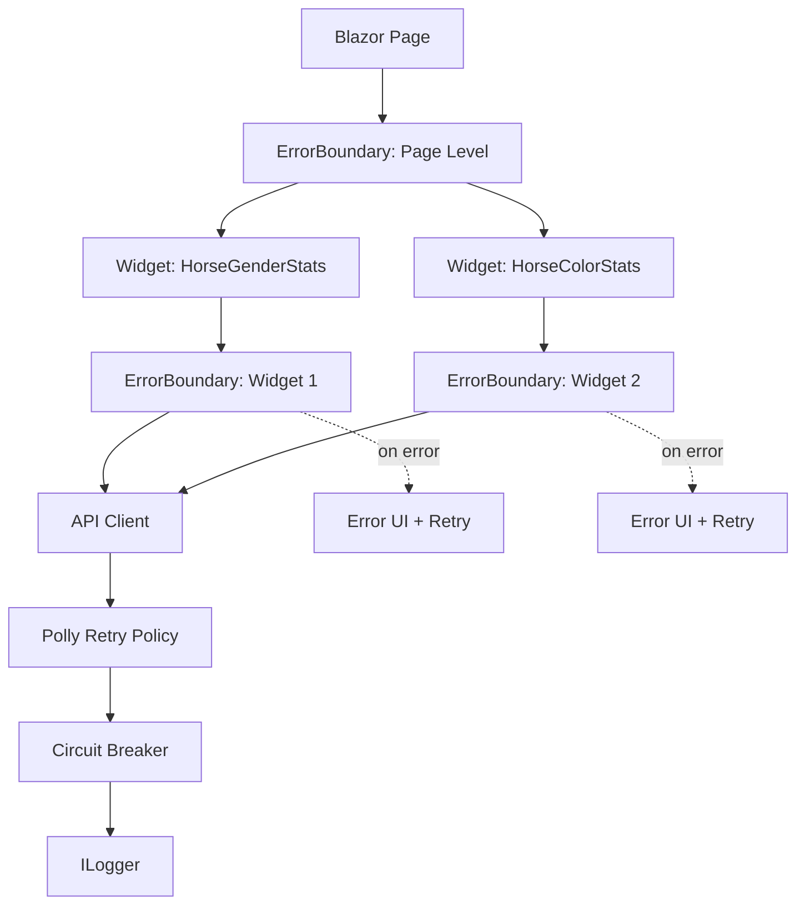

# UI Resilience & Error Boundaries

**Feature Number:** 026

**Status:** Proposed

## Feature Summary

Implement comprehensive error handling and resilience patterns for the TripleDerby admin web application to gracefully handle API failures, network issues, and component errors. Use Blazor ErrorBoundary components to isolate failures, implement retry logic with exponential backoff for transient errors, and provide clear user feedback without degrading the entire application experience.

## Actors & Goals

| Actor | Goal |
|-------|------|
| **Admin User** | Continue using functional parts of the application even when individual components or API calls fail |
| **Admin User** | Receive clear, actionable feedback when operations fail (distinguish between transient vs permanent failures) |
| **System** | Automatically retry transient API failures (5xx, timeouts) without user intervention |
| **System** | Fail fast on client errors (4xx) and provide immediate feedback to users |
| **Developer** | Easily diagnose production issues through structured error logging |

## Current State Analysis

### What We Have
1. **BaseApiClient** ([BaseApiClient.cs:8-116](c:\Development\TripleDerby\TripleDerby.Web\ApiClients\BaseApiClient.cs#L8-L116))
   - Returns `ApiResponse<T>` wrapper with `Success`, `Data`, `Error`, `StatusCode`
   - Catches exceptions and logs errors
   - No retry logic
   - No circuit breaker pattern

2. **Global Error Handling**
   - Error page ([Error.razor](c:\Development\TripleDerby\TripleDerby.Web\Components\Pages\Error.razor)) for unhandled exceptions
   - `blazor-error-ui` div in [MainLayout.razor:23-27](c:\Development\TripleDerby\TripleDerby.Web\Components\Layout\MainLayout.razor#L23-L27)
   - Exception handler configured in [Program.cs:60](c:\Development\TripleDerby\TripleDerby.Web\Program.cs#L60)

3. **API Clients**
   - 9 different API clients (Horse, Stats, User, Race, RaceRun, Track, Training, Feeding, Breeding)
   - All use HttpClient with Aspire service discovery
   - No resilience policies configured

### What's Missing
1. **No ErrorBoundary Usage**
   - Pages and widgets fail catastrophically
   - Single component failure takes down entire page
   - Dashboard widgets (HorseGenderStats, HorseColorStats, HorseLegTypeStats) have no isolation

2. **No Retry Logic**
   - API failures immediately surface to user
   - Transient network issues cause permanent failures
   - No exponential backoff

3. **No Circuit Breaker**
   - Repeated failures continue hammering failing services
   - No automatic degradation or fallback

4. **Inconsistent Error Handling in Components**
   - Some components check for null ([TrainHorse.razor:20-27](c:\Development\TripleDerby\TripleDerby.Web\Components\Pages\TrainHorse.razor#L20-L27))
   - Others assume success and may crash
   - Widgets show loading state but no error state ([HorseGenderStats.razor:26-29](c:\Development\TripleDerby\TripleDerby.Web\Components\Widgets\HorseGenderStats.razor#L26-L29))

5. **Limited User Feedback**
   - No distinction between retryable vs permanent errors
   - No user-actionable messages
   - No "retry" buttons for failed operations

## Requirements

### Functional Requirements

| ID | Requirement | Priority |
|----|-------------|----------|
| **FR1** | Isolate component failures using ErrorBoundary so failed widgets/sections don't crash entire page | Must Have |
| **FR2** | Automatically retry API calls for transient failures (5xx, timeouts, network errors) with exponential backoff | Must Have |
| **FR3** | Fail immediately for client errors (4xx) and display user-friendly error messages | Must Have |
| **FR4** | Display error UI in failed components with option to manually retry | Must Have |
| **FR5** | Log all errors with context (component, API endpoint, user action) for diagnostics | Must Have |
| **FR6** | Implement circuit breaker pattern to prevent cascading failures | Should Have |
| **FR7** | Show generic error messages to users, log detailed errors for developers | Should Have |
| **FR8** | Provide consistent error UI/UX across all pages and components | Should Have |

### Non-Functional Requirements

| ID | Requirement | Priority |
|----|-------------|----------|
| **NFR1** | Retry logic should not block UI (async with cancellation support) | Must Have |
| **NFR2** | Maximum 3 retry attempts with exponential backoff (1s, 2s, 4s) | Must Have |
| **NFR3** | Error boundaries should have minimal performance overhead | Must Have |
| **NFR4** | Error messages should be accessible (ARIA labels, screen reader friendly) | Should Have |
| **NFR5** | Solution should integrate with existing logging infrastructure | Must Have |

## Observable Behaviors

| # | Behavior |
|---|----------|
| **B1** | When a dashboard widget API call fails (transient), system retries up to 3 times with exponential backoff before showing error UI |
| **B2** | When a widget fails after retries, it displays error state with "Retry" button while other widgets continue functioning |
| **B3** | When a page-level API call returns 4xx error, system immediately shows error message without retry |
| **B4** | When user clicks "Retry" on failed component, system re-attempts the operation |
| **B5** | When circuit breaker opens due to repeated failures, subsequent calls fail fast with cached error for 30 seconds |
| **B6** | When component throws unhandled exception, ErrorBoundary catches it and displays fallback UI without crashing page |
| **B7** | All errors are logged with structured data (timestamp, component, endpoint, status code, error details) |
| **B8** | When API is unavailable, user sees clear message: "Unable to connect to server. Please try again." |

## Technical Approach

### Architecture Overview



### Components

#### 1. Enhanced BaseApiClient with Polly
- Add Polly NuGet package for resilience policies
- Configure retry policy:
  - Retry on: `HttpRequestException`, `TaskCanceledException`, HTTP 5xx
  - Max attempts: 3
  - Backoff: Exponential (1s, 2s, 4s)
  - No retry on: 4xx errors
- Configure circuit breaker:
  - Open after: 5 consecutive failures
  - Break duration: 30 seconds
  - Half-open: Allow 1 test request

#### 2. ErrorBoundary Implementation Levels

**Application Level** ([Routes.razor](c:\Development\TripleDerby\TripleDerby.Web\Components\Routes.razor))
```razor
<ErrorBoundary>
    <ChildContent>
        <Router ...>
    </ChildContent>
    <ErrorContent>
        <!-- Catastrophic failure UI -->
    </ErrorContent>
</ErrorBoundary>
```

**Page Level** (Optional for complex pages like [Home.razor](c:\Development\TripleDerby\TripleDerby.Web\Components\Pages\Home.razor))
```razor
<ErrorBoundary>
    <ChildContent>
        @Body
    </ChildContent>
    <ErrorContent>
        <!-- Page failed, show reload button -->
    </ErrorContent>
</ErrorBoundary>
```

**Component Level** (All widgets and data-loading components)
```razor
<ErrorBoundary>
    <ChildContent>
        <HorseGenderStats />
    </ChildContent>
    <ErrorContent Context="error">
        <ErrorWidget OnRetry="@(() => RecoverAsync())" />
    </ErrorContent>
</ErrorBoundary>
```

#### 3. Reusable Error UI Components

**ErrorWidget.razor** - Standardized error display
```razor
@* Parameters: ErrorMessage, OnRetry, ShowDetails *@
<div class="error-container">
    <FluentMessageBar Intent="MessageIntent.Error">
        @ErrorMessage
    </FluentMessageBar>
    @if (OnRetry != null)
    {
        <FluentButton OnClick="OnRetry">Retry</FluentButton>
    }
</div>
```

**ErrorBoundaryFallback.razor** - Reusable fallback content
- Generic error message
- Retry callback support
- Logging integration

#### 4. Widget Error Handling Pattern

Update widgets to:
1. Wrap content in ErrorBoundary
2. Handle API response failures explicitly
3. Provide retry mechanism
4. Show loading/error/success states

Example for [HorseGenderStats.razor](c:\Development\TripleDerby\TripleDerby.Web\Components\Widgets\HorseGenderStats.razor):
```csharp
private async Task LoadAsync()
{
    loading = true;
    errorMessage = null;

    try
    {
        var response = await StatsApi.GetHorseGenderStatsAsync();
        if (response.Success)
        {
            Stats = response.Data.Select(/* ... */);
        }
        else
        {
            errorMessage = "Failed to load gender stats";
            Logger.LogWarning("Stats API returned {Status}: {Error}",
                response.StatusCode, response.Error);
        }
    }
    catch (Exception ex)
    {
        errorMessage = "An error occurred loading stats";
        Logger.LogError(ex, "Failed to load gender stats");
    }
    finally
    {
        loading = false;
        await InvokeAsync(StateHasChanged);
    }
}
```

### Integration Points

1. **HttpClient Configuration** ([Program.cs:19-54](c:\Development\TripleDerby\TripleDerby.Web\Program.cs#L19-L54))
   - Add Polly policies to HttpClient registration
   - Configure retry and circuit breaker policies
   - Add logging handlers

2. **Existing API Clients**
   - Minimal changes to BaseApiClient
   - Polly policies wrap HttpClient automatically
   - Update method signatures to return ApiResponse (already done)

3. **Component Updates**
   - Home.razor: Wrap each widget in ErrorBoundary
   - Horses.razor: Add ErrorBoundary, handle RefreshItemsAsync failures
   - TrainHorse.razor: Add ErrorBoundary, improve polling error handling
   - All other pages: Add appropriate ErrorBoundary levels

4. **Logging**
   - Use existing ILogger infrastructure
   - Add structured logging with Polly context
   - Log retry attempts, circuit breaker state changes

## Implementation Plan

### Phase 1: Foundation (Polly Integration)
1. Add Polly NuGet packages to TripleDerby.Web
2. Create `PollyPolicies.cs` helper with retry and circuit breaker policies
3. Update HttpClient registrations in Program.cs to use Polly policies
4. Test retry behavior with integration tests
5. Update BaseApiClient to expose retry/circuit breaker events for logging

### Phase 2: Error Boundary Infrastructure
1. Create reusable `ErrorWidget.razor` component
2. Add ErrorBoundary to Routes.razor (application level)
3. Create ErrorBoundary wrapper for widgets: `WidgetErrorBoundary.razor`
4. Add error state properties to widget components (errorMessage, hasError)
5. Implement retry mechanism in widgets

### Phase 3: Widget Updates
1. Update HorseGenderStats.razor
   - Add ErrorBoundary wrapper
   - Handle API response failures
   - Add retry button to error state
2. Update HorseColorStats.razor (same pattern)
3. Update HorseLegTypeStats.razor (same pattern)
4. Test widget isolation on Home.razor

### Phase 4: Page Updates
1. Update Horses.razor
   - Add ErrorBoundary
   - Handle RefreshItemsAsync failures gracefully
   - Show error in grid when data fails to load
2. Update TrainHorse.razor
   - Add ErrorBoundary
   - Improve polling timeout handling
   - Add retry for failed training requests
3. Update remaining pages (Users, Races, Tracks, etc.)

### Phase 5: Testing & Refinement
1. Test transient failure scenarios (disconnect network, kill API)
2. Test circuit breaker behavior (repeated failures)
3. Test error UI accessibility
4. Verify error logging and diagnostics
5. Load test to ensure no performance degradation

## Success Criteria

| Criterion | Validation Method |
|-----------|-------------------|
| Widget failures are isolated | Kill Stats API, verify Home page other widgets still work |
| Transient failures auto-retry | Simulate network blip, verify retry logs and eventual success |
| Circuit breaker prevents cascading failures | Force API to return 5xx repeatedly, verify circuit opens after 5 failures |
| Error messages are user-friendly | Show errors to non-technical user, verify comprehension |
| Retry buttons restore functionality | Click retry after API restored, verify data loads |
| No performance degradation | Compare page load times before/after with no errors |
| All errors are logged | Review logs after failure scenarios, verify context present |

## Open Questions

1. ~~Should we cache successful data and show stale data during outages?~~ ❌ No - User selected no offline support
2. ~~Should we add connection status indicators?~~ ❌ No - User selected no status indicators
3. Should we add telemetry/metrics for error rates? (Nice to have, not in initial scope)
4. Do we need different retry policies for different API clients? (Start with single policy, refine if needed)
5. Should long-running operations (training, breeding) have different timeout policies? (Yes - address in implementation)

## Dependencies

- **Polly** NuGet package (Microsoft.Extensions.Http.Resilience or Polly.Extensions.Http)
- Existing HttpClient infrastructure
- Existing ILogger infrastructure
- FluentUI Blazor components (already present)

## Impact Analysis

### Files Modified
- `TripleDerby.Web/Program.cs` - Add Polly configuration
- `TripleDerby.Web/ApiClients/BaseApiClient.cs` - Minor logging enhancements
- `TripleDerby.Web/Components/Routes.razor` - Add ErrorBoundary
- `TripleDerby.Web/Components/Pages/*.razor` - Add ErrorBoundary to data-loading pages
- `TripleDerby.Web/Components/Widgets/*.razor` - Add error handling and ErrorBoundary

### Files Created
- `TripleDerby.Web/Resilience/PollyPolicies.cs` - Retry and circuit breaker policies
- `TripleDerby.Web/Components/Shared/ErrorWidget.razor` - Reusable error UI
- `TripleDerby.Web/Components/Shared/WidgetErrorBoundary.razor` - Widget-specific error boundary

### Breaking Changes
None - All changes are additive and backward compatible.

## Future Enhancements

1. **Optimistic Updates** - Show UI changes immediately, rollback on failure
2. **Request Deduplication** - Prevent duplicate concurrent requests for same data
3. **Smart Retries** - Adaptive retry delays based on API response headers (Retry-After)
4. **Error Analytics** - Aggregate error metrics and dashboards
5. **Partial Rendering** - Show partial data when some API calls succeed
6. **Service Worker** - Advanced offline capabilities with background sync

## Related Features

- Feature 023: Unified Microservice Messaging Architecture (impacts Training/Breeding resilience)
- Feature 013: Race Admin UI (benefits from error boundaries on race grids)
- Feature 020: Horse Training System (polling mechanism needs timeout handling)

## References

- [Blazor ErrorBoundary Documentation](https://learn.microsoft.com/en-us/aspnet/core/blazor/fundamentals/handle-errors#error-boundaries)
- [Polly Resilience Policies](https://www.pollydocs.org/)
- [Microsoft.Extensions.Http.Resilience](https://learn.microsoft.com/en-us/dotnet/core/resilience/http-resilience)
