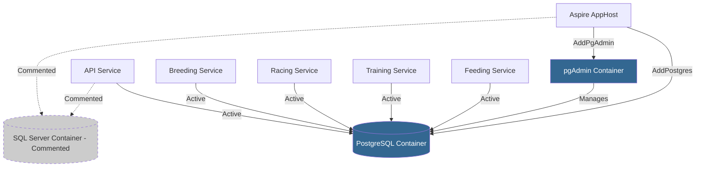

# Feature 027: PostgreSQL for Local Development

## Summary

Enable PostgreSQL as the primary database for local development while maintaining SQL Server configuration as commented code for easy switching. This includes updating .NET Aspire orchestration to use PostgreSQL containers with pgAdmin for database management.

## Motivation

The primary driver is to evaluate PostgreSQL's performance characteristics and tooling ecosystem for potential production use. By maintaining both configurations with manual commenting/uncommenting, developers can easily switch between databases for comparison testing without complex configuration management.

## Current State

### Database Provider
- **Active**: SQL Server (via container orchestrated by .NET Aspire)
- **Port**: 59944 (persistent container with data volume)
- **No EF Migrations**: Database uses `EnsureCreated()` with seed data from `ModelBuilderExtensions`

### SQL Server Dependencies

#### Aspire AppHost (TripleDerby.AppHost)
- [Program.cs:5-8](TripleDerby.AppHost\Program.cs#L5-L8): `AddSqlServer()` with persistent container
- [Program.cs:18](TripleDerby.AppHost\Program.cs#L18): API references SQL connection
- [Program.cs:28,34,40,46](TripleDerby.AppHost\Program.cs#L28): All microservices reference SQL
- [TripleDerby.AppHost.csproj:28](TripleDerby.AppHost\TripleDerby.AppHost.csproj#L28): `Aspire.Hosting.SqlServer` package

#### API Service (TripleDerby.Api)
- [Program.cs:51](TripleDerby.Api\Program.cs#L51): `AddSqlServerClient(connectionName: "sql")`
- [Config/DatabaseConfig.cs:15](TripleDerby.Api\Config\DatabaseConfig.cs#L15): `UseSqlServer()` with connection string

#### Microservices (All 4 services: Breeding, Racing, Training, Feeding)
- Example from [TripleDerby.Services.Breeding\Program.cs:34](TripleDerby.Services.Breeding\Program.cs#L34):
  - `UseSqlServer()` for DbContext configuration
  - `AddSqlServerClient(connectionName: "sql")` for Aspire integration

#### Infrastructure Layer
- [TripleDerby.Infrastructure.csproj:20](TripleDerby.Infrastructure\TripleDerby.Infrastructure.csproj#L20): `Microsoft.EntityFrameworkCore.SqlServer` package
- [Data/TripleDerbyContext.cs](TripleDerby.Infrastructure\Data\TripleDerbyContext.cs): Database-agnostic DbContext
- 25 `IEntityTypeConfiguration<T>` classes in `Data/Configurations/` folder
- [Data/ModelBuilderExtensions.cs](TripleDerby.Infrastructure\Data\ModelBuilderExtensions.cs): Seed data logic

### Database Initialization
- Uses `db.Database.EnsureCreated()` in [TripleDerby.Api\Program.cs:108](TripleDerby.Api\Program.cs#L108)
- No migration files exist (no `Migrations/` folder)
- Seed data applied via `modelBuilder.Seed()` in `TripleDerbyContext.OnModelCreating()`

### Test Projects
- Tests use in-memory or test-specific `DbContext` implementations
- No changes required for tests

## Requirements

### Functional Requirements

1. **PostgreSQL as Active Provider**
   - PostgreSQL must be the uncommented, active database configuration
   - SQL Server configuration must be present but commented out
   - Both database providers must be functionally equivalent

2. **Aspire Orchestration**
   - PostgreSQL container with persistent data volume
   - pgAdmin container for database management UI
   - Appropriate service dependencies and health checks
   - Port configuration similar to current SQL Server setup

3. **Easy Switching Mechanism**
   - Manual commenting/uncommenting of database provider code blocks
   - Clear inline comments marking SQL Server vs PostgreSQL sections
   - Consistent pattern across all projects (API + 4 microservices)
   - NuGet packages for both providers present in .csproj files

4. **Database Management Tools**
   - pgAdmin accessible via Aspire dashboard
   - Pre-configured connection to PostgreSQL container
   - Persistent pgAdmin configuration

5. **Documentation**
   - Step-by-step switching guide in `/docs/`
   - File-by-file instructions for commenting/uncommenting
   - Connection string format examples
   - Troubleshooting common issues

### Non-Functional Requirements

1. **No Data Loss**
   - Existing `EnsureCreated()` approach continues to work
   - Seed data must work identically on PostgreSQL
   - No migration generation required at this time

2. **Backward Compatibility**
   - SQL Server code remains fully functional when uncommented
   - No breaking changes to entity configurations
   - Switching between databases should require no schema changes

3. **Developer Experience**
   - Clear visual separation of provider-specific code
   - Comments indicate which lines to toggle
   - Single documentation source for switching process

4. **Performance Baseline**
   - PostgreSQL performance characteristics can be compared to SQL Server
   - No artificial performance limitations introduced

## Technical Approach

### Architecture Changes



### Implementation Areas

#### 1. Aspire AppHost Configuration

**File**: [TripleDerby.AppHost\Program.cs](TripleDerby.AppHost\Program.cs)

Changes needed:
- Add `Aspire.Hosting.PostgreSQL` NuGet package
- Comment out SQL Server container setup (lines 5-8)
- Add PostgreSQL container with persistent volume
- Add pgAdmin container with preconfigured connection
- Update all `.WithReference(sql)` to `.WithReference(postgres)`
- Comment out old SQL Server references
- Update `.WaitFor()` dependencies

**Example pattern**:
```csharp
// SQL SERVER (Commented for local dev - see docs/DATABASE_SWITCHING.md)
// var sql = builder.AddSqlServer("sql", port: 59944)
//     .WithDataVolume()
//     .WithLifetime(ContainerLifetime.Persistent)
//     .AddDatabase("TripleDerby");

// POSTGRESQL (Active for local dev)
var postgres = builder.AddPostgres("postgres", port: 55432)
    .WithDataVolume()
    .WithLifetime(ContainerLifetime.Persistent)
    .WithPgAdmin()
    .AddDatabase("TripleDerby");
```

#### 2. API Service Configuration

**Files**:
- [TripleDerby.Api\Program.cs](TripleDerby.Api\Program.cs) - line 51
- [TripleDerby.Api\Config\DatabaseConfig.cs](TripleDerby.Api\Config\DatabaseConfig.cs) - lines 14-15

Changes needed:
- Comment out `builder.AddSqlServerClient(connectionName: "sql")`
- Add `builder.AddNpgsqlDbContext(connectionName: "postgres")`
- In DatabaseConfig, comment out `UseSqlServer()`
- Add `UseNpgsql()` with same connection string and migrations assembly

**Pattern**:
```csharp
// SQL SERVER
// builder.AddSqlServerClient(connectionName: "sql");

// POSTGRESQL
builder.AddNpgsqlDataSource(connectionName: "postgres");
```

#### 3. Microservice Configuration

**Files** (same pattern for all 4 services):
- TripleDerby.Services.Breeding\Program.cs
- TripleDerby.Services.Racing\Program.cs
- TripleDerby.Services.Training\Program.cs
- TripleDerby.Services.Feeding\Program.cs

Changes needed (per service):
- Comment out `UseSqlServer()` in DbContext configuration
- Add `UseNpgsql()` with connection string
- Comment out `builder.AddSqlServerClient()`
- Add `builder.AddNpgsqlDataSource()`

#### 4. Infrastructure Layer

**File**: [TripleDerby.Infrastructure\TripleDerby.Infrastructure.csproj](TripleDerby.Infrastructure\TripleDerby.Infrastructure.csproj)

Changes needed:
- Keep `Microsoft.EntityFrameworkCore.SqlServer` (commented in code)
- Add `Npgsql.EntityFrameworkCore.PostgreSQL` package reference

**No changes needed**:
- TripleDerbyContext.cs (database-agnostic)
- Entity configurations (no SQL Server-specific code found)
- ModelBuilderExtensions.cs (seed data is provider-agnostic)

#### 5. AppHost Project

**File**: [TripleDerby.AppHost\TripleDerby.AppHost.csproj](TripleDerby.AppHost\TripleDerby.AppHost.csproj)

Changes needed:
- Keep `Aspire.Hosting.SqlServer` package (line 28)
- Add `Aspire.Hosting.PostgreSQL` package reference

#### 6. Documentation

**New file**: `docs/DATABASE_SWITCHING.md`

Content structure:
- Overview of dual-database setup
- Quick reference table (which files to modify)
- Step-by-step switching from PostgreSQL → SQL Server
- Step-by-step switching from SQL Server → PostgreSQL
- Connection string examples for both providers
- Common issues and troubleshooting
- Performance testing guidance

### pgAdmin Configuration

pgAdmin will be automatically configured by Aspire's `WithPgAdmin()` method:
- Accessible via Aspire dashboard
- Pre-configured connection to PostgreSQL container
- Default credentials managed by Aspire
- Persistent configuration volume

### Database Schema Compatibility

**Potential compatibility issues** (to validate during implementation):

1. **Identity Columns**
   - SQL Server: `IDENTITY(1,1)`
   - PostgreSQL: `SERIAL` or `GENERATED ALWAYS AS IDENTITY`
   - EF Core should handle this automatically

2. **String Comparison**
   - SQL Server: Case-insensitive by default
   - PostgreSQL: Case-sensitive by default
   - May affect queries with WHERE clauses on strings

3. **Data Types**
   - SQL Server: `nvarchar(max)`, `datetime2`
   - PostgreSQL: `text`, `timestamp`
   - EF Core type mapping should handle this

4. **Seed Data**
   - All seed data in ModelBuilderExtensions must work on both providers
   - GUIDs, dates, and strings should be provider-agnostic

## Implementation Phases

### Phase 1: Package Installation & AppHost Setup
1. Add PostgreSQL Aspire hosting package to AppHost.csproj
2. Add Npgsql package to Infrastructure.csproj
3. Comment out SQL Server container in AppHost Program.cs
4. Add PostgreSQL container with pgAdmin
5. Test container startup

### Phase 2: API Service Migration
1. Update DatabaseConfig.cs with commented SQL Server + active PostgreSQL
2. Update API Program.cs Aspire client integration
3. Update all service references from `sql` to `postgres`
4. Test API service starts and connects to PostgreSQL

### Phase 3: Microservices Migration
1. Update each microservice Program.cs (Breeding, Racing, Training, Feeding)
2. Follow same pattern: comment SQL Server, add PostgreSQL
3. Update Aspire client integrations
4. Test each service independently

### Phase 4: Schema Validation
1. Run application and verify `EnsureCreated()` works
2. Validate all seed data loads correctly
3. Test basic CRUD operations on key entities (Horse, Race, etc.)
4. Compare schema between SQL Server and PostgreSQL

### Phase 5: Documentation & Testing
1. Create DATABASE_SWITCHING.md guide
2. Test switching from PostgreSQL → SQL Server
3. Test switching from SQL Server → PostgreSQL
4. Document any compatibility issues found
5. Add troubleshooting section

## Success Criteria

### Functional Validation

- [ ] Application starts successfully with PostgreSQL
- [ ] All 4 microservices connect to PostgreSQL container
- [ ] Database schema created via `EnsureCreated()` successfully
- [ ] All seed data loads without errors
- [ ] pgAdmin accessible via Aspire dashboard
- [ ] pgAdmin can connect to PostgreSQL container
- [ ] Aspire dashboard shows all services healthy
- [ ] Basic CRUD operations work (create horse, run race, etc.)

### Code Quality

- [ ] SQL Server code present and clearly commented in all files
- [ ] Consistent commenting pattern across all projects
- [ ] Both NuGet packages present (SqlServer + Npgsql)
- [ ] No hardcoded connection strings in code
- [ ] Clear inline comments marking provider sections

### Documentation

- [ ] DATABASE_SWITCHING.md exists in `/docs/`
- [ ] Step-by-step instructions for both directions
- [ ] File list with line numbers for all changes
- [ ] Connection string examples for both providers
- [ ] Troubleshooting section with common issues

### Switching Validation

- [ ] Can switch from PostgreSQL to SQL Server by uncommenting
- [ ] Can switch from SQL Server to PostgreSQL by recommenting
- [ ] Switching requires no schema migrations
- [ ] Both providers use same seed data successfully

## Open Questions

None - all requirements clarified through discovery questions.

## Risks & Mitigation

| Risk | Impact | Mitigation |
|------|--------|------------|
| Schema incompatibilities between providers | High | Validate all entity configurations work with both; add notes to DATABASE_SWITCHING.md |
| Case-sensitivity differences in queries | Medium | Test all existing queries; document any that need provider-specific handling |
| Seed data fails on PostgreSQL | High | Test seed data thoroughly; ensure GUIDs and date formats are provider-agnostic |
| Developer confusion switching providers | Medium | Clear, step-by-step documentation with exact line numbers |
| Performance differences not actionable | Low | Out of scope - this is exploratory; document findings for future decisions |

## Related Documentation

- [.NET Aspire PostgreSQL hosting](https://learn.microsoft.com/en-us/dotnet/aspire/database/postgresql-component)
- [Npgsql Entity Framework Core Provider](https://www.npgsql.org/efcore/)
- [EF Core Database Providers](https://learn.microsoft.com/en-us/ef/core/providers/)

## Future Enhancements

- **Feature 028**: Add EF Core Migrations support for both providers
- **Feature 029**: Environment-based provider selection (avoid manual commenting)
- **Feature 030**: Production deployment strategy (SQL Server vs PostgreSQL)
- **Feature 031**: Performance benchmarking suite (SQL Server vs PostgreSQL)

## Appendix: File Change Summary

| File | Lines | Change Type |
|------|-------|-------------|
| TripleDerby.AppHost\Program.cs | 5-8, 18, 28, 34, 40, 46 | Comment SQL, Add PostgreSQL |
| TripleDerby.AppHost\TripleDerby.AppHost.csproj | Add line | Add PostgreSQL package |
| TripleDerby.Api\Program.cs | 51 | Comment SQL client, Add Npgsql |
| TripleDerby.Api\Config\DatabaseConfig.cs | 15 | Comment UseSqlServer, Add UseNpgsql |
| TripleDerby.Services.Breeding\Program.cs | 34, 54 | Comment SQL, Add PostgreSQL |
| TripleDerby.Services.Racing\Program.cs | Similar | Comment SQL, Add PostgreSQL |
| TripleDerby.Services.Training\Program.cs | Similar | Comment SQL, Add PostgreSQL |
| TripleDerby.Services.Feeding\Program.cs | Similar | Comment SQL, Add PostgreSQL |
| TripleDerby.Infrastructure\TripleDerby.Infrastructure.csproj | Add line | Add Npgsql package |
| docs\DATABASE_SWITCHING.md | New file | Switching guide |

Total files modified: **10 files**
Total new files: **1 file**
