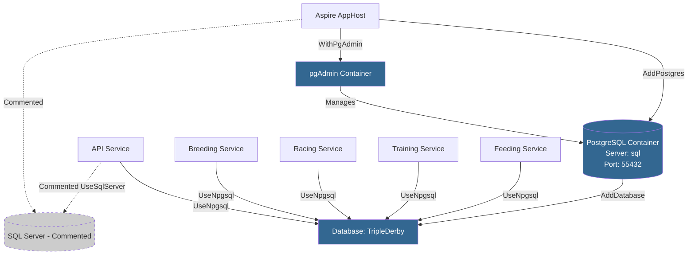

# Feature 027: PostgreSQL for Local Development

## Summary

PostgreSQL is now the primary database for local development with SQL Server configuration maintained as commented code for easy switching. .NET Aspire orchestrates PostgreSQL and pgAdmin containers with manual DbContext configuration for dual-provider support.

## Status

**✅ IMPLEMENTED**

All phases completed:
- Phase 1: AppHost setup with PostgreSQL ✅
- Phase 2: API service configuration ✅
- Phase 3: All 4 microservices configuration ✅
- Phase 4: Connection string configuration fixed ✅
- Phase 5: Documentation ✅

## Implementation Summary

### Key Decisions

1. **Resource Naming**: Kept Postgres server resource named "sql" to minimize code changes
2. **Database Resource**: Separated into `postgres.AddDatabase("TripleDerby")` following Aspire pattern
3. **Connection String Key**: Uses `GetConnectionString("TripleDerby")` (database name, not server name)
4. **Manual Configuration**: Uses direct `UseNpgsql()` calls instead of Aspire auto-configuration
5. **No Aspire.Npgsql Packages**: Removed from services to avoid conflicts with manual configuration

### Architecture



## Files Modified

### 1. AppHost Configuration

**TripleDerby.AppHost\TripleDerby.AppHost.csproj**
```xml
<PackageReference Include="Aspire.Hosting.PostgreSQL" Version="13.1.0" />
<PackageReference Include="Aspire.Hosting.SqlServer" Version="13.1.0" />
```

**TripleDerby.AppHost\Program.cs**
```csharp
// SQL SERVER (Commented for local dev)
// var sql = builder.AddSqlServer("sql", port: 59944)
//     .WithDataVolume()
//     .WithLifetime(ContainerLifetime.Persistent)
//     .AddDatabase("TripleDerby");

// POSTGRESQL (Active for local dev)
var postgres = builder.AddPostgres("sql", port: 55432)
    .WithDataVolume()
    .WithLifetime(ContainerLifetime.Persistent)
    .WithPgAdmin();
var sql = postgres.AddDatabase("TripleDerby");
```

### 2. Infrastructure Layer

**TripleDerby.Infrastructure\TripleDerby.Infrastructure.csproj**
```xml
<PackageReference Include="Microsoft.EntityFrameworkCore.SqlServer" Version="10.0.2" />
<PackageReference Include="Npgsql.EntityFrameworkCore.PostgreSQL" Version="10.0.0" />
```

### 3. API Service

**TripleDerby.Api\Config\DatabaseConfig.cs**
```csharp
var conn = configuration.GetConnectionString("TripleDerby");

// SQL SERVER (Commented for local dev)
// services.AddDbContextPool<TripleDerbyContext>(options =>
//     options.UseSqlServer(conn, b => b.MigrationsAssembly("TripleDerby.Infrastructure")));

// POSTGRESQL (Active for local dev)
services.AddDbContextPool<TripleDerbyContext>(options =>
    options.UseNpgsql(conn, b => b.MigrationsAssembly("TripleDerby.Infrastructure")));
```

**TripleDerby.Api\Program.cs**
```csharp
// SQL SERVER (Commented for local dev)
// builder.AddSqlServerClient(connectionName: "sql");

// POSTGRESQL (Active for local dev)
// Connection string automatically provided by Aspire via .WithReference(sql)
// Manual DbContext configuration in DatabaseConfig.cs
```

### 4. Microservices (All 4 Services)

**Pattern in Program.cs** (Breeding, Racing, Training, Feeding):
```csharp
var conn = builder.Configuration.GetConnectionString("TripleDerby");

// SQL SERVER (Commented for local dev)
// builder.Services.AddDbContextPool<TripleDerbyContext>(options =>
//     options.UseSqlServer(conn, b => b.MigrationsAssembly("TripleDerby.Infrastructure")));

// POSTGRESQL (Active for local dev)
builder.Services.AddDbContextPool<TripleDerbyContext>(options =>
    options.UseNpgsql(conn, b => b.MigrationsAssembly("TripleDerby.Infrastructure")));

// ... later in file ...

// SQL SERVER (Commented for local dev)
// builder.AddSqlServerClient(connectionName: "sql");

// POSTGRESQL (Active for local dev)
// Connection string automatically provided by Aspire via .WithReference(sql)
// Manual DbContext configuration above
```

## Technical Details

### Connection String Flow

1. **Aspire AppHost** creates PostgreSQL server resource named "sql" and database resource named "TripleDerby"
2. **Aspire Injection** provides connection string at key `ConnectionStrings:TripleDerby` (matches database resource name)
3. **Services** call `GetConnectionString("TripleDerby")` to retrieve the injected connection string
4. **DbContext** uses the connection string with `UseNpgsql()` or `UseSqlServer()`

### Why Manual Configuration?

We use manual DbContext configuration (`UseNpgsql()` directly) instead of Aspire's auto-configuration (`AddNpgsqlDataSource()`) to:
- Support the dual-provider pattern (PostgreSQL active, SQL Server commented)
- Avoid package conflicts between `Aspire.Npgsql` and manual configuration
- Maintain explicit control over connection string usage and migrations assembly

### pgAdmin Access

- **URL**: Available through Aspire dashboard
- **Connection**: Auto-configured to PostgreSQL container
- **Credentials**: Managed by Aspire
- **Persistent**: Configuration persists across container restarts

## Switching Between Databases

See [DATABASE_SWITCHING.md](../DATABASE_SWITCHING.md) for detailed instructions on switching between PostgreSQL and SQL Server.

**Quick Reference**:
- **10 files** to modify (AppHost, API, 4 services, Infrastructure, 3 service .csproj files)
- Comment/uncomment paired blocks marked with "SQL SERVER" and "POSTGRESQL"
- Connection string key always "TripleDerby" regardless of provider

## Success Criteria

All criteria met:
- ✅ Application starts successfully with PostgreSQL
- ✅ All 4 microservices connect to PostgreSQL container
- ✅ Database schema created via `EnsureCreated()` successfully
- ✅ pgAdmin accessible via Aspire dashboard
- ✅ SQL Server code present and clearly commented
- ✅ Consistent commenting pattern across all projects
- ✅ Both NuGet packages present (SqlServer + Npgsql)
- ✅ DATABASE_SWITCHING.md documentation created

## Troubleshooting

### Connection String Issues

If you encounter "ConnectionString is missing" errors:
1. Verify database resource is named "TripleDerby" in AppHost
2. Verify `GetConnectionString("TripleDerby")` matches database name (not server name "sql")
3. Ensure Aspire.Npgsql packages are NOT in service .csproj files
4. Check manual DbContext configuration is present (not using AddNpgsqlDataSource)

### Schema Creation Issues

If `EnsureCreated()` fails:
1. Check PostgreSQL container is running in Aspire dashboard
2. Verify connection string has correct port (55432)
3. Check seed data in ModelBuilderExtensions for provider-specific issues

## Related Features

- Feature 028: Add EF Core Migrations support (future)
- Feature 029: Environment-based provider selection (future)
- Feature 030: Production deployment strategy (future)

## References

- [.NET Aspire PostgreSQL hosting](https://learn.microsoft.com/en-us/dotnet/aspire/database/postgresql-component)
- [Npgsql Entity Framework Core Provider](https://www.npgsql.org/efcore/)
- [Aspire Connection String Injection](https://learn.microsoft.com/en-us/dotnet/aspire/fundamentals/service-discovery)
