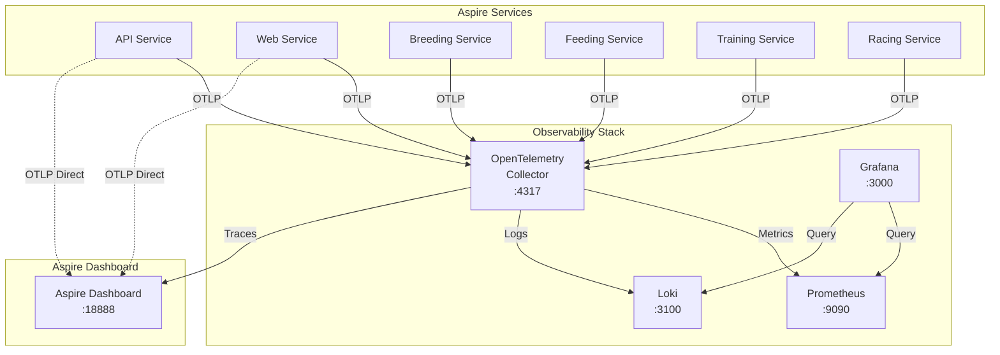

# Feature 028: Grafana Observability Stack for Aspire

## Summary

Add Grafana, Loki, and Prometheus to the TripleDerby Aspire AppHost for enhanced local development observability. This feature enables developers to use the official .NET Grafana dashboard (19924) and companion endpoint dashboard (19925) to visualize ASP.NET Core metrics, centralized logs, and distributed traces across all microservices. The implementation leverages existing OpenTelemetry infrastructure in ServiceDefaults and adds containerized observability stack components managed by Aspire.

---

## Requirements

### Functional Requirements
- [ ] Deploy Grafana, Prometheus, Loki, and OpenTelemetry Collector as Aspire container resources
- [ ] Configure OpenTelemetry Collector to route metrics to Prometheus and logs to Loki
- [ ] Pre-configure Grafana with Prometheus and Loki data sources
- [ ] Pre-load .NET dashboard 19924 (ASP.NET Core) and 19925 (ASP.NET Core Endpoint)
- [ ] Expose all services on local ports for development access
- [ ] Maintain existing Aspire dashboard functionality alongside Grafana

### Acceptance Criteria
- [ ] Given Aspire AppHost starts, when containers launch, then Grafana/Loki/Prometheus are running and healthy
- [ ] Given application emits metrics, when viewing Grafana dashboard 19924, then ASP.NET Core metrics display correctly
- [ ] Given application logs messages, when querying Loki in Grafana, then structured logs appear from all services
- [ ] Given distributed request across microservices, when viewing traces, then trace spans are visible
- [ ] Given developer accesses Grafana UI, then dashboards 19924 and 19925 are pre-loaded and functional

### Non-Functional Requirements
- [ ] Performance: Container startup completes within 30 seconds on typical dev machine
- [ ] Usability: All services accessible via well-known ports (Grafana: 3000, Prometheus: 9090)
- [ ] Maintainability: Configuration stored in source control (no manual Grafana setup required)
- [ ] Documentation: Clear README explaining how to access and use each component

---

## Technical Analysis

### Current State

**Existing Infrastructure:**
- OpenTelemetry SDK configured in [TripleDerby.ServiceDefaults/Extensions.cs:44-71](c:\Development\TripleDerby\TripleDerby.ServiceDefaults\Extensions.cs#L44-L71)
- OTLP exporter configured to send to `OTEL_EXPORTER_OTLP_ENDPOINT` (line 75)
- Metrics instrumentation: AspNetCore, HttpClient, Runtime (lines 55-57)
- Tracing instrumentation: AspNetCore, HttpClient (lines 61-65)
- Logging includes formatted messages and scopes (lines 48-49)

**Aspire AppHost:**
- Version 13.1.0 (.NET 10.0)
- PostgreSQL, Redis, RabbitMQ already configured as container resources
- Microservices: API, Web, Breeding, Feeding, Training, Racing

### Affected Systems

**AppHost Project:**
- `TripleDerby.AppHost/Program.cs` - Add container resource definitions
- `TripleDerby.AppHost/TripleDerby.AppHost.csproj` - Potentially add helper packages (none required)

**New Configuration Files:**
- `TripleDerby.AppHost/otel-collector-config.yaml` - OpenTelemetry Collector pipeline configuration
- `TripleDerby.AppHost/grafana-datasources.yaml` - Grafana data source provisioning
- `TripleDerby.AppHost/grafana-dashboards.yaml` - Dashboard provisioning config
- `TripleDerby.AppHost/dashboards/aspnetcore-19924.json` - Dashboard 19924 definition
- `TripleDerby.AppHost/dashboards/aspnetcore-endpoint-19925.json` - Dashboard 19925 definition

**ServiceDefaults (Minor Update):**
- Update OTLP endpoint to point to OpenTelemetry Collector container

### Architecture



### Data Flow

1. **Metrics Flow:**
   - Services emit metrics via OpenTelemetry SDK
   - OTLP exporter sends to OpenTelemetry Collector (port 4317)
   - Collector exports metrics to Prometheus (port 8889)
   - Grafana queries Prometheus for dashboard 19924/19925

2. **Logs Flow:**
   - Services emit structured logs via ILogger
   - OpenTelemetry logging provider sends to OTLP
   - Collector exports logs to Loki (port 3100)
   - Grafana LogQL queries display logs

3. **Traces Flow:**
   - Services emit traces via OpenTelemetry tracing
   - OTLP sends to both Collector and Aspire Dashboard
   - Aspire Dashboard provides trace visualization

### Integration Points

**Container Dependencies:**
- Loki must start before OpenTelemetry Collector
- Prometheus must start before OpenTelemetry Collector
- OpenTelemetry Collector must start before application services
- Grafana must start after Prometheus and Loki (data sources)

**Network Communication:**
- Services use Aspire service discovery to find `otel-collector` by name
- Internal container network for Prometheus/Loki/Grafana communication
- External port mappings for developer browser access

### Risks & Challenges

**Resource Usage:**
- Adding 4 containers increases memory footprint (~1-2GB additional RAM)
- Mitigation: Use lightweight Alpine-based images where available

**Configuration Complexity:**
- Multiple YAML configuration files required
- Mitigation: Use Aspire volume mounts for configuration injection

**Dashboard Updates:**
- Dashboard JSON definitions may need updates as .NET evolves
- Mitigation: Document source URLs for dashboards, check for updates periodically

**Port Conflicts:**
- Default ports (3000, 9090) may conflict with other dev services
- Mitigation: Make ports configurable via environment variables

---

## Implementation Approach

### Approach 1: OpenTelemetry Collector Hub (Recommended)

**Architecture:**
```
Services → OTLP → OpenTelemetry Collector → Prometheus/Loki
                          ↓
                   Aspire Dashboard (traces)
```

**Pros:**
- Single OTLP endpoint for all services
- Centralized configuration for telemetry routing
- Can add additional exporters later (Jaeger, Zipkin, etc.)
- Collector buffers data, reducing backpressure on services

**Cons:**
- Additional component to manage
- Slight latency added to telemetry pipeline

**Implementation:**
- Use `grafana/otel-lgtm` Docker image (all-in-one: Loki, Grafana, Tempo, Mimir)
- OR use individual containers with custom Collector config

### Approach 2: Direct Exporters

**Architecture:**
```
Services → Prometheus Scrape Endpoint (metrics)
Services → Loki HTTP (logs)
Services → Aspire Dashboard (traces)
```

**Pros:**
- Simpler architecture
- Fewer moving parts

**Cons:**
- Requires Prometheus exporter package in ServiceDefaults
- Services directly coupled to observability backend
- Multiple exporter configurations per service
- No unified telemetry pipeline

### Decision: Approach 1 (OpenTelemetry Collector Hub)

Using the Collector provides better flexibility, centralized configuration, and aligns with OpenTelemetry best practices.

---

## Container Resource Definitions

### 1. Loki (Log Aggregation)

```csharp
var loki = builder.AddContainer("loki", "grafana/loki", "3.3.2")
    .WithHttpEndpoint(port: 3100, targetPort: 3100, name: "http")
    .WithArgs("--config.file=/etc/loki/local-config.yaml")
    .WithLifetime(ContainerLifetime.Persistent);
```

### 2. Prometheus (Metrics Storage)

```csharp
var prometheus = builder.AddContainer("prometheus", "prom/prometheus", "v3.1.0")
    .WithHttpEndpoint(port: 9090, targetPort: 9090, name: "http")
    .WithBindMount("./prometheus.yml", "/etc/prometheus/prometheus.yml")
    .WithArgs("--config.file=/etc/prometheus/prometheus.yml",
              "--storage.tsdb.path=/prometheus",
              "--web.console.libraries=/usr/share/prometheus/console_libraries",
              "--web.console.templates=/usr/share/prometheus/consoles")
    .WithLifetime(ContainerLifetime.Persistent);
```

### 3. OpenTelemetry Collector

```csharp
var otelCollector = builder.AddContainer("otel-collector", "otel/opentelemetry-collector-contrib", "0.115.1")
    .WithHttpEndpoint(port: 4317, targetPort: 4317, name: "otlp-grpc")
    .WithHttpEndpoint(port: 4318, targetPort: 4318, name: "otlp-http")
    .WithHttpEndpoint(port: 8889, targetPort: 8889, name: "prometheus")
    .WithBindMount("./otel-collector-config.yaml", "/etc/otelcol-contrib/config.yaml")
    .WithReference(loki)
    .WaitFor(loki)
    .WithReference(prometheus)
    .WithLifetime(ContainerLifetime.Persistent);
```

### 4. Grafana (Visualization)

```csharp
var grafana = builder.AddContainer("grafana", "grafana/grafana", "11.4.0")
    .WithHttpEndpoint(port: 3000, targetPort: 3000, name: "http")
    .WithBindMount("./grafana/provisioning", "/etc/grafana/provisioning")
    .WithBindMount("./grafana/dashboards", "/var/lib/grafana/dashboards")
    .WithEnvironment("GF_AUTH_ANONYMOUS_ENABLED", "true")
    .WithEnvironment("GF_AUTH_ANONYMOUS_ORG_ROLE", "Admin")
    .WithEnvironment("GF_SECURITY_ADMIN_PASSWORD", "admin")
    .WithReference(prometheus)
    .WaitFor(prometheus)
    .WithReference(loki)
    .WaitFor(loki)
    .WithLifetime(ContainerLifetime.Persistent);
```

---

## Configuration Files

### OpenTelemetry Collector Config (`otel-collector-config.yaml`)

```yaml
receivers:
  otlp:
    protocols:
      grpc:
        endpoint: 0.0.0.0:4317
      http:
        endpoint: 0.0.0.0:4318

processors:
  batch:
    timeout: 10s

exporters:
  prometheus:
    endpoint: "0.0.0.0:8889"
    namespace: "tripled"
    const_labels:
      app: "triple-derby"

  loki:
    endpoint: "http://loki:3100/loki/api/v1/push"

  otlp:
    # Send traces to Aspire Dashboard
    endpoint: "host.docker.internal:18889"
    tls:
      insecure: true

service:
  pipelines:
    metrics:
      receivers: [otlp]
      processors: [batch]
      exporters: [prometheus]

    logs:
      receivers: [otlp]
      processors: [batch]
      exporters: [loki]

    traces:
      receivers: [otlp]
      processors: [batch]
      exporters: [otlp]
```

### Prometheus Config (`prometheus.yml`)

```yaml
global:
  scrape_interval: 15s
  evaluation_interval: 15s

scrape_configs:
  - job_name: 'otel-collector'
    static_configs:
      - targets: ['otel-collector:8889']
```

### Grafana Data Sources (`grafana/provisioning/datasources/datasources.yaml`)

```yaml
apiVersion: 1

datasources:
  - name: Prometheus
    type: prometheus
    access: proxy
    url: http://prometheus:9090
    isDefault: true
    editable: false

  - name: Loki
    type: loki
    access: proxy
    url: http://loki:3100
    editable: false
```

### Grafana Dashboard Provisioning (`grafana/provisioning/dashboards/dashboards.yaml`)

```yaml
apiVersion: 1

providers:
  - name: 'TripleDerby Dashboards'
    orgId: 1
    folder: 'TripleDerby'
    type: file
    disableDeletion: false
    updateIntervalSeconds: 10
    allowUiUpdates: true
    options:
      path: /var/lib/grafana/dashboards
      foldersFromFilesStructure: true
```

---

## ServiceDefaults Update

Update OTLP endpoint to point to OpenTelemetry Collector:

**Environment Variable (set in Aspire AppHost):**
```csharp
.WithEnvironment("OTEL_EXPORTER_OTLP_ENDPOINT", "http://otel-collector:4317")
```

**Alternative: Update Extensions.cs directly:**
```csharp
private static TBuilder AddOpenTelemetryExporters<TBuilder>(this TBuilder builder)
    where TBuilder : IHostApplicationBuilder
{
    // Default to otel-collector in Aspire environment
    var otlpEndpoint = builder.Configuration["OTEL_EXPORTER_OTLP_ENDPOINT"]
                       ?? "http://otel-collector:4317";

    if (!string.IsNullOrWhiteSpace(otlpEndpoint))
    {
        builder.Services.Configure<OpenTelemetryLoggerOptions>(options =>
        {
            options.AddOtlpExporter(otlpOptions =>
            {
                otlpOptions.Endpoint = new Uri(otlpEndpoint);
            });
        });

        builder.Services.AddOpenTelemetry().UseOtlpExporter();
    }

    return builder;
}
```

---

## Dashboard Files

### Obtaining Dashboard JSON

Dashboard 19924 and 19925 JSON definitions can be downloaded from:
- https://grafana.com/grafana/dashboards/19924-asp-net-core/
- https://grafana.com/grafana/dashboards/19925-asp-net-core-endpoint/

1. Navigate to dashboard page
2. Click "Download JSON" button
3. Save to `TripleDerby.AppHost/grafana/dashboards/aspnetcore-19924.json`
4. Save to `TripleDerby.AppHost/grafana/dashboards/aspnetcore-endpoint-19925.json`

### Dashboard Customization

Update datasource UIDs in JSON to match provisioned Prometheus:
```json
{
  "datasource": {
    "type": "prometheus",
    "uid": "prometheus"
  }
}
```

---

## Implementation Tasks

### Phase 1: Container Setup
- [ ] Add Loki container resource to AppHost Program.cs
- [ ] Add Prometheus container resource to AppHost Program.cs
- [ ] Create `prometheus.yml` configuration file
- [ ] Add OpenTelemetry Collector container resource
- [ ] Create `otel-collector-config.yaml` configuration file
- [ ] Add Grafana container resource
- [ ] Test all containers start successfully

### Phase 2: Grafana Configuration
- [ ] Create `grafana/provisioning/datasources/datasources.yaml`
- [ ] Create `grafana/provisioning/dashboards/dashboards.yaml`
- [ ] Download dashboard 19924 JSON from Grafana.com
- [ ] Download dashboard 19925 JSON from Grafana.com
- [ ] Save dashboards to `grafana/dashboards/` directory
- [ ] Update dashboard datasource UIDs to match provisioning
- [ ] Test Grafana loads with dashboards pre-configured

### Phase 3: Service Integration
- [ ] Update ServiceDefaults to point OTLP to otel-collector
- [ ] Add OTLP endpoint environment variable to all services in AppHost
- [ ] Update each service `.WithReference(otelCollector)` and `.WaitFor(otelCollector)`
- [ ] Test metrics appear in Prometheus
- [ ] Test logs appear in Loki via Grafana
- [ ] Test dashboard 19924 displays live metrics

### Phase 4: Documentation
- [ ] Create `docs/OBSERVABILITY.md` with setup instructions
- [ ] Document how to access each component (URLs, credentials)
- [ ] Document how to query logs in Loki
- [ ] Document how to use dashboard 19924/19925
- [ ] Add troubleshooting section for common issues

### Phase 5: Validation
- [ ] Verify all containers start in correct order
- [ ] Verify metrics from all 6 services appear in dashboard
- [ ] Verify logs from all services queryable in Loki
- [ ] Verify distributed traces work across microservices
- [ ] Verify Aspire dashboard still functional alongside Grafana
- [ ] Test on clean environment (no cached containers)

---

## Success Criteria

### Container Health
- [ ] All observability containers start without errors
- [ ] Container startup completes within 30 seconds
- [ ] Containers persist data across restarts (Persistent lifetime)

### Metrics Visualization
- [ ] Dashboard 19924 displays ASP.NET Core metrics from all services
- [ ] Dashboard 19925 shows endpoint-level performance data
- [ ] Metrics update in near real-time (< 30 second delay)
- [ ] Custom TripleDerby business metrics visible in Prometheus

### Log Aggregation
- [ ] Structured logs from all services appear in Loki
- [ ] Log queries by service name work correctly
- [ ] Log levels (Info, Warning, Error) filterable
- [ ] Logs include trace/span IDs for correlation

### Trace Correlation
- [ ] Distributed traces visible across microservices
- [ ] Trace IDs correlate logs to traces
- [ ] Aspire dashboard continues to show traces

### Developer Experience
- [ ] Single `dotnet run` command starts entire stack
- [ ] Clear console output showing observability URLs
- [ ] No manual Grafana configuration required
- [ ] Documentation enables new developers to use stack immediately

---

## Alternative: All-in-One LGTM Stack

Instead of individual containers, use Grafana's LGTM (Loki, Grafana, Tempo, Mimir) image:

```csharp
var lgtm = builder.AddContainer("lgtm", "grafana/otel-lgtm", "0.8.1")
    .WithHttpEndpoint(port: 3000, targetPort: 3000, name: "grafana")
    .WithHttpEndpoint(port: 4317, targetPort: 4317, name: "otlp-grpc")
    .WithHttpEndpoint(port: 4318, targetPort: 4318, name: "otlp-http")
    .WithLifetime(ContainerLifetime.Persistent);
```

**Pros:**
- Single container, simpler setup
- Pre-configured data sources
- Includes Tempo for traces (instead of Aspire dashboard)

**Cons:**
- Larger image size
- Less granular control over components
- May include components we don't need (Mimir)

---

## Files to Create

### AppHost Configuration
- `TripleDerby.AppHost/Program.cs` (update)
- `TripleDerby.AppHost/otel-collector-config.yaml`
- `TripleDerby.AppHost/prometheus.yml`

### Grafana Configuration
- `TripleDerby.AppHost/grafana/provisioning/datasources/datasources.yaml`
- `TripleDerby.AppHost/grafana/provisioning/dashboards/dashboards.yaml`
- `TripleDerby.AppHost/grafana/dashboards/aspnetcore-19924.json`
- `TripleDerby.AppHost/grafana/dashboards/aspnetcore-endpoint-19925.json`

### Documentation
- `docs/OBSERVABILITY.md` (new)
- `docs/features/028-grafana-observability-stack.md` (this file)

### ServiceDefaults (Minor Update)
- `TripleDerby.ServiceDefaults/Extensions.cs` (update OTLP endpoint default)

---

## Open Questions

- [ ] Should we use individual containers or the LGTM all-in-one image?
  - **Recommendation:** Individual containers for learning and flexibility

- [ ] Should we add Tempo for trace storage, or rely on Aspire dashboard?
  - **Recommendation:** Use Aspire dashboard for traces initially, add Tempo later if needed

- [ ] Should Grafana be anonymous access or require login?
  - **Recommendation:** Anonymous for local dev, document how to enable auth for production

- [ ] Should we configure alerts in Grafana?
  - **Recommendation:** No alerts for initial implementation, add in follow-up feature

- [ ] Should we expose Prometheus UI (port 9090) or only access via Grafana?
  - **Recommendation:** Expose both for debugging, document Grafana as primary interface

---

## Resources

### Official Documentation
- [ASP.NET Core Dashboard 19924](https://grafana.com/grafana/dashboards/19924-asp-net-core/)
- [ASP.NET Core Endpoint Dashboard 19925](https://grafana.com/grafana/dashboards/19925-asp-net-core-endpoint/)
- [.NET Aspire Dashboard Configuration](https://learn.microsoft.com/en-us/dotnet/aspire/fundamentals/dashboard/configuration)
- [OpenTelemetry Collector Configuration](https://opentelemetry.io/docs/collector/configuration/)

### Example Implementations
- [Depechie/OpenTelemetryGrafana](https://github.com/Depechie/OpenTelemetryGrafana) - Aspire with Grafana stack
- [.NET 8 Metrics and Grafana Blog Post](https://devblogs.microsoft.com/dotnet/introducing-aspnetcore-metrics-and-grafana-dashboards-in-dotnet-8/)

### Community Resources
- [GitHub Issue #1037: Streamline Grafana/Prometheus in Aspire](https://github.com/dotnet/aspire/issues/1037)

---

## Notes

- **Aspire Dashboard vs. Grafana:** Both serve different purposes. Aspire dashboard is excellent for live development debugging with traces/logs/metrics in one view. Grafana provides richer metric visualization, historical data analysis, and production-ready dashboards.

- **Port Mappings:** All ports are configurable. Defaults chosen to match common conventions:
  - Grafana: 3000 (standard)
  - Prometheus: 9090 (standard)
  - Loki: 3100 (standard)
  - OTLP: 4317 (gRPC), 4318 (HTTP) (standard)

- **Container Lifetime:** Using `Persistent` lifetime keeps data across AppHost restarts, useful for comparing metrics before/after changes.

- **Security:** Configuration uses insecure defaults (anonymous Grafana, no auth) suitable ONLY for local development. Production deployment requires proper authentication, HTTPS, and secret management.
