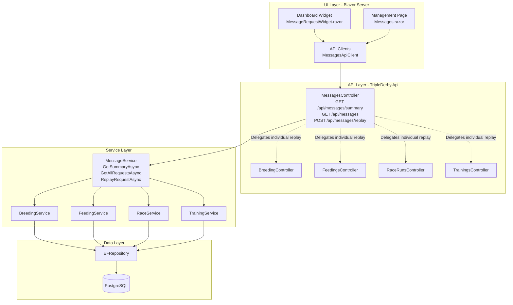
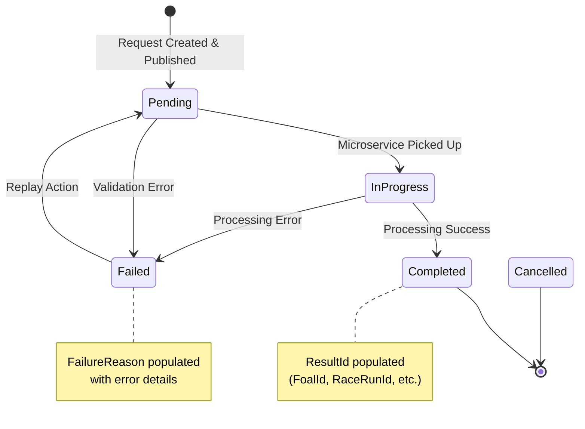
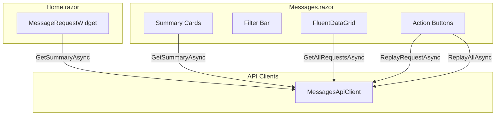
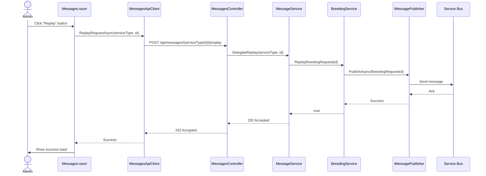

# Feature 029: Message Request Management & Monitoring

## Overview

Implement a comprehensive admin dashboard widget and management page for viewing, monitoring, and replaying asynchronous message requests across all four microservices (Breeding, Feeding, Racing, Training). This feature provides operational visibility into the message queue health and enables administrators to troubleshoot and retry failed operations.

## Current State

### Request Tracking Infrastructure

All four microservices use a consistent pattern for tracking async operations:

| Service | Entity | Schema | Status Enum | Replay Endpoints |
|---------|--------|--------|-------------|------------------|
| **Breeding** | BreedingRequest | `brd` | BreedingRequestStatus | Individual + Batch |
| **Racing** | RaceRequest | `rac` | RaceRequestStatus | Individual + Batch |
| **Training** | TrainingRequest | `trn` | TrainingRequestStatus | Individual only |
| **Feeding** | FeedingRequest | none (dbo) | FeedingRequestStatus | **Missing** |

**Status Lifecycle:** All request entities use the same enum pattern:
- `Pending (0)` - Request created, message published, awaiting processing
- `InProgress (1)` - Microservice actively processing the request
- `Completed (2)` - Processing successful, result entity created
- `Failed (3)` - Processing failed with error message
- `Cancelled (4)` - Request cancelled before completion

**Request Entity Pattern:** All entities track:
- Request metadata (Id, CreatedDate, ProcessedDate, OwnerId, CreatedBy, UpdatedBy)
- Target entities (HorseId, SireId/DamId, RaceId, FeedingId/TrainingId)
- Status tracking (Status enum, FailureReason)
- Result linking (FoalId, RaceRunId, FeedingSessionId, TrainingSessionId)

### Existing Replay Endpoints

**Breeding:**
- `POST /api/breeding/requests/{id}/replay` - Replay single request
- `POST /api/breeding/requests/replay?maxDegreeOfParallelism=10` - Replay all non-complete

**Racing:**
- `POST /api/races/{raceId}/runs/requests/{id}/replay` - Replay single request
- `POST /api/races/{raceId}/runs/requests/replay?maxDegreeOfParallelism=10` - Replay all non-complete

**Training:**
- `POST /api/trainings/requests/{id}/replay` - Replay single request
- **Missing:** Batch replay endpoint

**Feeding:**
- **Missing:** All replay endpoints

### Existing Dashboard

The Home page ([Home.razor:1](c:\Development\TripleDerby\TripleDerby.Web\Components\Pages\Home.razor#L1)) contains:
- Navigation cards for Horses, Users, Breeding, Feedings, Tracks, Trainings, Races
- Statistics widgets: HorseGenderStats, HorseLegTypeStats, HorseColorStats
- Layout: FluentGrid with responsive FluentCard components

## Goals

1. **Dashboard Widget** - Add a real-time message queue health widget to the Home page showing pending/failed request counts per service
2. **Management Page** - Create a unified admin page for viewing, filtering, and replaying requests across all services
3. **API Completion** - Add missing replay endpoints for consistency
4. **Schema Consistency** - Move FeedingRequest to `fed` schema to match other services

## Requirements

### Functional Requirements

#### FR-1: Dashboard Widget
- **Location:** Home page, replacing or alongside HorseGenderStats/HorseLegTypeStats
- **Display:** Card showing request counts per service:
  - Pending count (status badge with count)
  - Failed count (error badge with count)
  - Service grouping (Breeding, Feeding, Racing, Training)
- **Interaction:** Click to navigate to full management page
- **Real-time:** Auto-refresh every 30 seconds
- **Error Handling:** Show error state with retry button if API fails

#### FR-2: Management Page
- **Route:** `/admin/messages` or `/messages`
- **Layout:** Single unified page with filtering
- **Sections:**
  1. **Summary Cards** - Overview counts per service (Pending, Failed, Completed)
  2. **Request Grid** - Sortable, filterable table/grid of all requests
  3. **Actions** - Replay individual/bulk requests

#### FR-3: Filtering & Sorting
- **Status Filter:** Dropdown/tabs for Pending, Failed, Completed, All
- **Service Filter:** Tabs or multi-select for Breeding, Feeding, Racing, Training, All
- **Sorting:** By CreatedDate (default), ProcessedDate, Status

#### FR-4: Request Display
Each request row/card shows:
- **Service Type** - Icon/badge (Breeding, Feeding, Racing, Training)
- **Status** - Colored badge (Pending=Blue, Failed=Red, Completed=Green, InProgress=Orange)
- **Created Date** - Relative time (e.g., "2 hours ago")
- **Processed Date** - If completed/failed
- **Target Entity** - Horse name, Race name, etc. (with link)
- **Failure Reason** - If failed
- **Actions** - Replay button (only for Failed/Pending)

#### FR-5: Replay Actions
- **Individual Replay:** Button per failed request, calls existing endpoint
- **Bulk Replay:** "Replay All Failed" button per service, calls batch endpoint
- **Confirmation:** Confirm before bulk replay
- **Feedback:** Toast notification on success/failure

### Non-Functional Requirements

#### NFR-1: Performance
- Widget loads in <500ms (paginated/limited query)
- Management page supports pagination (default 50 items)
- No N+1 queries (use EF Include for related entities)

#### NFR-2: Authorization
- **Phase 1:** No auth/auth (admin-only assumed)
- **Future:** Protect `/admin/*` routes with admin role

#### NFR-3: Accessibility
- Widget meets WCAG 2.1 AA standards
- Screen reader friendly status badges
- Keyboard navigation for replay actions

#### NFR-4: Consistency
- Follow existing widget patterns (HorseGenderStats, HorseColorStats)
- Use FluentUI components (FluentCard, FluentBadge, FluentDataGrid)
- Match existing error handling (ErrorBoundary, ErrorWidget)

## Technical Design

### Architecture



### Data Model

#### Unified Request DTO

```csharp
public record MessageRequestSummary
{
    public Guid Id { get; init; }
    public RequestServiceType ServiceType { get; init; }
    public RequestStatus Status { get; init; }
    public DateTimeOffset CreatedDate { get; init; }
    public DateTimeOffset? ProcessedDate { get; init; }
    public string? FailureReason { get; init; }

    // Target entity display info
    public string TargetDescription { get; init; } = string.Empty;
    public string? TargetLink { get; init; }

    // Owner info
    public Guid OwnerId { get; init; }

    // Result entity link (if completed)
    public Guid? ResultId { get; init; }
    public string? ResultLink { get; init; }
}

public enum RequestServiceType : byte
{
    Breeding = 1,
    Feeding = 2,
    Racing = 3,
    Training = 4
}

public enum RequestStatus : byte
{
    Pending = 0,
    InProgress = 1,
    Completed = 2,
    Failed = 3,
    Cancelled = 4
}
```

#### Summary DTO

```csharp
public record MessageRequestsSummaryResult
{
    public ServiceSummary Breeding { get; init; } = new();
    public ServiceSummary Feeding { get; init; } = new();
    public ServiceSummary Racing { get; init; } = new();
    public ServiceSummary Training { get; init; } = new();
    public int TotalPending { get; init; }
    public int TotalFailed { get; init; }
}

public record ServiceSummary
{
    public int Pending { get; init; }
    public int Failed { get; init; }
    public int Completed { get; init; }
    public int InProgress { get; init; }
}
```

### API Endpoints

#### New: MessagesController

```csharp
[ApiController]
[Route("api/messages")]
public class MessagesController(IMessageService messageService)
{
    /// <summary>
    /// Gets summary counts for dashboard widget
    /// </summary>
    [HttpGet("summary")]
    [ProducesResponseType(StatusCodes.Status200OK)]
    public async Task<ActionResult<MessageRequestsSummaryResult>> GetSummary(
        CancellationToken cancellationToken);

    /// <summary>
    /// Gets paginated list of all message requests with filtering
    /// </summary>
    [HttpGet]
    [ProducesResponseType(StatusCodes.Status200OK)]
    public async Task<ActionResult<PagedList<MessageRequestSummary>>> GetAll(
        [FromQuery] PaginationRequest pagination,
        [FromQuery] RequestStatus? status = null,
        [FromQuery] RequestServiceType? serviceType = null,
        CancellationToken cancellationToken = default);

    /// <summary>
    /// Gets details for a specific request by ID and service type
    /// </summary>
    [HttpGet("{serviceType}/{id}")]
    [ProducesResponseType(StatusCodes.Status200OK)]
    [ProducesResponseType(StatusCodes.Status404NotFound)]
    public async Task<ActionResult<MessageRequestDetails>> GetRequest(
        RequestServiceType serviceType,
        Guid id,
        CancellationToken cancellationToken);

    /// <summary>
    /// Replays a specific request (delegates to service-specific controller)
    /// </summary>
    [HttpPost("{serviceType}/{id}/replay")]
    [ProducesResponseType(StatusCodes.Status202Accepted)]
    [ProducesResponseType(StatusCodes.Status404NotFound)]
    public async Task<IActionResult> ReplayRequest(
        RequestServiceType serviceType,
        Guid id,
        CancellationToken cancellationToken);

    /// <summary>
    /// Replays all failed/pending requests for a service
    /// </summary>
    [HttpPost("{serviceType}/replay-all")]
    [ProducesResponseType(StatusCodes.Status202Accepted)]
    public async Task<ActionResult<ReplayAllResult>> ReplayAll(
        RequestServiceType serviceType,
        [FromQuery] int maxDegreeOfParallelism = 10,
        CancellationToken cancellationToken = default);
}
```

#### Updates: FeedingsController

Add missing endpoints:

```csharp
/// <summary>
/// Replay a feeding request by republishing the message.
/// </summary>
[HttpPost("requests/{id:guid}/replay")]
[ProducesResponseType(StatusCodes.Status202Accepted)]
[ProducesResponseType(StatusCodes.Status404NotFound)]
public async Task<IActionResult> ReplayRequest(
    Guid id,
    CancellationToken cancellationToken);

/// <summary>
/// Replay all non-complete feeding requests.
/// </summary>
[HttpPost("requests/replay-all")]
[ProducesResponseType(StatusCodes.Status202Accepted)]
public async Task<ActionResult<ReplayAllResult>> ReplayAll(
    [FromQuery] int maxDegreeOfParallelism = 10,
    CancellationToken cancellationToken = default);
```

#### Updates: TrainingsController

Add batch endpoint:

```csharp
/// <summary>
/// Replay all non-complete training requests.
/// </summary>
[HttpPost("requests/replay-all")]
[ProducesResponseType(StatusCodes.Status202Accepted)]
public async Task<ActionResult<ReplayAllResult>> ReplayAll(
    [FromQuery] int maxDegreeOfParallelism = 10,
    CancellationToken cancellationToken = default);
```

### Service Layer

#### New: IMessageService

```csharp
public interface IMessageService
{
    Task<MessageRequestsSummaryResult> GetSummaryAsync(CancellationToken cancellationToken = default);

    Task<PagedList<MessageRequestSummary>> GetAllRequestsAsync(
        PaginationRequest pagination,
        RequestStatus? statusFilter = null,
        RequestServiceType? serviceTypeFilter = null,
        CancellationToken cancellationToken = default);

    Task<MessageRequestDetails?> GetRequestDetailsAsync(
        RequestServiceType serviceType,
        Guid id,
        CancellationToken cancellationToken = default);
}
```

Implementation aggregates data from all four request tables using repository pattern with specifications.

#### Updates: IFeedingService

```csharp
// Add to interface
Task<bool> ReplayFeedingRequest(Guid id, CancellationToken cancellationToken = default);
Task<int> ReplayAllNonComplete(int maxDegreeOfParallelism = 10, CancellationToken cancellationToken = default);
```

#### Updates: ITrainingService

```csharp
// Add to interface
Task<int> ReplayAllNonComplete(int maxDegreeOfParallelism = 10, CancellationToken cancellationToken = default);
```

### UI Components

#### Dashboard Widget: MessageRequestWidget.razor

Location: `TripleDerby.Web/Components/Widgets/MessageRequestWidget.razor`

Features:
- FluentCard with height matching other widgets
- Four service sections with badges showing counts
- Click to navigate to management page
- Auto-refresh every 30s using `PeriodicTimer`
- Skeleton loading state
- Error state with retry button

```razor
<FluentCard Height="156px;">
    <ErrorBoundary>
        <ChildContent>
            <MessageRequestWidget Title="Message Queue" />
        </ChildContent>
        <ErrorContent>
            <ErrorWidget ErrorMessage="An unexpected error occurred in the Message Queue widget." />
        </ErrorContent>
    </ErrorBoundary>
</FluentCard>
```

#### Management Page: Messages.razor

Location: `TripleDerby.Web/Components/Pages/Messages.razor`

Features:
- `@page "/messages"` or `@page "/admin/messages"`
- Summary cards at top (4 cards for each service showing counts)
- Filter bar: Status dropdown, Service type tabs
- FluentDataGrid with pagination
- Replay actions per row and bulk replay per service

Layout:
```
┌─────────────────────────────────────────────────────────────┐
│ Message Queue Management                                     │
├─────────────────────────────────────────────────────────────┤
│ ┌──────────┐ ┌──────────┐ ┌──────────┐ ┌──────────┐        │
│ │ Breeding │ │ Feeding  │ │ Racing   │ │ Training │        │
│ │ 12P / 3F │ │  5P / 1F │ │  8P / 0F │ │  2P / 2F │        │
│ └──────────┘ └──────────┘ └──────────┘ └──────────┘        │
├─────────────────────────────────────────────────────────────┤
│ Filters: [Status ▼] [Service Type: All|Breeding|...]        │
├─────────────────────────────────────────────────────────────┤
│ Service │ Status  │ Created    │ Target         │ Actions  │
│ 🏠      │ ⚠Failed │ 2h ago     │ Sire: Thunder  │ [Replay] │
│ 🥕      │ ⏳Pend. │ 30m ago    │ Horse: Storm   │          │
│ 🏁      │ ✓Compl. │ 1h ago     │ Race 5         │          │
└─────────────────────────────────────────────────────────────┘
```

### Database Changes

#### Migration: Move FeedingRequest to `fed` schema

Update `FeedingRequestConfiguration.cs`:

```csharp
public void Configure(EntityTypeBuilder<FeedingRequest> builder)
{
    builder.ToTable("FeedingRequests", schema: "fed");

    builder.Property(fr => fr.Status)
        .HasConversion<byte>()
        .HasDefaultValue(FeedingRequestStatus.Pending)
        .IsRequired();

    builder.Property(fr => fr.FailureReason)
        .HasMaxLength(1024);

    // Indexes for common queries
    builder.HasIndex(fr => fr.Status);
    builder.HasIndex(fr => fr.CreatedDate);
    builder.HasIndex(fr => fr.HorseId);
}
```

Migration command: `dotnet ef migrations add MoveFeedingRequestToFedSchema`

### Specifications for Queries

#### CountByStatusSpecification

```csharp
public class CountRequestsByStatusSpecification<T> : Specification<T> where T : class
{
    public CountRequestsByStatusSpecification(RequestStatus status)
    {
        Query.Where(r => EF.Property<byte>(r, "Status") == (byte)status);
    }
}
```

#### AllRequestsWithFiltersSpecification

```csharp
public class AllRequestsWithFiltersSpecification<T> : Specification<T> where T : class
{
    public AllRequestsWithFiltersSpecification(
        PaginationRequest pagination,
        RequestStatus? statusFilter = null)
    {
        if (statusFilter.HasValue)
        {
            Query.Where(r => EF.Property<byte>(r, "Status") == (byte)statusFilter.Value);
        }

        Query.OrderByDescending(r => EF.Property<DateTimeOffset>(r, "CreatedDate"))
            .Skip(pagination.Skip)
            .Take(pagination.Size);
    }
}
```

## Implementation Plan

### Phase 1: API Completion (Priority 1)

**Goal:** Complete missing replay endpoints for consistency

1. **Add FeedingService replay methods**
   - Implement `ReplayFeedingRequest` (follow BreedingService pattern)
   - Implement `ReplayAllNonComplete` (parallel Task.WhenAll pattern)
   - Add to `IFeedingService` interface

2. **Add TrainingService batch replay**
   - Implement `ReplayAllNonComplete` in TrainingService
   - Add to `ITrainingService` interface

3. **Add FeedingsController replay endpoints**
   - `POST /api/feedings/requests/{id}/replay`
   - `POST /api/feedings/requests/replay-all`

4. **Add TrainingsController batch endpoint**
   - `POST /api/trainings/requests/replay-all`

5. **Unit tests**
   - Test replay methods (mock message publisher)
   - Test controller endpoints (mock service)

### Phase 2: Schema Migration (Priority 1)

**Goal:** Move FeedingRequest to `fed` schema for consistency

1. **Update FeedingRequestConfiguration**
   - Add `ToTable("FeedingRequests", schema: "fed")`
   - Add indexes (Status, CreatedDate, HorseId)
   - Match pattern from BreedingRequestConfiguration

2. **Generate and apply migration**
   - `dotnet ef migrations add MoveFeedingRequestToFedSchema -p TripleDerby.Infrastructure -s TripleDerby.Api`
   - Review SQL for correctness
   - Drop and recreate database (as per user instruction)

### Phase 3: Message Service & Controller (Priority 2)

**Goal:** Create unified message query and replay orchestration

1. **Create DTOs**
   - `MessageRequestSummary` record
   - `MessageRequestsSummaryResult` record
   - `ServiceSummary` record
   - `RequestServiceType` enum
   - `RequestStatus` enum (shared enum)

2. **Create IMessageService interface**
   - Define `GetSummaryAsync` method
   - Define `GetAllRequestsAsync` method with filters
   - Define `GetRequestDetailsAsync` method

3. **Implement MessageService**
   - Inject all four repositories (BreedingRequest, FeedingRequest, RaceRequest, TrainingRequest)
   - Inject all four services for replay delegation
   - Implement aggregation logic for summary
   - Implement union query for GetAllRequestsAsync
   - Map entities to DTOs with service type

4. **Create MessagesController**
   - `GET /api/messages/summary` endpoint
   - `GET /api/messages` endpoint with pagination/filtering
   - `POST /api/messages/{serviceType}/{id}/replay` (delegates to service)
   - `POST /api/messages/{serviceType}/replay-all` (delegates to service)

5. **Unit tests**
   - Test MessageService aggregation logic
   - Test controller endpoints
   - Test error handling for missing requests

### Phase 4: Dashboard Widget (Priority 2)

**Goal:** Add message queue health widget to Home page

1. **Create IMessagesApiClient**
   - Define `GetSummaryAsync` method
   - Define error handling and retry logic

2. **Implement MessagesApiClient**
   - HTTP client for `/api/messages/summary`
   - Follow pattern from HorsesApiClient

3. **Create MessageRequestWidget.razor**
   - FluentCard layout matching HorseGenderStats
   - Four service sections (Breeding, Feeding, Racing, Training)
   - Badge components for Pending/Failed counts
   - Click to navigate to `/messages`
   - Auto-refresh using PeriodicTimer (30s interval)
   - Skeleton loading state
   - Error state with retry button

4. **Add widget to Home.razor**
   - Replace HorseGenderStats or HorseLegTypeStats (user to decide)
   - Wrap in ErrorBoundary
   - Use same grid layout pattern

5. **CSS styling**
   - Match existing widget styles
   - Responsive layout
   - Accessible badges

### Phase 5: Management Page (Priority 3)

**Goal:** Create full management UI for viewing and replaying requests

1. **Extend IMessagesApiClient**
   - Add `GetAllRequestsAsync` with filters
   - Add `ReplayRequestAsync` method
   - Add `ReplayAllAsync` method

2. **Implement API client methods**
   - HTTP GET with query string for filters
   - HTTP POST for replay actions
   - Error handling and validation

3. **Create Messages.razor page**
   - Route: `/messages`
   - Summary cards section (4 cards with counts)
   - Filter bar (Status dropdown, Service type tabs)
   - FluentDataGrid for request list
   - Pagination controls

4. **Implement filtering logic**
   - Status filter (Pending, Failed, Completed, All)
   - Service type filter (tabs or dropdown)
   - Apply filters to API calls
   - Update UI based on filter state

5. **Implement replay actions**
   - Individual replay button per row
   - Bulk replay button per service
   - Confirmation dialog for bulk actions
   - Toast notifications for success/failure
   - Refresh grid after replay

6. **Add navigation**
   - Update NavMenu to include Messages link (admin section)
   - Or add link from dashboard widget only

7. **Responsive design**
   - Mobile-friendly cards (collapse to list view)
   - Desktop-friendly grid (full table)

### Phase 6: Testing & Polish (Priority 3)

1. **Integration testing**
   - Test widget with mock API responses
   - Test management page with various filters
   - Test replay actions (use local dev with Service Bus emulator)

2. **Error handling**
   - Network errors (retry logic)
   - 404 for missing requests
   - Validation errors (already replayed, etc.)

3. **Accessibility audit**
   - Screen reader testing
   - Keyboard navigation
   - Color contrast for status badges

4. **Performance validation**
   - Widget loads <500ms
   - Management page pagination works with 1000+ requests
   - No N+1 queries (use EF logging)

5. **Documentation**
   - Update README with new endpoints
   - Add screenshots to feature doc
   - Document admin workflow

## Success Criteria

### Acceptance Criteria

1. **Dashboard Widget:**
   - [ ] Widget displays on Home page
   - [ ] Shows pending/failed counts for all 4 services
   - [ ] Auto-refreshes every 30 seconds
   - [ ] Clicking navigates to management page
   - [ ] Shows loading skeleton on initial load
   - [ ] Shows error state if API fails

2. **Management Page:**
   - [ ] Accessible at `/messages` route
   - [ ] Displays all requests across all services
   - [ ] Filter by status (Pending, Failed, All) works
   - [ ] Pagination works for large datasets
   - [ ] Shows service type, status, dates, target entity, failure reason

3. **Replay Functionality:**
   - [ ] Individual replay button calls correct endpoint
   - [ ] Batch replay per service works
   - [ ] Confirmation shown before bulk actions
   - [ ] Toast notification on success/failure
   - [ ] Grid refreshes after replay

4. **API Completeness:**
   - [ ] Feeding replay endpoints implemented
   - [ ] Training batch replay implemented
   - [ ] New MessagesController endpoints work
   - [ ] All endpoints return correct DTOs

5. **Schema Consistency:**
   - [ ] FeedingRequest moved to `fed` schema
   - [ ] Migration applied successfully
   - [ ] All queries still work

### Testing Checklist

- [ ] Unit tests for MessageService aggregation
- [ ] Unit tests for new controller endpoints
- [ ] Unit tests for FeedingService/TrainingService replay methods
- [ ] Integration test: Widget loads summary
- [ ] Integration test: Management page filtering
- [ ] Integration test: Replay individual request
- [ ] Integration test: Replay all failed requests
- [ ] Manual test: Auto-refresh works
- [ ] Manual test: Error states display correctly
- [ ] Accessibility: Screen reader announces status changes
- [ ] Accessibility: Keyboard navigation works

## Open Questions

1. **Authentication/Authorization:**
   - Q: Should we add role-based auth now or defer?
   - A: Defer to future feature. No auth/auth implemented yet in the system.

2. **Real-time Updates:**
   - Q: Should the management page use SignalR for real-time status updates?
   - A: No, use polling (30s refresh). SignalR adds complexity for Phase 1.

3. **Filtering Persistence:**
   - Q: Should filter state persist in URL query params?
   - A: Yes, good UX for bookmarking/sharing. Use NavigationManager.

4. **Bulk Actions:**
   - Q: Should we support selecting multiple requests for batch replay (not all)?
   - A: No for Phase 1. "Replay All Failed" per service is sufficient.

5. **Audit Trail:**
   - Q: Should we track who initiated a replay and when?
   - A: Yes, but defer to Phase 2. Add UpdatedBy/UpdatedDate tracking on replay.

6. **Service Health Metrics:**
   - Q: Should we show average processing time, success rate %?
   - A: Nice to have. Defer to Phase 2 (observability feature).

## Related Features

- **Feature 023:** Unified Microservice Messaging Architecture
- **Feature 026:** UI Resilience - Error Boundaries (error handling pattern)
- **Feature 027:** PostgreSQL Local Development (database context)
- **Feature 028:** Grafana Observability Stack (future: metrics integration)

## Dependencies

- Ardalis.Specification (for query specs)
- FluentUI Blazor components (FluentCard, FluentDataGrid, FluentBadge)
- Azure Service Bus or RabbitMQ (existing message publisher)

## Risks & Mitigation

| Risk | Impact | Mitigation |
|------|--------|------------|
| Performance degradation with large result sets | High | Use pagination, indexes on Status/CreatedDate columns |
| Accidental bulk replay of thousands of messages | High | Add confirmation dialog, limit maxDegreeOfParallelism |
| Schema migration breaks existing queries | Medium | Test thoroughly, use EF migrations |
| Replay endpoint inconsistencies | Medium | Follow established pattern from BreedingService |
| Widget polling overloads API | Low | Use 30s interval, add caching in MessageService |

## Future Enhancements

1. **Advanced Filtering:**
   - Filter by horse name/ID
   - Filter by owner
   - Filter by date range
   - Search by failure reason text

2. **Observability Integration:**
   - Export metrics to Grafana (Feature 028)
   - Alert on high failure rates
   - Track replay success rates

3. **Bulk Actions:**
   - Select multiple requests for batch replay
   - Cancel pending requests
   - Delete old completed requests (retention policy)

4. **Real-time Updates:**
   - SignalR hub for live status changes
   - Push notifications for failures

5. **Request Details Modal:**
   - Click row to see full JSON payload
   - Show retry history
   - Show related entities (Horse details, Race details)

6. **Role-Based Access:**
   - Admin-only for replay actions
   - Horse owners can view their own requests (read-only)

## Diagrams

### Request Status Flow



### UI Component Structure



### Data Flow for Replay Action



## Notes

- **User confirmed:** No auth/auth yet, so no need to restrict access in Phase 1
- **User confirmed:** Drop and recreate database for migrations (no production data)
- **User confirmed:** Replace HorseGenderStats or HorseLegTypeStats with widget (TBD which one)
- **Pattern consistency:** All replay endpoints follow same pattern (202 Accepted, NotFound for missing)
- **Code reuse:** MessageService aggregates existing service methods, no duplication
