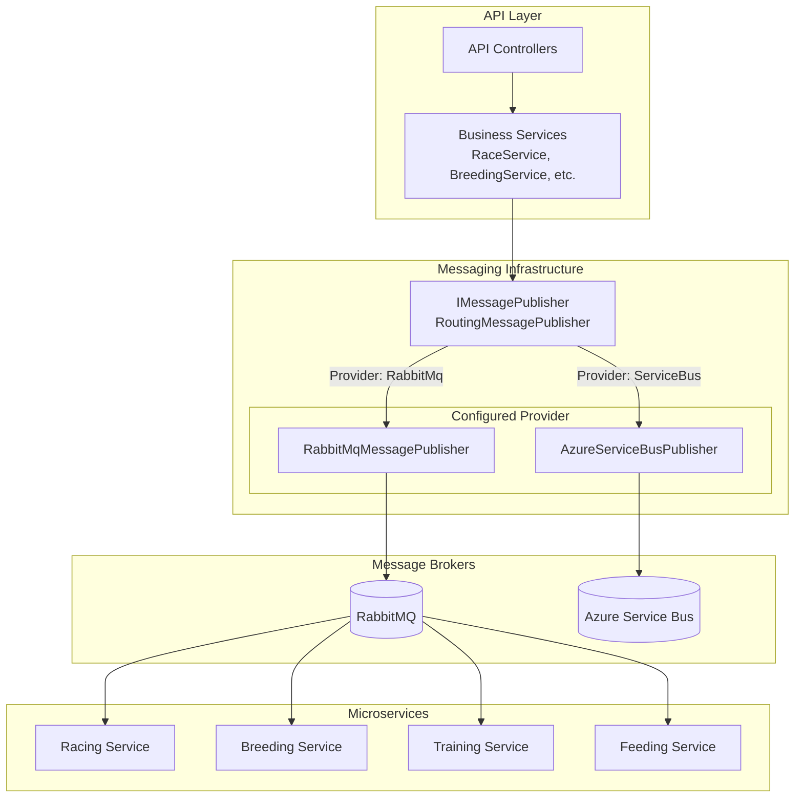
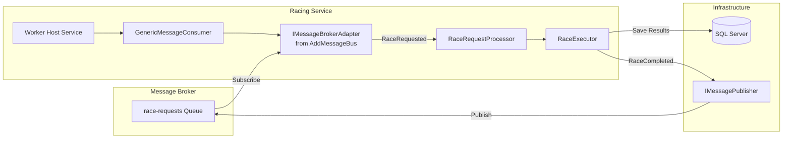

# Unified Microservice Messaging Architecture - Implementation Plan

## Overview

**Feature**: [023-unified-microservice-messaging-architecture](../features/023-unified-microservice-messaging-architecture.md)
**Approach**: TDD with Vertical Slices
**Total Phases**: 5

## Summary

This implementation standardizes all microservices to use a unified, configuration-driven messaging architecture. The approach extends `AddMessageBus()` to register both `IMessagePublisher` and `IMessageBrokerAdapter` based on a single `MessageBus:Routing:Provider` configuration setting.

**Key Design Decisions:**
1. Extend existing `AddMessageBus()` (breaking change acceptable - improves architecture)
2. Direct registration pattern (matches current publisher pattern)
3. Create comprehensive README files for each service with Mermaid diagrams
4. Service Bus adapter as placeholder (architecture-ready, not fully implemented)

---

## Phase 1: Extend MessageBusExtensions for Consumer Adapter Registration

**Goal**: Update `AddMessageBus()` to register `IMessageBrokerAdapter` based on provider configuration

**Vertical Slice**: Infrastructure can select and register the correct broker adapter for consumers

### RED - Write Failing Tests

**Test File**: `TripleDerby.Tests.Unit/Messaging/MessageBusExtensionsTests.cs`

- [ ] Test: `AddMessageBus_WithRabbitMqProvider_RegistersRabbitMqBrokerAdapter`
- [ ] Test: `AddMessageBus_WithServiceBusProvider_RegistersServiceBusBrokerAdapter`
- [ ] Test: `AddMessageBus_WithAutoProvider_RabbitMqConnectionString_RegistersRabbitMqBrokerAdapter`
- [ ] Test: `AddMessageBus_WithAutoProvider_ServiceBusConnectionString_RegistersServiceBusBrokerAdapter`
- [ ] Test: `AddMessageBus_RegistersBothPublisherAndConsumerAdapter`

### GREEN - Make Tests Pass

**Files to Modify**:
- `TripleDerby.Infrastructure/Messaging/MessageBusExtensions.cs`

**Tasks**:
- [ ] Extract publisher registration to `RegisterRabbitMq()` private method
- [ ] Extract publisher registration to `RegisterServiceBus()` private method
- [ ] Add consumer adapter registration to `RegisterRabbitMq()`: `services.AddSingleton<IMessageBrokerAdapter, RabbitMqBrokerAdapter>()`
- [ ] Add consumer adapter registration to `RegisterServiceBus()`: `services.AddSingleton<IMessageBrokerAdapter, ServiceBusBrokerAdapter>()`
- [ ] Update `AddMessageBus()` to call appropriate registration method based on provider
- [ ] Update logging to indicate both publisher and consumer registration

### REFACTOR - Clean Up

- [ ] Extract validation logic to separate methods
- [ ] Ensure consistent error messages
- [ ] Add XML documentation for new registration methods

### Acceptance Criteria

- [ ] All new tests pass
- [ ] Existing MessageBusExtensions tests still pass
- [ ] RabbitMQ adapter registered when `Provider: "RabbitMq"`
- [ ] Service Bus adapter registered when `Provider: "ServiceBus"`
- [ ] Auto-detection selects correct adapter based on connection string
- [ ] Startup logs show provider selection for both publisher and consumer

**Deliverable**: `AddMessageBus()` extension registers both publisher and consumer adapter based on configuration

---

## Phase 2: Create Service Bus Adapter Placeholder

**Goal**: Ensure `ServiceBusBrokerAdapter` exists with clear placeholder implementation

**Vertical Slice**: Architecture supports Service Bus provider selection (even if not fully functional)

### Tasks

**Files to Check/Create**:
- `TripleDerby.Infrastructure/Messaging/ServiceBusBrokerAdapter.cs`

**Implementation**:
- [ ] Verify `ServiceBusBrokerAdapter` class exists
- [ ] Implement `IMessageBrokerAdapter` interface
- [ ] Add constructor with `ILogger<ServiceBusBrokerAdapter>` dependency
- [ ] Implement `ConnectAsync()` to throw `NotImplementedException` with helpful message
- [ ] Implement `SubscribeAsync()` to throw `NotImplementedException`
- [ ] Implement `DisconnectAsync()` and `DisposeAsync()` as no-ops
- [ ] Add XML documentation explaining placeholder status
- [ ] Log warning when methods are called

**Example Implementation**:
```csharp
/// <summary>
/// Azure Service Bus implementation of IMessageBrokerAdapter.
/// ARCHITECTURE PLACEHOLDER: Not fully implemented yet.
/// Use MessageBus:Routing:Provider='RabbitMq' until Service Bus consumer is completed.
/// </summary>
public class ServiceBusBrokerAdapter : IMessageBrokerAdapter
{
    private readonly ILogger<ServiceBusBrokerAdapter> _logger;

    public ServiceBusBrokerAdapter(ILogger<ServiceBusBrokerAdapter> logger)
    {
        _logger = logger ?? throw new ArgumentNullException(nameof(logger));
    }

    public Task ConnectAsync(MessageBrokerConfig config, CancellationToken cancellationToken)
    {
        _logger.LogWarning(
            "ServiceBusBrokerAdapter is not fully implemented. " +
            "Please use MessageBus:Routing:Provider='RabbitMq' or implement ServiceBusBrokerAdapter consumer logic.");

        throw new NotImplementedException(
            "Service Bus consumer adapter is not yet implemented. " +
            "Set MessageBus:Routing:Provider='RabbitMq' in appsettings.json or implement this adapter.");
    }

    public Task SubscribeAsync<TMessage>(
        Func<TMessage, MessageContext, Task<MessageProcessingResult>> handler,
        CancellationToken cancellationToken)
    {
        throw new NotImplementedException("Service Bus consumer not yet implemented.");
    }

    public Task DisconnectAsync() => Task.CompletedTask;

    public ValueTask DisposeAsync() => ValueTask.CompletedTask;
}
```

### Acceptance Criteria

- [ ] `ServiceBusBrokerAdapter` class exists and compiles
- [ ] Implements `IMessageBrokerAdapter` interface
- [ ] Throws clear `NotImplementedException` when called
- [ ] Error message explains how to use RabbitMQ instead
- [ ] Can be registered in DI without errors

**Deliverable**: Service Bus adapter placeholder ready for architecture support

---

## Phase 3: Update Microservice Registrations

**Goal**: Remove hardcoded `RabbitMqBrokerAdapter` from all microservices

**Vertical Slice**: All microservices use unified configuration-driven pattern

### Tasks - Racing Service

**File**: `TripleDerby.Services.Racing/Program.cs`

**Changes**:
- [ ] Remove line: `builder.Services.AddSingleton<IMessageBrokerAdapter, RabbitMqBrokerAdapter>();`
- [ ] Move `builder.Services.AddMessageBus(builder.Configuration);` before consumer registration
- [ ] Verify order: AddMessageBus → AddSingleton(Consumer) → AddHostedService(Worker)
- [ ] Build and verify no compilation errors

**Before (lines 52-56)**:
```csharp
// Messaging - Generic message consumer with RabbitMQ adapter
builder.Services.AddSingleton<IMessageBrokerAdapter, RabbitMqBrokerAdapter>();
builder.Services.AddSingleton<IMessageConsumer, GenericMessageConsumer<RaceRequested, IRaceRequestProcessor>>();
builder.Services.AddHostedService<Worker>();
builder.Services.AddMessageBus(builder.Configuration);
```

**After**:
```csharp
// Messaging - Generic message consumer (adapter comes from AddMessageBus)
builder.Services.AddMessageBus(builder.Configuration);
builder.Services.AddSingleton<IMessageConsumer, GenericMessageConsumer<RaceRequested, IRaceRequestProcessor>>();
builder.Services.AddHostedService<Worker>();
```

### Tasks - Breeding Service

**File**: `TripleDerby.Services.Breeding/Program.cs`

**Changes**:
- [ ] Remove line: `builder.Services.AddSingleton<IMessageBrokerAdapter, RabbitMqBrokerAdapter>();`
- [ ] Move `builder.Services.AddMessageBus(builder.Configuration);` before consumer registration
- [ ] Verify order: AddMessageBus → AddSingleton(Consumer) → AddHostedService(Worker)
- [ ] Build and verify no compilation errors

**Before (lines 38-46)**:
```csharp
// Register generic message consumer with RabbitMQ adapter
builder.Services.AddSingleton<IMessageBrokerAdapter, RabbitMqBrokerAdapter>();
builder.Services.AddSingleton<IMessageConsumer, GenericMessageConsumer<BreedingRequested, IBreedingRequestProcessor>>();

builder.Services.AddHostedService<Worker>();
builder.Services.AddSingleton<ITimeManager, TimeManager>();
builder.Services.AddSingleton<IRandomGenerator, RandomGenerator>();
builder.Services.AddSingleton<IHorseNameGenerator, HorseNameGenerator>();
builder.Services.AddMessageBus(builder.Configuration);
```

**After**:
```csharp
// Register message bus (publishes and consumes via configured provider)
builder.Services.AddMessageBus(builder.Configuration);

// Register generic message consumer
builder.Services.AddSingleton<IMessageConsumer, GenericMessageConsumer<BreedingRequested, IBreedingRequestProcessor>>();

builder.Services.AddHostedService<Worker>();
builder.Services.AddSingleton<ITimeManager, TimeManager>();
builder.Services.AddSingleton<IRandomGenerator, RandomGenerator>();
builder.Services.AddSingleton<IHorseNameGenerator, HorseNameGenerator>();
```

### Tasks - Training Service

**File**: `TripleDerby.Services.Training/Program.cs`

**Changes**:
- [ ] Remove line: `builder.Services.AddSingleton<IMessageBrokerAdapter, RabbitMqBrokerAdapter>();`
- [ ] Move `builder.Services.AddMessageBus(builder.Configuration);` before consumer registration
- [ ] Verify order: AddMessageBus → AddSingleton(Consumer) → AddHostedService(Worker)
- [ ] Build and verify no compilation errors

**Before (lines 38-43)**:
```csharp
// Register generic message consumer with RabbitMQ adapter
builder.Services.AddSingleton<IMessageBrokerAdapter, RabbitMqBrokerAdapter>();
builder.Services.AddSingleton<IMessageConsumer, GenericMessageConsumer<TrainingRequested, ITrainingRequestProcessor>>();

builder.Services.AddHostedService<Worker>();
builder.Services.AddMessageBus(builder.Configuration);
```

**After**:
```csharp
// Register message bus (publishes and consumes via configured provider)
builder.Services.AddMessageBus(builder.Configuration);

// Register generic message consumer
builder.Services.AddSingleton<IMessageConsumer, GenericMessageConsumer<TrainingRequested, ITrainingRequestProcessor>>();

builder.Services.AddHostedService<Worker>();
```

### Tasks - Feeding Service

**File**: `TripleDerby.Services.Feeding/Program.cs`

**Changes**:
- [ ] Remove line: `builder.Services.AddSingleton<IMessageBrokerAdapter, RabbitMqBrokerAdapter>();`
- [ ] Move `builder.Services.AddMessageBus(builder.Configuration);` before consumer registration
- [ ] Verify order: AddMessageBus → AddSingleton(Consumer) → AddHostedService(Worker)
- [ ] Build and verify no compilation errors

**Before (lines 38-43)**:
```csharp
// Register generic message consumer with RabbitMQ adapter
builder.Services.AddSingleton<IMessageBrokerAdapter, RabbitMqBrokerAdapter>();
builder.Services.AddSingleton<IMessageConsumer, GenericMessageConsumer<FeedingRequested, IFeedingRequestProcessor>>();

builder.Services.AddHostedService<Worker>();
builder.Services.AddMessageBus(builder.Configuration);
```

**After**:
```csharp
// Register message bus (publishes and consumes via configured provider)
builder.Services.AddMessageBus(builder.Configuration);

// Register generic message consumer
builder.Services.AddSingleton<IMessageConsumer, GenericMessageConsumer<FeedingRequested, IFeedingRequestProcessor>>();

builder.Services.AddHostedService<Worker>();
```

### Acceptance Criteria

- [ ] All 4 microservices updated
- [ ] No hardcoded `RabbitMqBrokerAdapter` references
- [ ] All services use identical registration pattern
- [ ] Solution builds successfully
- [ ] No compilation errors

**Deliverable**: All microservices use unified, configuration-driven registration

---

## Phase 4: Create README Documentation

**Goal**: Create comprehensive README files for API and all microservices with architecture diagrams

**Vertical Slice**: Developers can understand architecture and configuration by reading service READMEs

### Tasks - API README

**File**: `TripleDerby.Api/README.md` (create new)

**Content**:
- [ ] Project overview and purpose
- [ ] Architecture diagram (Mermaid) showing API → Message Bus → Microservices
- [ ] Message publishing flow diagram
- [ ] Configuration sections:
  - Database connection
  - Message bus routing configuration
  - Cache configuration
- [ ] Message bus configuration examples (RabbitMQ and Service Bus)
- [ ] Endpoints overview (link to Swagger)
- [ ] Running the API (prerequisites, commands)
- [ ] Troubleshooting common issues

**Architecture Diagram Example**:


### Tasks - Racing Service README

**File**: `TripleDerby.Services.Racing/README.md` (create new)

**Content**:
- [ ] Service overview and purpose (race simulation)
- [ ] Architecture diagram (Mermaid) showing message flow
- [ ] Message consumption flow diagram
- [ ] Configuration sections:
  - Message bus consumer configuration
  - Message bus routing configuration
  - Database connection
- [ ] Messages consumed: `RaceRequested`
- [ ] Messages published: `RaceCompleted`
- [ ] Processing flow explanation
- [ ] Running the service (prerequisites, commands)
- [ ] Monitoring and health checks
- [ ] Troubleshooting

**Architecture Diagram Template**:


### Tasks - Breeding Service README

**File**: `TripleDerby.Services.Breeding/README.md` (create new)

**Content**:
- [ ] Service overview and purpose (horse breeding)
- [ ] Architecture diagram (Mermaid)
- [ ] Message consumption flow
- [ ] Configuration sections
- [ ] Messages consumed: `BreedingRequested`
- [ ] Messages published: `BreedingCompleted`
- [ ] Breeding genetics explanation (brief)
- [ ] Processing flow
- [ ] Running the service
- [ ] Troubleshooting

### Tasks - Training Service README

**File**: `TripleDerby.Services.Training/README.md` (create new)

**Content**:
- [ ] Service overview and purpose (horse training)
- [ ] Architecture diagram (Mermaid)
- [ ] Message consumption flow
- [ ] Configuration sections
- [ ] Messages consumed: `TrainingRequested`
- [ ] Messages published: `TrainingCompleted`
- [ ] Training mechanics explanation
- [ ] Processing flow
- [ ] Running the service
- [ ] Troubleshooting

### Tasks - Feeding Service README

**File**: `TripleDerby.Services.Feeding/README.md` (create new)

**Content**:
- [ ] Service overview and purpose (horse feeding)
- [ ] Architecture diagram (Mermaid)
- [ ] Message consumption flow
- [ ] Configuration sections
- [ ] Messages consumed: `FeedingRequested`
- [ ] Messages published: `FeedingCompleted`
- [ ] Feeding mechanics explanation
- [ ] Processing flow
- [ ] Running the service
- [ ] Troubleshooting

### Common README Sections (All Services)

Each service README should include:

1. **Overview**: What this service does
2. **Architecture**: Mermaid diagram showing message flow
3. **Configuration**:
   - Required connection strings
   - MessageBus:Routing:Provider setting
   - MessageBus:Consumer settings
   - Service-specific settings
4. **Messages**: What messages consumed/published
5. **Running Locally**:
   - Prerequisites (RabbitMQ, SQL Server)
   - dotnet run command
   - Environment variables
6. **Configuration Examples**:
   - RabbitMQ configuration
   - Service Bus configuration (architecture ready)
7. **Troubleshooting**:
   - Common errors and solutions
   - Connection issues
   - Message not being processed

### Acceptance Criteria

- [ ] API README created with comprehensive architecture diagrams
- [ ] Racing Service README created
- [ ] Breeding Service README created
- [ ] Training Service README created
- [ ] Feeding Service README created
- [ ] All READMEs include Mermaid diagrams
- [ ] All READMEs include configuration examples for both RabbitMQ and Service Bus
- [ ] All READMEs explain unified messaging architecture
- [ ] Consistent formatting and structure across all READMEs

**Deliverable**: Complete documentation for API and all microservices with architecture diagrams

---

## Phase 5: Validation and Testing

**Goal**: Verify unified architecture works end-to-end and update tests

**Vertical Slice**: Complete system works with configuration-driven broker selection

### Unit Testing

**Test File**: `TripleDerby.Tests.Unit/Messaging/MessageBusExtensionsTests.cs`

- [ ] Test: Verify RabbitMQ adapter registered when provider is "RabbitMq"
- [ ] Test: Verify Service Bus adapter registered when provider is "ServiceBus"
- [ ] Test: Verify auto-detection selects RabbitMQ with messaging connection string
- [ ] Test: Verify auto-detection selects Service Bus with servicebus connection string
- [ ] Test: Verify both publisher and adapter registered together
- [ ] Test: Verify clear error when invalid provider specified
- [ ] Test: Verify clear error when Service Bus provider used (NotImplementedException)

### Integration Testing

**Manual Validation**:
- [ ] Start Racing service with RabbitMQ configuration
- [ ] Start Breeding service with RabbitMQ configuration
- [ ] Start Training service with RabbitMQ configuration
- [ ] Start Feeding service with RabbitMQ configuration
- [ ] Verify all services start without errors
- [ ] Verify startup logs show "Message bus configured with provider: RabbitMq"
- [ ] Send message through API (e.g., queue race)
- [ ] Verify Racing service consumes message
- [ ] Verify race executes and completes
- [ ] Verify RaceCompleted message published

**Configuration Validation**:
- [ ] Test with `Provider: "Auto"` - should detect RabbitMQ
- [ ] Test with `Provider: "RabbitMq"` - should use RabbitMQ explicitly
- [ ] Test with `Provider: "ServiceBus"` - should throw NotImplementedException with clear message
- [ ] Test with invalid provider - should throw InvalidOperationException at startup

### End-to-End Flow Test

**Scenario**: Queue a race and verify complete flow

1. [ ] Start API and all microservices
2. [ ] POST to `/api/races/{id}/queue`
3. [ ] Verify API publishes `RaceRequested` message
4. [ ] Verify Racing service consumes message from queue
5. [ ] Verify race executes (check logs)
6. [ ] Verify `RaceCompleted` message published
7. [ ] Verify race results saved to database

### Acceptance Criteria

- [ ] All unit tests pass
- [ ] All existing integration tests pass
- [ ] Manual end-to-end flow works
- [ ] All 4 microservices start successfully
- [ ] Messages publish and consume correctly
- [ ] Provider selection logged at startup
- [ ] Invalid configuration shows clear error messages
- [ ] No regressions in existing functionality

**Deliverable**: Production-ready unified microservice messaging architecture

---

## Files Summary

### New Files Created
- `TripleDerby.Api/README.md` - API documentation
- `TripleDerby.Services.Racing/README.md` - Racing service documentation
- `TripleDerby.Services.Breeding/README.md` - Breeding service documentation
- `TripleDerby.Services.Training/README.md` - Training service documentation
- `TripleDerby.Services.Feeding/README.md` - Feeding service documentation
- `TripleDerby.Tests.Unit/Messaging/MessageBusExtensionsTests.cs` - Extension tests (if not exists)

### Modified Files
- `TripleDerby.Infrastructure/Messaging/MessageBusExtensions.cs` - Add consumer adapter registration
- `TripleDerby.Infrastructure/Messaging/ServiceBusBrokerAdapter.cs` - Verify placeholder exists
- `TripleDerby.Services.Racing/Program.cs` - Remove hardcoded adapter
- `TripleDerby.Services.Breeding/Program.cs` - Remove hardcoded adapter
- `TripleDerby.Services.Training/Program.cs` - Remove hardcoded adapter
- `TripleDerby.Services.Feeding/Program.cs` - Remove hardcoded adapter

### No Changes Required
- All `appsettings.json` files (configuration already correct)
- `GenericMessageConsumer.cs` (works with adapter from DI)
- `RabbitMqBrokerAdapter.cs` (existing implementation unchanged)

---

## Milestones

| Milestone | After Phase | What's Working |
|-----------|-------------|----------------|
| Infrastructure Ready | Phase 1 | AddMessageBus registers both publisher and adapter |
| Architecture Complete | Phase 2 | Service Bus adapter placeholder in place |
| Services Unified | Phase 3 | All microservices use consistent pattern |
| Documented | Phase 4 | Complete README files with diagrams |
| Validated | Phase 5 | End-to-end message flow verified |

---

## Risks

| Risk | Mitigation | Phase |
|------|------------|-------|
| Breaking existing microservices | Thorough testing; changes are simple deletions | 3, 5 |
| Service Bus adapter called accidentally | Clear NotImplementedException with guidance | 2 |
| DI registration order issues | Ensure AddMessageBus before consumer registration | 3 |
| Documentation becomes outdated | Keep diagrams in sync with code changes | 4 |

---

## Success Criteria

### Code Quality
- [ ] All microservices use identical registration pattern
- [ ] No hardcoded broker adapter references
- [ ] MessageBusExtensions registers both publisher and adapter
- [ ] Clear error messages for misconfiguration
- [ ] Unit test coverage > 80% for extension methods

### Functionality
- [ ] Messages publish and consume successfully
- [ ] Provider selection based on configuration works
- [ ] All 4 microservices start successfully
- [ ] End-to-end message flow works
- [ ] Auto-detection selects correct provider

### Documentation
- [ ] README exists for API and all 4 microservices
- [ ] Architecture diagrams clearly show message flow
- [ ] Configuration examples for both brokers
- [ ] Troubleshooting sections helpful
- [ ] Consistent formatting across all READMEs

---

## Phase Execution Order

**CRITICAL: Stop after each phase for user review and approval.**

1. **Phase 1**: Update MessageBusExtensions → TEST → REPORT → WAIT FOR APPROVAL
2. **Phase 2**: Create Service Bus placeholder → VERIFY → REPORT → WAIT FOR APPROVAL
3. **Phase 3**: Update all microservices → BUILD → REPORT → WAIT FOR APPROVAL
4. **Phase 4**: Create all README files → REVIEW → REPORT → WAIT FOR APPROVAL
5. **Phase 5**: Run validation tests → REPORT RESULTS → WAIT FOR APPROVAL

**Do not proceed to next phase without explicit user approval.**

---

## Post-Implementation

After all phases complete:

1. Update main README.md to reference service-specific READMEs
2. Consider creating architecture documentation in `/docs/architecture/`
3. Update CI/CD pipelines if needed
4. Plan for future Service Bus implementation (separate feature)
